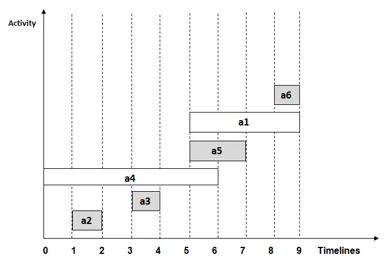

## Differentiate among Divide & Conquer, Greedy Algorithm, and Dynamic Programming.

| Feature                 | Divide & Conquer                      | Greedy Algorithm                                   | Dynamic Programming                                   |
| ----------------------- | ------------------------------------- | -------------------------------------------------- | ----------------------------------------------------- |
| Strategy                | Break problem → subproblems → combine | Build solution step-by-step with best local choice | Break problem → overlapping subproblems + memoization |
| Optimal Substructure    | May or may not exist                  | Must exist                                         | Must exist                                            |
| Overlapping Subproblems | No                                    | No                                                 | Yes                                                   |
| Example                 | Merge Sort, Quick Sort                | Kruskal's, Prim’s, Dijkstra’s                      | 0/1 Knapsack, Fibonacci, Matrix Chain                 |
| Complexity              | Often logarithmic or polynomial       | Linear/Greedy                                      | Polynomial (with memoization)                         |

## TOPLOGICAL SORT : 

- can be multiple 

## Activity selection :
- sort wrt finish .
- start with first and dont include overlapping .
- draw graph.
