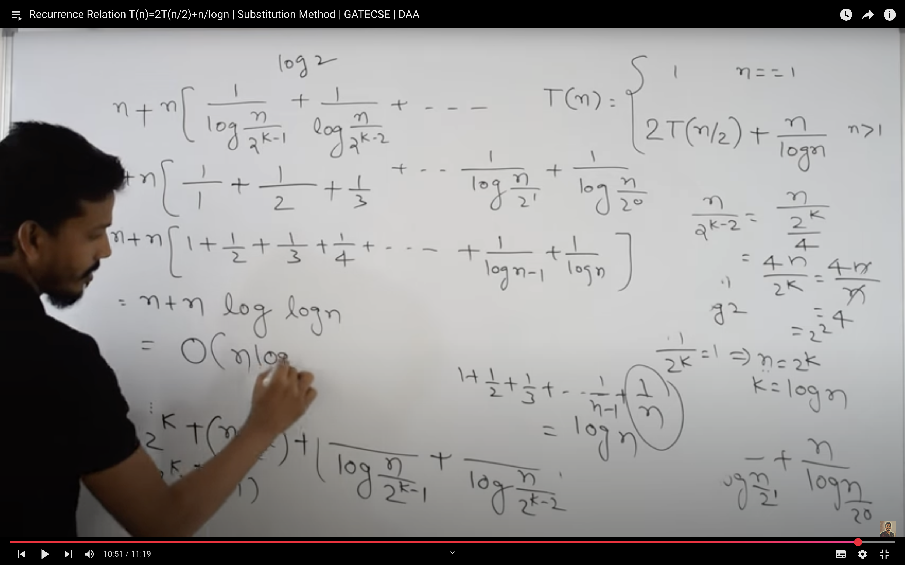
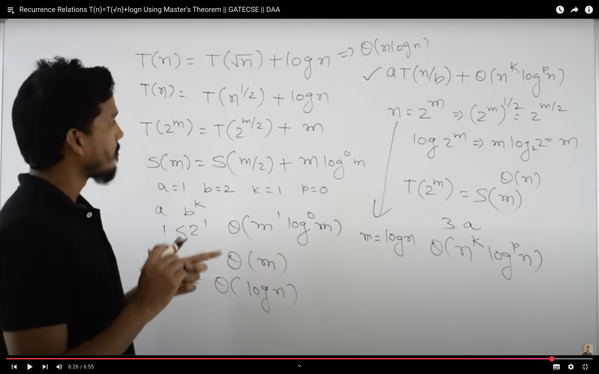

## Solving recurrence equations: 
Iterative method, Recursion-tree method, Guess method, Master method, Master’s theorem, and proof of master’s theorem.

1. Substituation Method :
- find final term , observe pattern and termination condition.

> The harmonic series: 1+1/2 +1/3+...1/n     =  logn 
and     1+1/2 +1/3+...1/logn =  loglogn .

2. MASTERS THEOREM  : 

- special case :
if b!=1 , substitute n=2^m . 

#### NOATATIONS 

### Big O
- Big O notation, written as O(f(n)), describes the upper bound of the time or space complexity of an algorithm in terms of the input size 𝑛. It tells us how the running time or memory grows at most as the input grows larger.
- We say a function 
> T(n) <= c.f(n) for all n>=n0

- Describes worst-case growth rate.

Ignores constant factors and lower-order terms.

Helps compare algorithms' efficiency as input grows large.

> 2^2n = O(2^n)
=> FALSE.
because we cant define a c here as c=2^n.