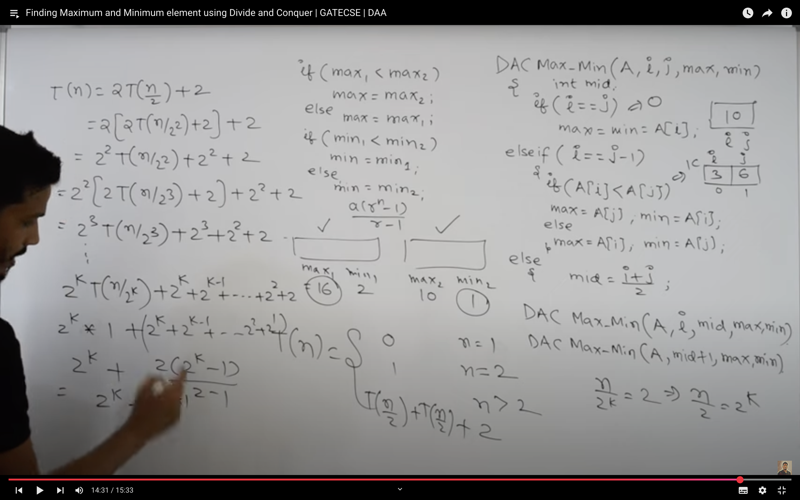
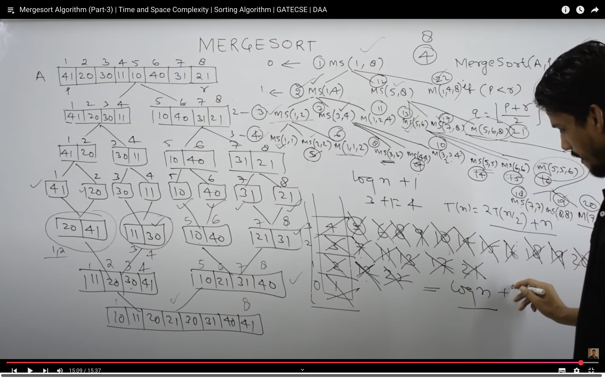
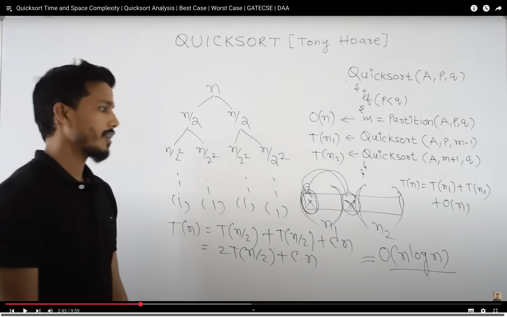
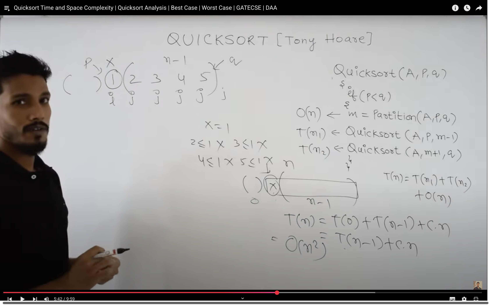
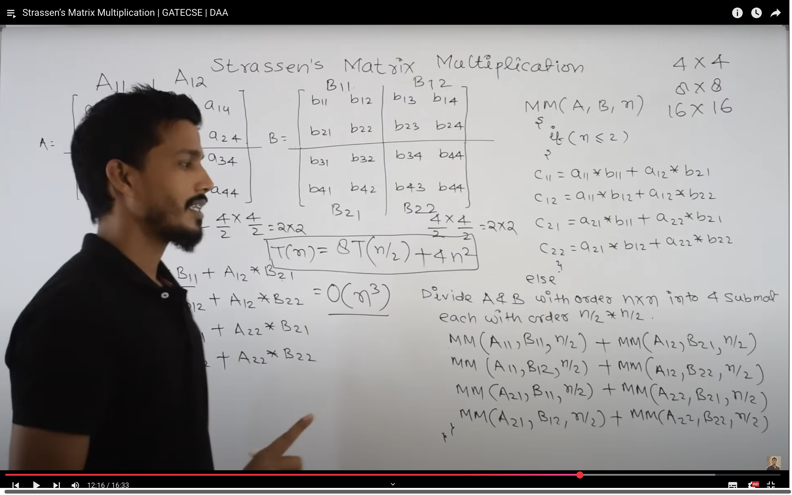
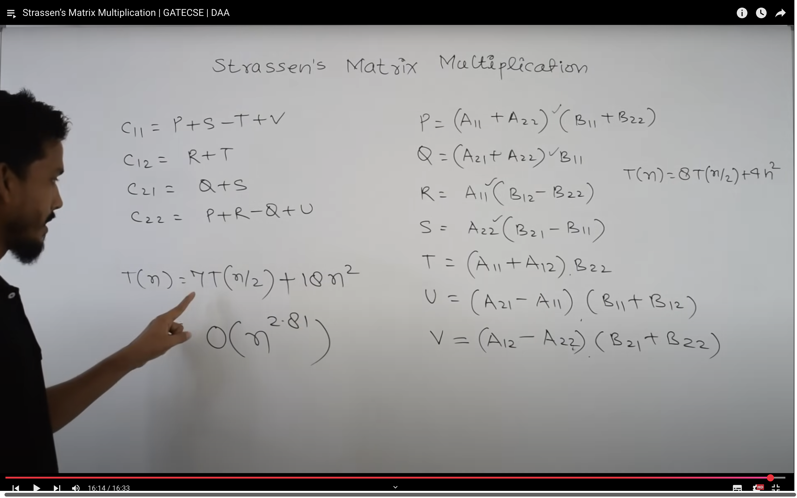
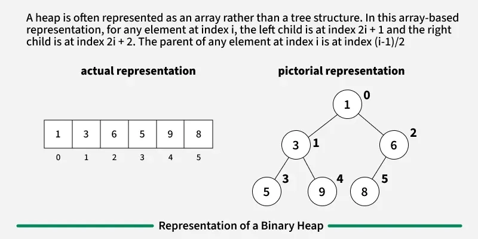
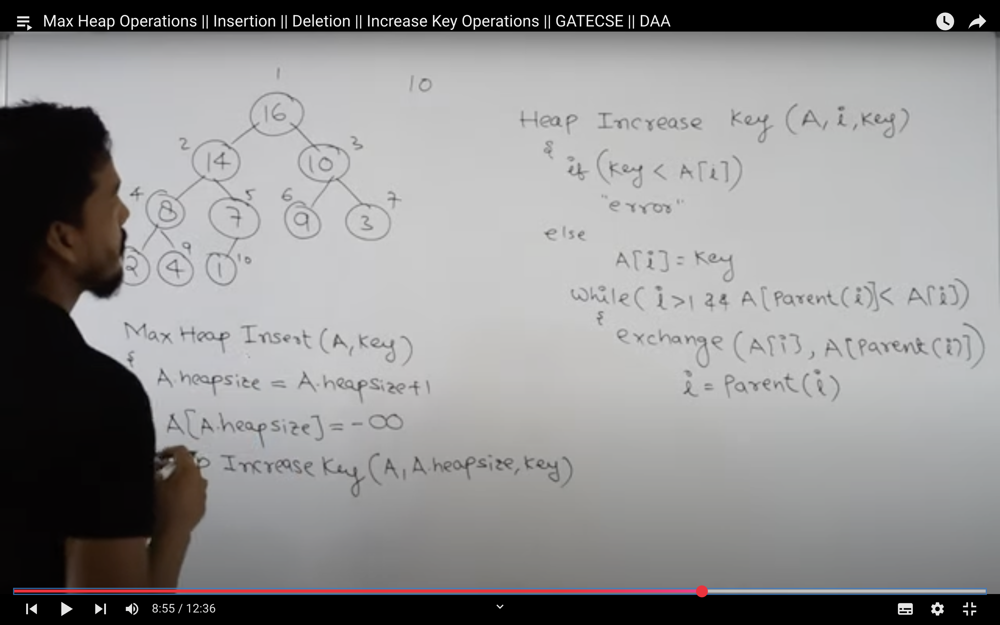

## DIVIDE AND CONQUER 
- MINIMUM AND MAXIMUM USING D&C
```c++
struct Pair {
    int min;
    int max;
};

Pair findMinMax(int arr[], int low, int high) {
    Pair result, left, right;

    // Case 1: Only one element
    if (low == high) {
        result.min = arr[low];
        result.max = arr[low];
        return result;
    }

    // Case 2: Two elements
    if (high == low + 1) {
        if (arr[low] < arr[high]) {
            result.min = arr[low];
            result.max = arr[high];
        } else {
            result.min = arr[high];
            result.max = arr[low];
        }
        return result;
    }

    // Case 3: More than two elements
    int mid = (low + high) / 2;
    left = findMinMax(arr, low, mid);
    right = findMinMax(arr, mid + 1, high);

    result.min = (left.min < right.min) ? left.min : right.min;
    result.max = (left.max > right.max) ? left.max : right.max;

    return result;
}
```

> Complexity = O(n).


- MERGE SORT 
```c++
void merge(int arr[], int l, int m, int r) {
    int n1 = m - l + 1;
    int n2 = r - m;

    // Create temporary arrays
    int L[n1], R[n2];

    // Copy data to temp arrays
    for (int i = 0; i < n1; i++)
        L[i] = arr[l + i];
    for (int j = 0; j < n2; j++)
        R[j] = arr[m + 1 + j];

    // Merge the temp arrays
    int i = 0, j = 0, k = l;
    while (i < n1 && j < n2) {
        if (L[i] <= R[j])
            arr[k++] = L[i++];
        else
            arr[k++] = R[j++];
    }

    // Copy remaining elements
    while (i < n1) arr[k++] = L[i++];
    while (j < n2) arr[k++] = R[j++];
}

void mergeSort(int arr[], int l, int r) {
    if (l < r) {
        int m = l + (r - l) / 2;

        // Sort left and right halves
        mergeSort(arr, l, m);
        mergeSort(arr, m + 1, r);

        // Merge the sorted halves
        merge(arr, l, m, r);
    }
}
```


- Divides the array into two halves.
  Sorts each half recursively.
  Merges the two sorted halves into one sorted array.

  
  - COMPLEXITY : 
  time = O(nlogn)
  space = n+logn = O(n)

  #### BEST AND WORST CASE COMPLEXITIES :
  - merging :
    - best case => n/2 comparisons , n movements.
    - worst case => n-1, n movements.;


### QUICK SORT ALGO : 
🔹 Steps:
Choose a pivot element.

Partition the array so that:

Elements less than the pivot come before it

Elements greater come after it

Recursively apply the same logic to the sub-arrays.

```c++
int partition(int arr[], int low, int high) {
    int pivot = arr[high]; // pivot element
    int i = low - 1;        // Index of smaller element

    for (int j = low; j < high; j++) {
        if (arr[j] < pivot) {
            i++;
            swap(arr[i], arr[j]);
        }
    }
    swap(arr[i + 1], arr[high]); // place pivot in correct position
    return i + 1;
}

// QuickSort function
void quickSort(int arr[], int low, int high) {
    if (low < high) {
        int pi = partition(arr, low, high); // partitioning index

        // Recursively sort left and right sub-arrays
        quickSort(arr, low, pi - 1);
        quickSort(arr, pi + 1, high);
    }
}
```

### COMPLEXITY :
- Time Complexity:

    - Best Case: (Ω(n log n)), Occurs when the pivot element divides the array into two equal halves.
    - Average Case (θ(n log n)), On average, the pivot divides the array into two parts, but not necessarily equal.
    - Worst Case: (O(n²)), Occurs when the smallest or largest element is always chosen as the pivot (e.g., sorted arrays).
 

 

- SPACE :   o(n)


## NORMAL MULTIPLICATION USING DIVIDE AND CONQUER :
- decide matrix into 2*2 matrixes .
- 8T(n/2)(8 Matrix multiplications for 4*4)+4n^2(4 calculations for C11,C12,C21,C22).
- complixity = O(n^3).


## STRASSENS MULTIPLICATION
- T(n) = 7T(n/2) +  O(n2).
From Master's Theorem, time complexity of above method is 
O(nLog7) which is approximately O(n2.8074)



## A Heap 
is a complete binary tree data structure that satisfies the heap property: for every node, the value of its children is greater than or equal to its own value. 
Heaps are usually used to implement priority queues, where the smallest (or largest) element is always at the root of the tree.

- A Binary Heap is a complete binary tree that stores data efficiently, allowing quick access to the maximum or minimum element, depending on the type of heap. 
- It can either be a Min Heap or a Max Heap. In a Min Heap, the key at the root must be the smallest among all the keys in the heap, and this property must hold true recursively for all nodes. 
- Similarly, a Max Heap follows the same principle, but with the largest key at the root.

- Almost complete Binary tree and Complete binary tree.

#### A Binary Heap is a Complete Binary Tree. A binary heap is typically represented as an array.

- The root element will be at arr[0].
The below table shows indices of other nodes for the ith node, i.e., arr[i]:
- arr[(i-1)/2]	Returns the parent node
- arr[(2*i)+1]	Returns the left child node
- arr[(2*i)+2]	Returns the right child node



## Max Heap Construction :
- strat from n/2 node .

- complexity = O(n);


## Operations :
1. DELETE : 
- Replace the root or element to be deleted by the last element.
- Delete the last element from the Heap.
- Since, the last element is now placed at the position of the root node. So, it may not follow the heap property. Therefore, heapify the last node placed at the position of root.
- Complexity : O(log n)

2. Insertion: Elements can be inserted to the heap following a similar approach as discussed above for deletion. The idea is to: 

- First increase the heap size by 1, so that it can store the new element.
- Insert the new element at the end of the Heap.
- This newly inserted element may distort the properties of Heap for its parents. So, in order to keep the properties of Heap, heapify this newly inserted element following a bottom-up approach.

