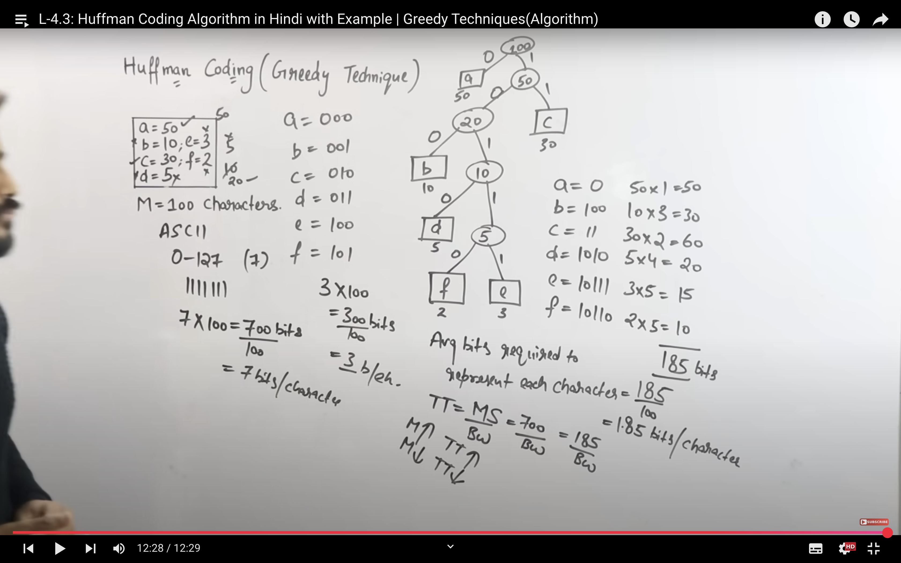
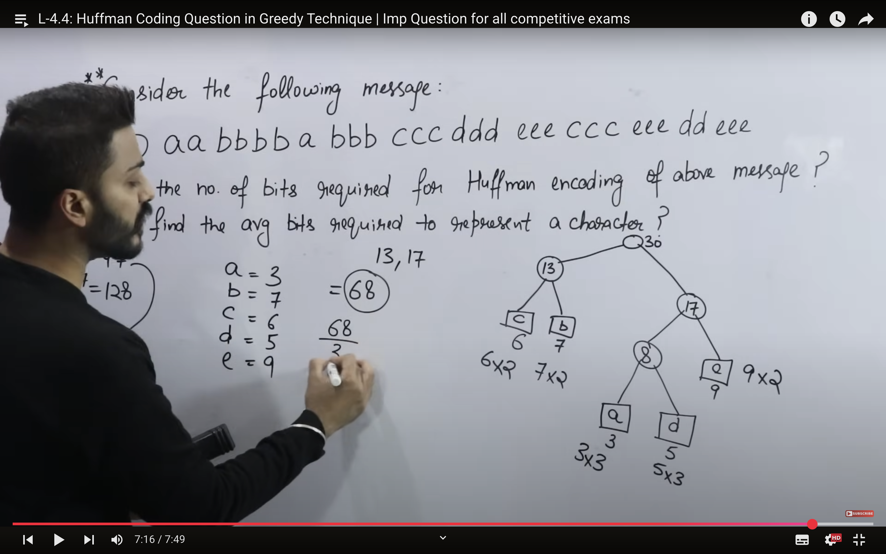
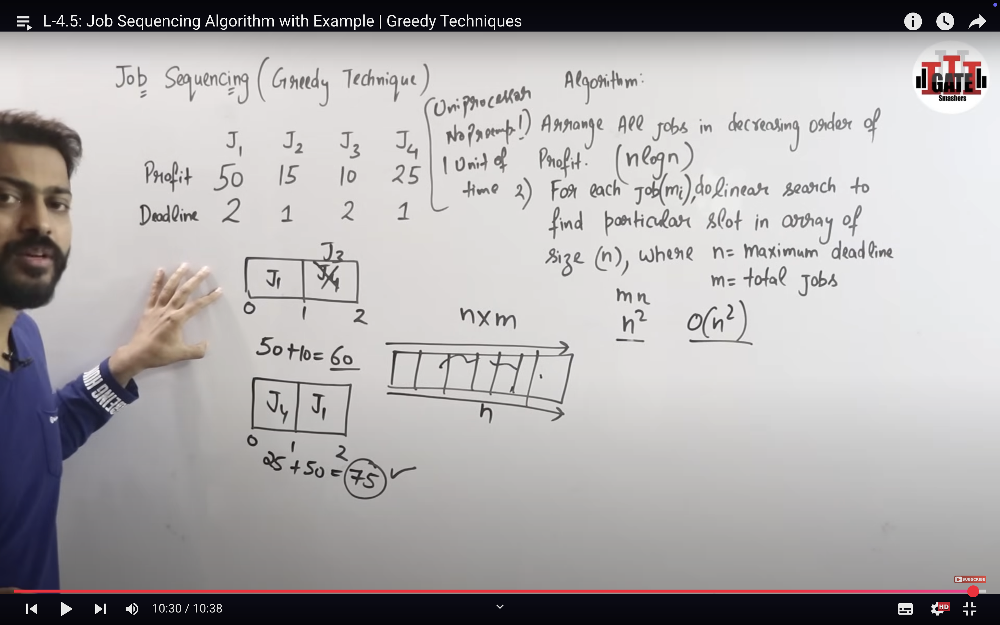
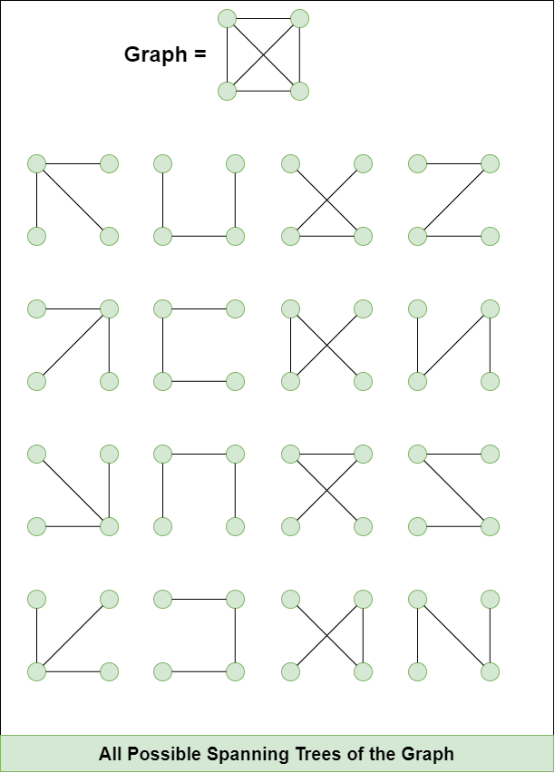
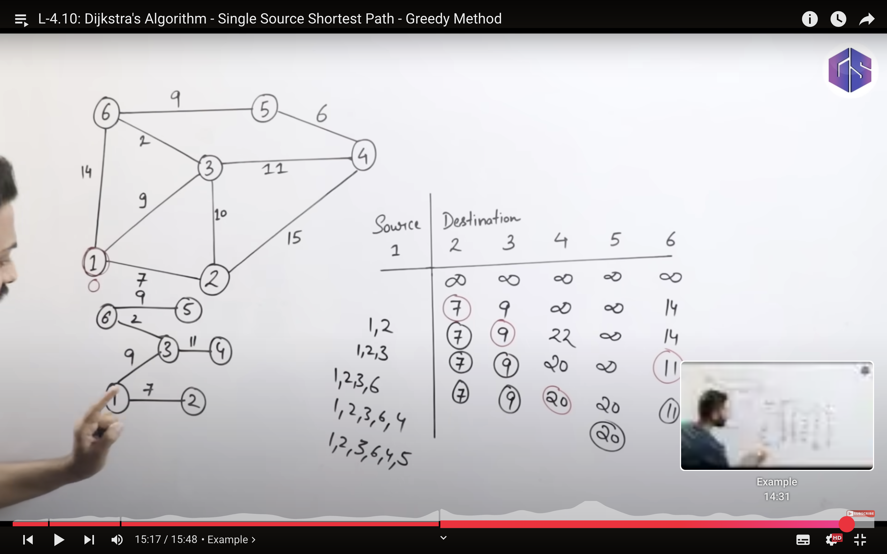
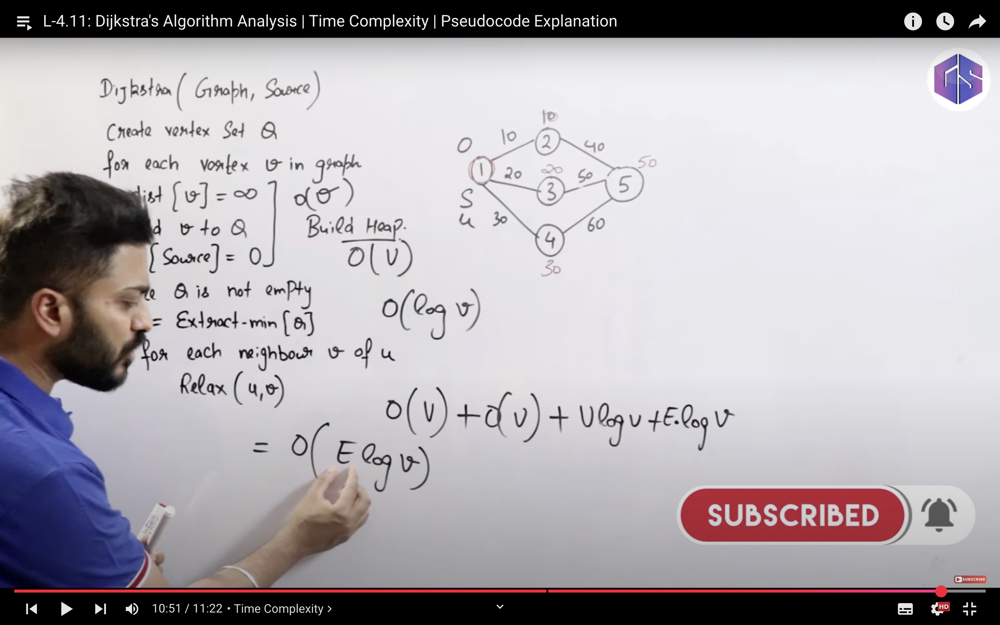
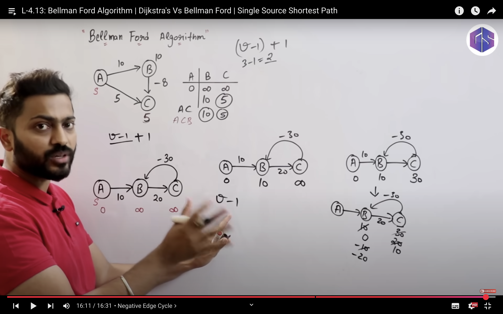
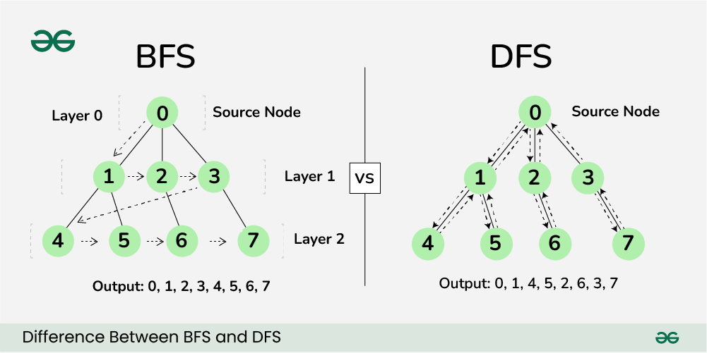

## GREEDY APPROACH 
- At every step of the algorithm, we make a choice that looks the best at the moment. 
- To make the choice, we sometimes sort the array so that we can always get the next optimal choice quickly. We sometimes also use a priority queue to get the next optimal item.
- Examples of popular algorithms where Greedy gives the best solution are Fractional Knapsack, Dijkstra's algorithm, Kruskal's algorithm, Huffman coding and Prim's Algorithm.

### How to Identify Greedy Problems:
There are two major ways to detect greedy problems –

1). `Can we break the problem into smaller parts?` If so, and solving those parts helps us solve the main problem, it probably would be solved using greedy approach. For example – In activity selection problem, once we have selected a activity then remaining subproblem is to choose those activities that start after the selected activity.

2). `Will choosing the best option at each step lead to the best overall solution?` If yes, then a greedy algorithm could be a good choice. For example – In Dijkstra’s shortest path algorithm, choosing the minimum-cost edge at each step guarantees the shortest path.

## Knapsack Problem
The 0/1 Knapsack Problem states that you have a backpack with a weight limit, and you are in a room full of treasures, each treasure with a value and a weight.

- greedy about
1. profit.
2. weight.
3. ratio of p/w =>  COMPLEXITY = O(nlogn)

## HUFFMAN ENCODING

- start with least 2 .
- delete the 2 in list and add new sum.
- start comparisong new sum and not previous leasts .

- Operation
Time Complexity                    Space                           Complexity            
Building Huffman Tree           O(N log N)                             O(N)

Encoding                          O(N)                                   O(1)

Decoding                            O(N)                              O(1)

## JOB SEQUENCING :

## Spanning Tree 
A spanning tree is a subset of Graph G, such that all the vertices are connected using minimum possible number of edges. Hence, a spanning tree does not have cycles and a graph may have more than one spanning tree.
.
- maximum number of spanning tree possible = n^(n-2) 

## Minimal spanning tree 
A minimum spanning tree (MST) is defined as a spanning tree that has the minimum weight among all the possible spanning trees.

- n-1 edges .
- all connected .

### KRUSKALS ALGO :
How to find MST using Kruskal’s algorithm?
1. Sort all the edges in a non-decreasing order of their weight. 
2. Pick the smallest edge. Check if it forms a cycle with the spanning tree formed so far. If the cycle is not formed, include this edge. Else, discard it. 
3. Repeat step 2 until there are (V-1) edges in the spanning tree.
> Time Complexity: O(E * log E) or O(E * log V) 
- Complexity	        Kruskal's Algorithm
    Time Complexity	    O(E log E)
    Space Complexity	O(V + E)

## Prim’s algorithm 
is a Greedy algorithm like Kruskal’s algorithm. This algorithm always starts with a single node and moves through several adjacent nodes, in order to explore all of the connected edges along the way.

- The algorithm starts with an empty spanning tree.
    - The idea is to maintain two sets of vertices. The first set contains the vertices already included in the MST, and the other set contains the vertices not yet included.
    - At every step, it considers all the edges that connect the two sets and picks the minimum weight edge from these edges. After picking the edge, it moves the other endpoint of the edge to the set containing MST. 

- Keep track of previous missed edges aslo and choose min among them if any .
- Aspect	            Complexity
    Time Complexity	    O((V + E) log V)
    Space Complexity	O(V + E)

## Dijastjra Algo: 

Step-by-Step Implementation

1. Set dist=0 and all other distances as infinity.
2. Push the source node into the min heap as a pair <distance, node> → i.e., <0, source>.
3. Pop the top element (node with the smallest distance).
4. For each adjacent neighbor of the current node:
5. Calculate the distance using the formula:
    dist[v] = dist[u] + weight[u][v]
    If this new distance is shorter than the current dist[v], update it.
    Push the updated pair <dist[v], v> into the min heap

- COMPLEXITY :

- O(V){assign infinite weights to all } +  O(V){ build heap } + O(VlogV){extract min weight , v times } + O(E logV ) {Relax or delete from heap } =>
overall `ElogV.` or (O((V + E) log V))
- Space Complexity	: O(V)

## BellMan Ford Algo :
The Bellman-Ford algorithm is best suited to find the shortest paths in a directed graph, with one or more negative edge weights, from the source vertex to all other vertices.
- Steps :
    - Set initial distance to zero for the source vertex, and set initial distances to infinity for all other vertices.
    - For each edge, check if a shorter distance can be calculated, and update the distance if the calculated distance is shorter.
    - Check all edges (step 2)`(V-1)times`. This is as many times as there are vertices (v) , minus one.
    - Optional: Check for negative cycles. This will be explained in better detail later.

## DFS AND BFS 

### BFS 
- Neighbours in queue , FIFO elements are result .

### DFS 
- element explored in result and parent suspended in stack for backtracking.
- empty all elements of stack at the end .
