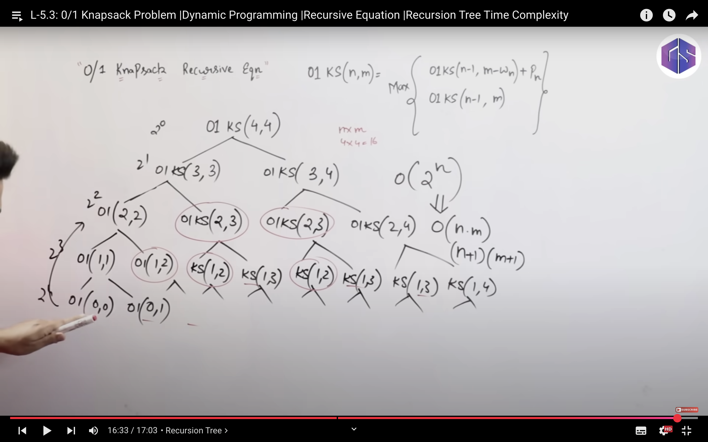
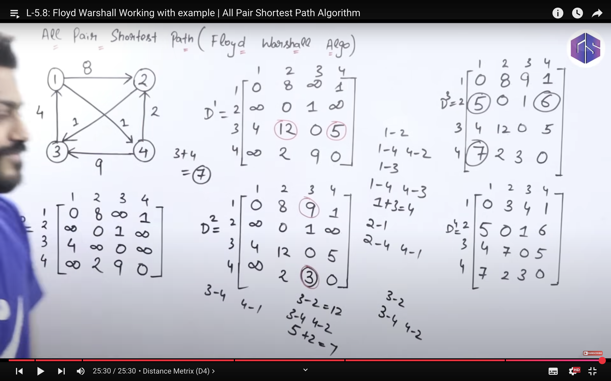
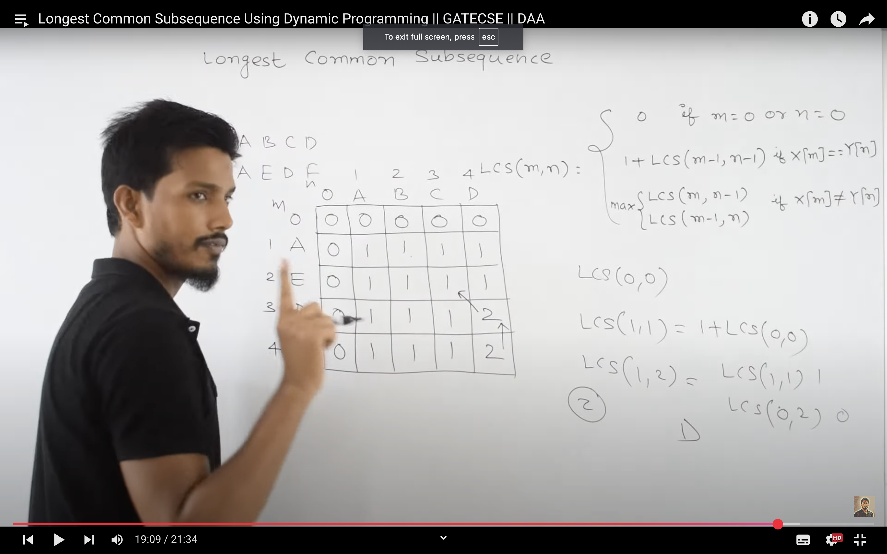

## Dynamic Programming :
- It is mainly an optimization over plain recursion. Wherever we see a recursive solution that has repeated calls for the same inputs, we can optimize it using Dynamic Programming.
- The idea is to simply store the results of subproblems so that we do not have to re-compute them when needed later. This simple optimization typically reduces time complexities from exponential to polynomial.

> eg :  Fibonacci series using Top Down memoization.

    if (n <= 1) {

        return n;

    }

    else{

        if (F[n]!=-1){

            retunr F[n];

        }

        else {

        return F[n] = fibonacci(n-1) + fibonacci(n-2)

        }

    }

- Top-Down (Memoization) – Recursion + DP

```cpp
int fib(int n, vector<int>& dp) {
    if (n <= 1) return n;
    if (dp[n] != -1) return dp[n];

    return dp[n] = fib(n - 1, dp) + fib(n - 2, dp);
}
```

- Bottom-Up (Tabulation)

```cpp
int fibonacci(int n) {
    if (n <= 1) return n;

    vector<int> dp(n + 1);
    dp[0] = 0;
    dp[1] = 1;

    for (int i = 2; i <= n; i++)
        dp[i] = dp[i - 1] + dp[i - 2];

    return dp[n];
}
```

- OPTIMIZEED 

```cpp
int fibonacci(int n) {
    if (n <= 1) return n;

    int prev2 = 0, prev1 = 1;
    for (int i = 2; i <= n; i++) {
        int current = prev1 + prev2;
        prev2 = prev1;
        prev1 = current;
    }

    return prev1;
}
```

## 0/1 Knapsack using DP
- Complexity = O(nm);
- space = (n+1)(m+1)

- table :

=> n= no of objects that can be pklaaced  and weight (x-axis) is allowd weight . fill accrodinglly.


## Subset sum 
- 
isSubsetSum(arr, n, sum) = isSubsetSum(arr, n-1, sum) OR 
                           isSubsetSum(arr, n-1, sum – arr[n-1])

-         Base Cases:
          isSubsetSum(arr, n, sum) = false, if sum > 0 and n = 0
          isSubsetSum(arr, n, sum) = true, if sum = 0


## Floyd-Warshalls Algo
- complexity of Dijastka for v vertices => V.ElogV => V.V^2logV (E=V^2 worst case) = V^3logV.
- complexity of Bellman Ford = VE => V^4
- FLoyd = v^3 for all vertices .
- Space Complexity of Floyd : O(V^2)

### algo
- distnaces along column and row of via remian same .
- D1 => via node 1 .
- D2 => via node 1 , node 2 .
- D0-D4 for 4 nodes.

- A[i,j]=  min  {  A[i,j] ,
                   A[i,k]+A[k,j]
                }
- time complexity = v^3.


## Longest Commong subsequence
- O(mn) complexity.
- m==0 or n==0 => termination cond.
- if X[m]==Y[n] ==> 1+LCS(n-1.m-1).
- else 
max {
    LCS(n,m-1) , 
    LCS(n-1,m)
}
- (m+1)(n+1) table.
- 0 all first row and col
- each entry is max of last row and top col.
- if macth +1. 
- to get substring if its above ==> dont include . 
- move to left and above both.

 


## matrix chain multiplication
- no of multiplications  =  `pqr` for [A](p*q)[B](q*r)


### TABLE 
- M[i,j]=min({
    M[i,k]+M[k+1,j]+Pi-1PkPj  i<=k<j
    0 if i=j
})
- k table is the value of k from which the min is obtained  and gives parenthesis 
- search for 1-4 , then new big parenthesis like 2-3(row 2) or 1-3(row 1).


## GRAPH
1. Length - 
Length of the graph is defined as the number of edges contained in the graph. 

2. Eccentricity of graph - 
It is defined as the maximum distance of one vertex from other vertex. The maximum distance between a vertex to all other vertices is considered as the eccentricity of the vertex. It is denoted by e(V). 
- Eccentricity from:
(A, A) = 0
(A, B) = 1
(A, C) = 2
(A, D) = 1
Maximum value  is 2, So Eccentricity is 2

3. Centre of graph - 
It consists of all the vertices whose eccentricity is minimum. Here the eccentricity is equal to the radius. For example, if the school is at the center of town it will reduce the distance buses has to travel. If eccentricity of two vertex is same and minimum among all other both of them can be the center of the graph.
- Inorder to find the center of the graph, we need to find the eccentricity of each vertex and find the minimum among all of them. 
The minimum eccentricity vertex will be considered as the center.

