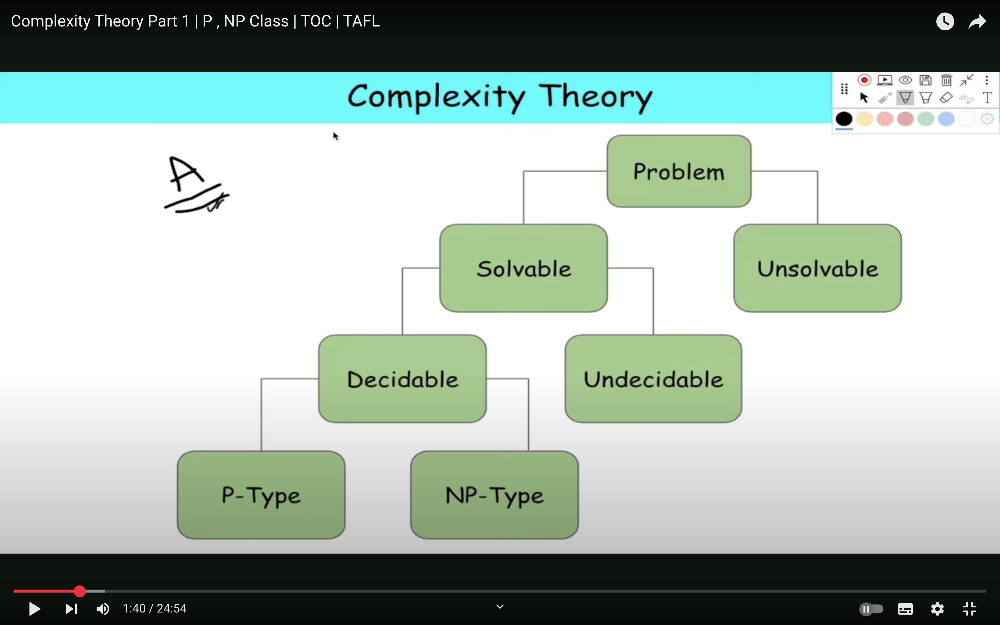
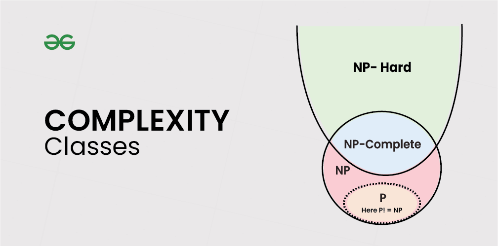

## 

## Naive Algo : 
Given text string with length n and a pattern with length m, the task is to prints all occurrences of pattern in text.
- Slide the pattern over text one by one and check for a match. If a match is found, then slide by 1 again to check for subsequent matches. 
- COMPLEXITY = O(n+m-1)(m)

## Robin Karp algo : 
- Step 1: Choose a suitable base and a modulus:
Select a prime number ‘p‘ as the modulus. This choice helps avoid overflow issues and ensures a good distribution of hash values.
Choose a base ‘b‘ (usually a prime number as well), which is often the size of the character set (e.g., 256 for ASCII characters).

- Step 2: Initialize the hash value:
Set an initial hash value ‘hash‘ to 0.

- Step 3: Calculate the initial hash value for the pattern:
Iterate over each character in the pattern from left to right.
For each character ‘c’ at position ‘i’, calculate its contribution to the hash value as ‘c * (bpattern_length – i – 1) % p’ and add it to ‘hash‘.
This gives you the hash value for the entire pattern.

- Step 4: Slide the pattern over the text:
Start by calculating the hash value for the first substring of the text that is the same length as the pattern.

- Step 5: Update the hash value for each subsequent substring:
To slide the pattern one position to the right, you remove the contribution of the leftmost character and add the contribution of the new character on the right.
The formula for updating the hash value when moving from position ‘i’ to ‘i+1’ is:
hash = (hash – (text[i – pattern_length]^(bpattern_length – 1))) * b + text[i]

- Step 6: Compare hash values:
When the hash value of a substring in the text matches the hash value of the pattern, it’s a potential match.
If the hash values match, we should perform a character-by-character comparison to confirm the match, as hash collisions can occur.

### Time Complexity: 

- The average and best-case running time of the Rabin-Karp algorithm is O(n+m), but its worst-case time is O(nm).
- The worst case of the Rabin-Karp algorithm occurs when all characters of pattern and text are the same as the hash values of all the substrings of T[] match with the hash value of P[]. 

## string matching using finite automata
-  This approach examines each character of text exactly once to find the pattern. Thus it takes linear time for matching but preprocessing time may be large.
- It is defined by tuple M = {Q, Σ, q, F, d} Where Q = Set of States in finite automata
    - Q = Set of States in finite automata
    
    - Σ=Sets of input symbols

    - q. = Initial state

    - F = Final State

    - σ = Transition function

> Time Complexity of finite automata = O(M³|Σ|).
> Time complexity of string matching using finite automata = O(M³|Σ|+n) = O(n).

## Complexity Theory
1. Solvable Problems
These are problems for which algorithms exist that can solve them for all valid inputs.
They are further divided into:
  1. Decidable Problems
    There exists an algorithm that always halts with a yes/no answer for any input.
    These problems are also called recursive problems.
    Can be computed deterministically.
    They are further classified as:

    1. P-Type (Polynomial Time)
    Can be solved in polynomial time.
    These are the easiest efficiently solvable problems.
    Example: Binary Search, Sorting, Matrix Multiplication.

    2. NP-Type (Non-deterministic Polynomial Time)
    Solutions can be verified in polynomial time by deterministic tuning machine , but not necessarily found in polynomial time.
    Might require non-deterministic algorithms to solve efficiently.
    Example: Sudoku, Travelling Salesman Problem (TSP), SAT Problem.

    ###  What is Co-NP?
    A language (problem) is in Co-NP if its complement is in NP.
    In simpler terms:
    - If you can verify NO answers in polynomial time, then the problem belongs to Co-NP.

    ### NP-hard :
    Every problem in NP can be reduced to it in polynomial time.
    It is at least as hard as the hardest problems in NP.
    It does not have to be in NP, i.e., might not be verifiable in polynomial time.
    - 🧠 Intuition:
    If you could solve an NP-hard problem quickly (in polynomial time), then you could solve all NP problems quickly.
    But verifying the solution of an NP-hard problem might not even be possible in polynomial time.

    ### ✅ What does NP-Complete mean?
    A problem is NP-Complete if it satisfies two conditions:
    1. It is in NP
    → That means its solution can be verified in polynomial time.
    2. It is NP-Hard
    → That means every problem in NP can be reduced to it in polynomial time.
    - 🧠 Intuition
    An NP-Complete problem is the hardest among NP problems.
    If you find a polynomial-time solution for any one NP-Complete problem, then:
    ✅ You can solve all NP problems in polynomial time → P = NP
    > tHINK REVERSE
    ➕ Examples:
    SAT (Satisfiability Problem) – First known NP-Complete problem.

> P is a subset of NP.
> P is subset of NP intersection Co-NP.

  2. Undecidable Problems
    No algorithm exists that solves the problem for all possible inputs.
    The machine might loop forever for some inputs.
    Example: Halting Problem, Post Correspondence Problem.

2. Unsolvable Problems
These go beyond computation — they cannot be solved by any algorithm, not even in theory.

