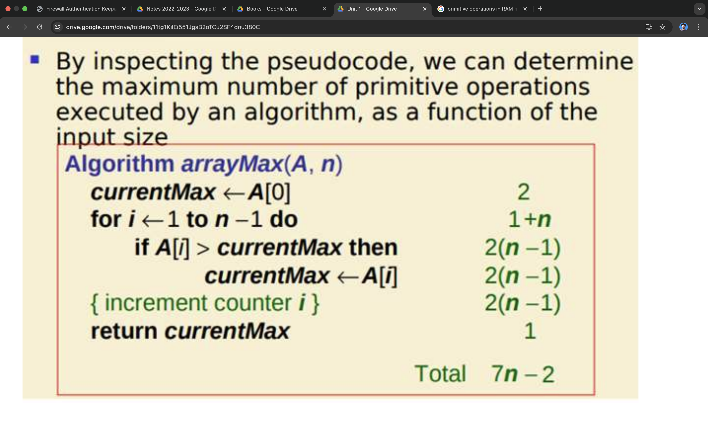

# Algorithms 
> “An algorithm is the list of instructions and rules that a computer needs to do to complete a task."

### There are two types of Abstract Machine

1. Random Access Machine (RAM)
2. Parallel Random Access Machine (PRAM)

## RAM
Random Access Machine or RAM model is a CPU. 
- It is a potentially unbound bank of memory cells, each of which can contain an arbitrary number or character. Memory cells are numbered and it takes time to access any cell in memory or say all operations (read/write from memory, standard arithmetic, and Boolean operations) take a `unit` of time. 
- RAM is a standard theoretical model of computation (infinite memory and equal access cost).

- 1 to point to A[0] , 1 to assign to cmax.
- 1 to assign 1 to i, 1 to compare till false => 1+n
- 1 to point to A[i] , 1 to compare .
- incremt/decremt = 2 , 1 to inc , 1 to reassign .

