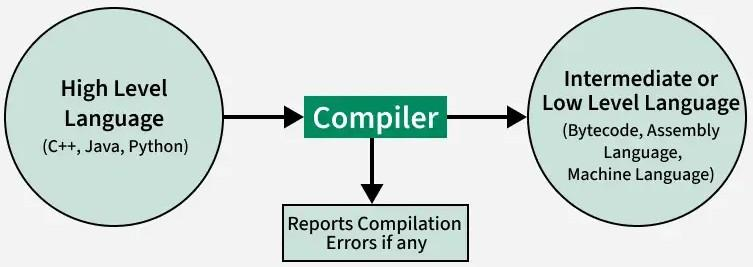
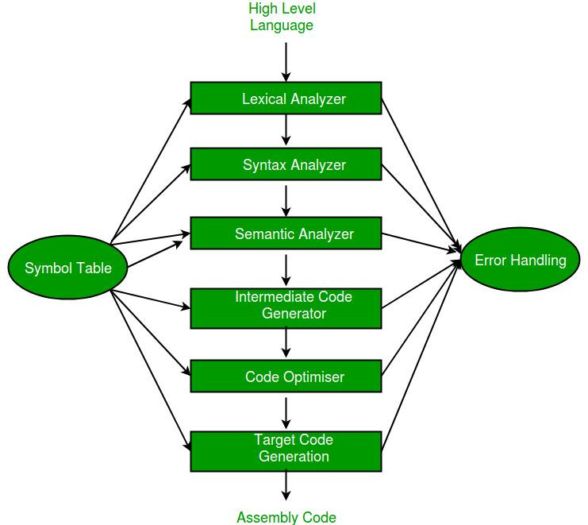

# Compiler design

##  Language Processing System
A language processing system is a set of tools used to transform a source program written in a high-level language into a target program, typically machine code, in several phases.

      Source Program
          |
    +------------------+
    |  Preprocessor    |
    +------------------+
          |
    +------------------+
    |     Compiler     |
    +------------------+
         |
    +------------------+
    |     Assembler    |
    +------------------+
         |
    +------------------+
    |     Linker       |
    +------------------+
         |
    +------------------+
    |     Loader       |
    +------------------+
         |
    Executable Machine Code

1. Preprocessor
The preprocessor is a program that is invoked by the compiler to process code before compilation. 
- Commands for that program, known as directives, are lines of the source file beginning with the character #, which distinguishes them from lines of source program text. The effect of each preprocessor directive is a change to the text of the source code, and the result is a new source code file, `which does not contain the directives`. 
- The preprocessed source code, an intermediate file, must be a valid C or C++ program, because it becomes the input to the compiler.
- Handles directives like #include, #define.
- Removes comments and expands macros.
- Output: Pure source code.
EXAMPLE :
1. 

#include <stdio.h>
#define PI 3.14

gets converted to 

// stdio.h content included
float pi = 3.14;

2. Compiler
- Translates high-level language to assembly or intermediate code.
- Performs lexical analysis, syntax analysis, semantic analysis, optimization, and code generation.
- Output: Assembly code or object code. eg file.s or .asm
Tools: GCC, Clang, etc.

3. Assembler
- Converts assembly code into machine-level object code.
- Output: Object file (.obj or .o)
Tools: GNU (Gnu's Not Unix) Assembler (as)

| Feature       | Description                                    |
| ------------- | ---------------------------------------------- |
| Input         | Assembly file (`.asm` or `.s`)                 |
| Output        | Object file (`.o` or `.obj`)                   |
| Main Purpose  | Convert assembly code to machine code          |
| Tools Example | `nasm`, `as` (GNU assembler), `MASM`, `TASM`   |
| Symbol Table  | Maintains variable/function/label locations    |

- Process pseudo-operations.
Processes assembler-specific instructions like ORG, EQU, END, etc.

4. Linker
- The linker’s job is to manage and connect different pieces of code and data, ensuring that all references between them are properly resolved.
example :
1. // file1.c
int add(int a, int b) {
    return a + b;
}
2. // file2.c
#include <stdio.h>

int add(int, int);

int main() {
    printf("%d\n", add(2, 3));
    return 0;
}
   1. Compilation:
    gcc -c file1.c    # generates file1.o
    gcc -c file2.c    # generates file2.o
    2. Linking Step:
    gcc file1.o file2.o -o program
    3. ./program 
    finds add function in the current directory and runs the program.

- Combines multiple object files into a single executable.
- Resolves external references and links library functions.
- Output: Executable file.
Tools: GNU Linker (ld)

5. Loader
- Loads executable into memory.
- Prepares code for execution by assigning memory addresses.
- Sets up execution environment.
- Transfers control to the program's entry point (e.g., main()).

| Loader Task        | Description                                                       |
| ------------------ | ----------------------------------------------------------------- |
| Load Executable    | Copies machine code and data from disk to RAM                     |
| Allocate Memory    | Reserves memory for code, data, BSS, heap, and stack              |
| Dynamic Relocation | Resolves addresses of dynamically linked libraries (if needed)    |
| Initialize Runtime | Sets up CPU registers, stack, and entry point                     |
| Start Execution    | Transfers control to the program’s entry point (e.g., `_start()`) |

## Compiler 
- A compiler is a software tool that translates a program written in a high-level programming language (like C, Java, or Python) into machine code or an intermediate form so it can be executed by a computer.
OR
- Compiler is a translator program that translates a program written in (HLL) the source program and translate it into an equivalent program in (MLL) the target program.

 As an important part of a compiler is `error showing` to the programmer.

### Functions :
🔹 Main Functions of a Compiler
1. Translate high-level source code into machine code
1. Detect and report syntax and semantic errors
1. Optimize the code for performance and efficiency
1. Generate correct and efficient target code (e.g., assembly or binary)
<!-- 2 things :
1. comiple whole code and find errors if any.
2. save code to memory if no errors.

eg : GCC Compiler for c,c++. 

- exe file is saved wrt JS in Browser. -->

### Phases of Compiler 

1. **Lexical analyzer**: 
[text](lex.md)

## INTERPRETER
- An interpreter is a type of language processor that directly executes instructions written in a programming or scripting language line by line (or statement by statement), without compiling them into machine code beforehand.
- An interpreter is a program that appears to execute a source program as if it were machine language.

### Key characteristics :

| Feature             | Interpreter                                              |
| ------------------- | -------------------------------------------------------- |
| **Execution**       | Executes code **line-by-line**                           |
| **Speed**           | Slower (no pre-compilation)                              |
| **Error Reporting** | Reports errors **at runtime**                            |
| **Storage**         | Does **not produce** a separate executable file          |
| **Use Case**        | Useful for **rapid development**, testing, and scripting |
| **Examples**        | Python, JavaScript, PHP, Ruby, MATLAB                    |

- Languages such as BASIC, SNOBOL, LISP can be translated using interpreters. JAVA also uses interpreter. The process of interpretation can be carried out in following phases.
1. Lexical analysis
2. Synatx analysis
3. Semantic analysis
4. Direct Execution 

### Working
1. Takes source code as input.
2. Analyzes one statement at a time:
3. Performs lexical, syntax, and semantic analysis.
4. Executes the statement immediately.
5. Continues to the next line unless an error is encountered.

- slower compared to Compiler but take lesser memory as line is directly either executed or error shown.