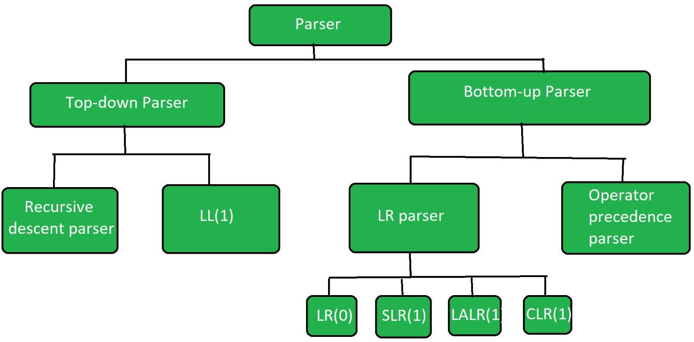
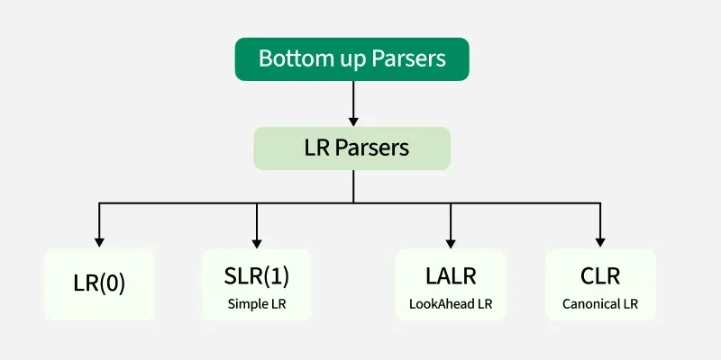

# SYNTAX ANALYSIS (PARSER)

## Role and Position of a Parser
The parser is a phase in the compiler that checks if the sequence of tokens (produced by the lexical analyzer) forms a valid syntactic structure according to the grammar of the programming language.

Position in Compiler:
Source Code → [Lexical Analyzer] → Tokens → [Parser] → Parse Tree → ...
Output:
- Parse tree or abstract syntax tree (AST)
- Errors if the syntax is invalid

## A Review of Context-Free Grammar (CFG)
A context-free grammar (CFG) is a formal system used to describe a class of languages known as context-free languages (CFLs).

### Components of CFG:
1. Terminals: Tokens (like if, else, {, } etc.)
2. Non-terminals: Variables representing phrases (e.g., expr, stmt)
3. Productions: Rules like stmt → if expr then stmt else stmt
4. Start symbol: Typically S or program

- Example:
S → aSb | ε
Generates balanced strings like: ab, aabb, aaabbb


## Derivation Tree (Parse Tree)
A derivation tree or parse tree visually represents how a string derives from the start symbol using the rules of CFG.
EXAMPLE:
Grammar:
E → E + T | T
T → id
Parse Tree:
      E
     /|\
    E + T
    |
    T
    |
   id       id

## Ambiguity
A grammar is ambiguous if a single string has more than one parse tree.
eg:
E → E + E | E * E | id

## Parsing approaches. 

###  Types

1. Top-down Parsing: LL (1) Parsing, 
2. Bottom Up Parsing technique, LR(1) Parsing, SLR parsing, Canonical LR Parsing, LALR Parsing,
3. Error recovery strategies, Yacc: an LALR(1) Parser generator

## Top-Down Parsing:
- Starts from the start symbol of the grammar and tries to derive the input string by expanding the productions.
> Uses a predictive approach, meaning it chooses the correct production based on lookahead.
- Common methods include Recursive Descent Parsing and LL(1) Parsing.
- They construct the parse tree by following a `leftmost derivation`, which means they always expand the leftmost non-terminal first.
- Top-Down Parsing is based on Left Most Derivation whereas Bottom-Up Parsing is dependent on `Reverse Right Most Derivation`. 
 
1. `Recursive Descent Parser` :
A recursive descent parser is a top-down parser that processes input based on a set of recursive functions, where each function corresponds to a grammar rule. It parses the input from left to right, constructing a parse tree by matching the grammar’s production rules. 

This parser is simple to implement and is suitable for LL(1) grammars, where decisions can be made based on a single lookahead token. While straightforward, recursive descent parsers struggle with left-recursive grammars and may require grammar transformations to handle such cases effectively.

- requires grammer not to be non-determistic, left recursive and ambigious .
eg :
- E-> iE'
  E'->+iE'+ę
=> RDP will be 
```c 

   main (){
    E(); // main function calls starting variable 
    if(input == $){
        // parsing completed
    }
   }

   E(){
    if(input==i) {
        input++ ;
        E`();
    }
   }

   E`(){
    if(input==+) {
    input ++;
    if(input=i) {
    inout++;
    E`();
    }
    }
    else {
        return ;
    }
   }
```


## Follow and first :

- First Set: The First set of a non-terminal contains all the terminal symbols that can appear at the beginning of any string derived from that non-terminal. In other words, it tells us which terminal symbols are possible when expanding a non-terminal.
- Follow Set: The Follow set of a non-terminal contains all the terminal symbols that can appear immediately after that non-terminal in any derivation. It helps identify what can follow a non-terminal in the grammar and is essential for handling productions where a non-terminal is at the end of a rule.
    - Follow cant be null => if Follow of First of B then use all values there and check exact follows. 
    - Follow of strat sym is $n . 


## 2. `Non Recursive Descent Parser` : or LL1  or predictive parse table 
An LL(1) parser is a top-down parsing technique that processes input from `Left to right (L), constructs a Leftmost derivation (L)`, and uses 1 symbol of lookahead (1).
### STEPS 
1. TABLE OF no of Symols * (vars +1).
    1. ADD A->â under M[A,a] where a belongs to FIRST OF â .
    2. if FIRST OF â contains epsilon , ADD A->â under M[A,a] where a belongs to FOLLOW OF â.
2. To check a string .
    STACK (operation)        input (string)                     Productions 
    $S starting              POP from here -> abxg$             specify prod used .
    (Remember its a stack)  
3. To derive parse tree .
- follow productions used .

### Properties of LL(1) Parsing
✅ Top-Down Parsing – Starts from the start symbol and expands productions.
✅ Predictive Parsing – Uses a parsing table to decide which rule to apply.
✅ Non-Backtracking – No need to backtrack if the grammar is LL(1).
✅ Requires LL(1) Grammar – The grammar must not have left recursion or ambiguity.

## Bottom-up parsing  
is a type of syntax analysis method where the parser starts from the input symbols (tokens) and attempts to reduce them to the start symbol of the grammar (usually denoted as S). The process involves applying production rules in reverse, starting from the leaves of the parse tree and working upwards toward the root.
- for unambigious grammer also.


1. LR Parsing
LR parsing is a type of bottom-up parsing technique used to handle large and complex grammars. It is commonly used in compilers for programming languages. The name “LR” comes from two parts:

The “L” stands for left-to-right scanning of the input. This means the parser reads the input string one symbol at a time, from left to right.

The “R” stands for rightmost derivation in reverse. This refers to the way the parser constructs the parse tree. Instead of building the tree from the top down (like in top-down parsing), LR parsing works from the leaves (the input symbols) and gradually reduces them back to the start symbol, following a rightmost derivation in reverse.

## LR0 Parser
https://www.cs.princeton.edu/courses/archive/spring20/cos320/LR0/

- An LR(0) parser is the simplest type of bottom-up parser in the LR family. It reads input left to right and constructs a rightmost derivation in reverse, but without using any lookahead symbols (hence 0 in LR(0)).

- 🔹 LR(0) Item
An LR(0) item is a production rule with a dot (•) indicating how much of the production has been parsed.
Example:
For production: A → XYZ
LR(0) items are:
1. A → •XYZ
1. A → X•YZ
1. A → XY•Z
1. A → XYZ•

- 🔹 Parsing Steps

1. Augment the Grammar
Add a new start symbol S' → S to ensure proper acceptance.

2. Construct LR(0) Items
Create states based on how far you have parsed each production.

3. Build DFA of LR(0) Items
Transitions represent reading terminals/non-terminals.

4. Construct ACTION and GOTO Tables
- ACTION[state, symbol] = shift/reduce/accept/error
- GOTO[state, non-terminal] = next state

5. Parsing Process
Use stack + parsing table to decide when to:
1. Shift (read input symbol),
2. Reduce (apply a production),
3. Accept (if input matches grammar),
4. Or give an error.

6. To construct parse tree 
    - use Reduction steps from prod.


## SLR 
- If there is a S-R (Shift and Reduce in same node ) then we use SLR .
- Instead of reduce in all of the nodes we only reduce in FOLLOW of LHS 


## CLR
- uses LR1 items ie LR0 + lookahead symbol.
-


## LALR
- Minimized form of CLR.

