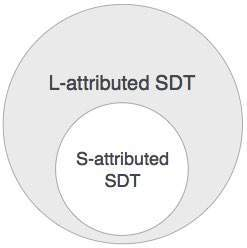
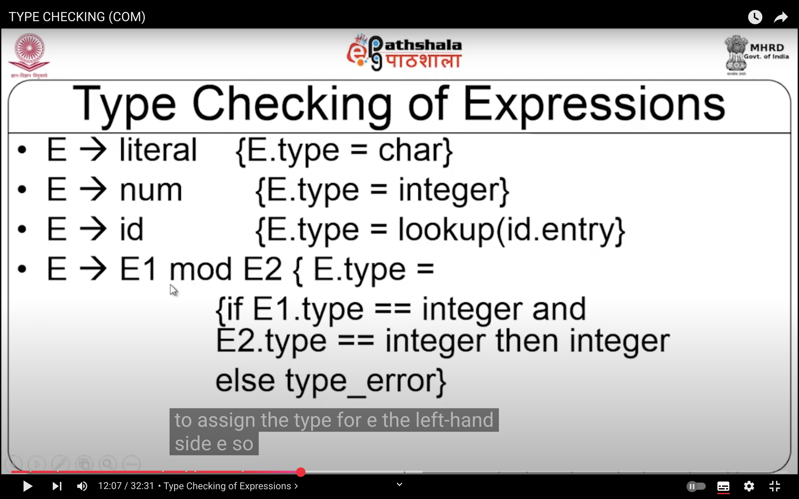
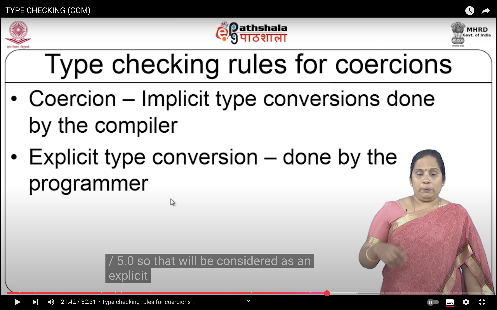
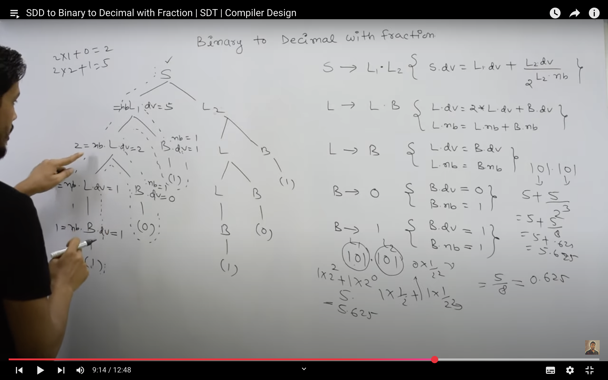
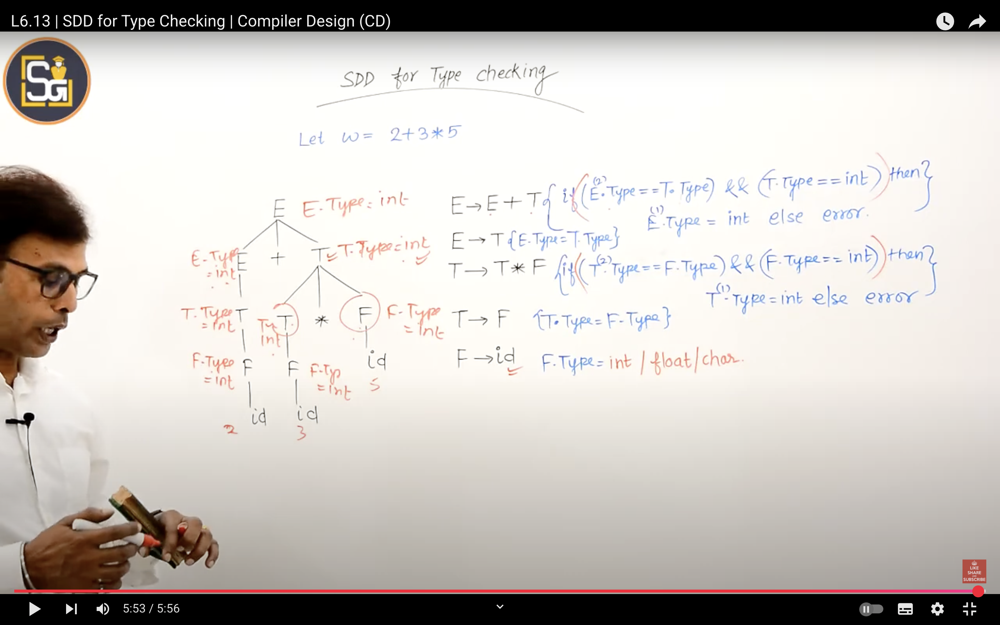

# 📘 Semantic Analysis – Compiler Design

## ✅ Definition
Semantic Analysis is a phase in a compiler where the compiler checks for **semantic errors** and ensures that the program has **meaningful logic** according to the language rules.

---

## SDD
- Syntax Directed Definitions (SDD) are formal methods of attaching semantic information to the syntactic structure of a programming language. SDDs improve the means of context-free high-level by instances, adding a semantic rule set for every production of the grammar. The rules described in these definitions state how to derive values such as types, memory locations, or fragments of code from the structure of an input object.
- Syntax Directed Translation (SDT) is the action of translating a high-level language program into an intermediate language or machine language according to the semantic rules imposed by SDDs. Semantic actions in SDT, act in coordination with the parsing process in order to provide the translation of the input code. These actions are declarative and they are triggered during the parsing phase of the message to yield the result.

## S-Attributed & L-Attributed 
1. Synthesized Attributes: These are those attributes which derive their values from their children nodes i.e. value of synthesized attribute at node is computed from the values of attributes at children nodes in parse tree. 

2. Inherited Attributes: These are the attributes which derive their values from their parent or sibling nodes i.e. value of inherited attributes are computed by value of parent or sibling nodes. 

- Synthesized attributes SDD: from children.
- Inherited attributes SDD: from the left side or siblings to the left in the production rule.

## Type Checking :

- type checking is assigned by developer as he wants .
- E=E1 mod E2 (E.type = if {E1.type=int && E2.type==int } then int else error ; )

### TYPE CHECKING FOR COERSIONS

- eg int(string) or 10/2.0

## Decimal to Binary with fraction SDD 

## SDD Type Checking
