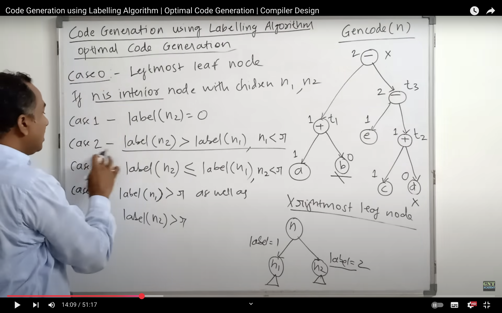
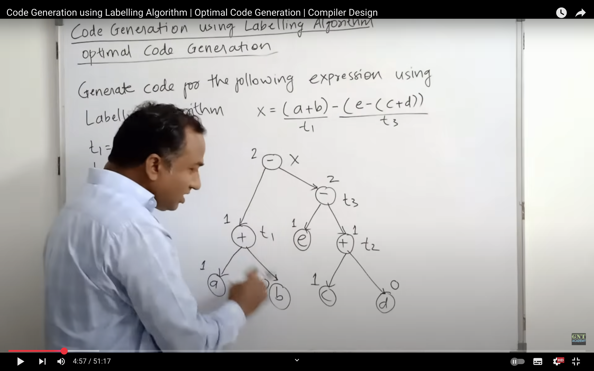

## Intermediate Code Generation 

### three Address Code Gen Rules 

## Quards , Triples and Indirect Triples TAC
 

## BackPatching 

- Triple Representation: Index		            Operator	Arg1	Arg2
                        100	                    <	a	b
       	                101	                    ifTrue	(100)	—
	                    102	                    goto	—	110
	                    103	                    >	c	d
	                    104	                    ifTrue	(103)	—
	                    105	                    goto	—	110
	                    106	                    -	b	c
	                    107	                    ^	(106)	4
	                    108	                    :=	(107)	—
	                    109	                    <	i	n
	                    110	                    ifTrue	(109)	—
	                    111	                    goto	—	114
	                    112                 +	i	2
	                    113	                    :=	(112)	—
	                    114	                    goto	—	109

## Code generation using Labelling Algo :
EAXMPLE:
---
t1=a+b
t2=c+d
t3=e-t2
t4=t1-t3

STEPS:
---
1. Draw DAG (directed acyclic graph).
2. Label it. 
	- If ‘n’ is a leaf node –
	1. If ‘n’ is a left child then its value is 1.
	2. If ‘n’ is a right child then its value is 0.
	- If ‘n’ is an interior node – Lets assume L1 and L2 are left and right child of interior node respectively.
	1. If L1 == L2 then value of ‘n’ is L1 + 1 or L2 + 1
	2. If L1 != L2 then value of ‘n’ is MAX(L1, L2)
3. gives min Registers needed.
4. GENCODE(n) is used.{ RSTCK AND TSTACK.}
- cases of genCode
1. CASE 0: if node is leftmost and leaf node.
GENERATE MOV a, RStack[top].
ie move a into RSTACK[top] ie RSTACK[R0].

--- REST CASES FOR NON-LEAF NODES
2. CASE 1:  IF label(n2)=0 ie right child label = 0
{
	gencode(n1),
	gencode op n2 , RSTACK(TOP)
}
ie MOV a, RSTACK[TOP]
and ADD b , RSTACK[TOP]

3. CASE 2 :  label(n2)>label(n1)  && label(n2) < r
{
	SWAP TOP 2 REGISTERS OF RSTACK ,
	GENCODE (N2),
	R= POP(RSTACK),
	GENCODE(N1),
	GENERATE OP R , RSTACK[TOP],
	PUSH (R, RSTACK),
	SWAP TOP 2 REGISTERS OF RSTACK ,
}

4. case 3 : label(n1)>=label(n2) && n2<r
{
	GENCODE(N1),
	R = POP(RSTACK),
	GENCODE(N2),
	GENERATE op , RSTACK[TOP] ,R ,
	PUSH (R , RSTACK)
}

5. CASE 4 : if label(n1)>r && label(n2)>r
{
	GENCODE (N2),
	T = POP(RSTACK),
	GENERATE MOV RSTACK[TOP] , T
	GENCODE(N1),
	GENERATE OP , T , RSTCK[TOP],
	PUSH (T , TSATCK)
}

