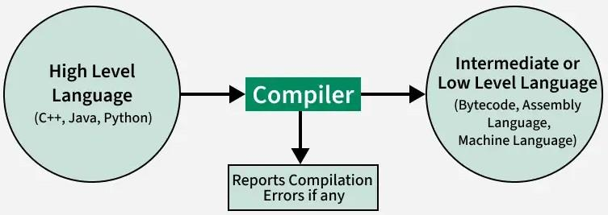
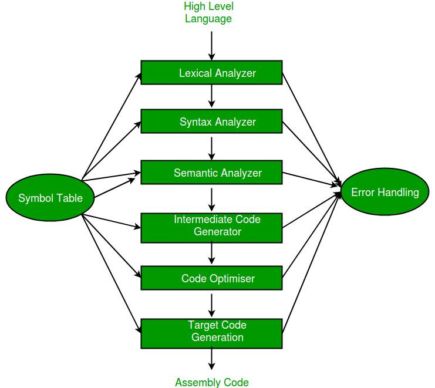

# Compiler design

##  Language Processing System

### Compiler 
Compiler is a translator program that translates a program written in (HLL) the source program and
translate it into an equivalent program in (MLL) the target program. As an important part of a
compiler is `error showing` to the programmer.
2 things :
1. comiple whole code and find errors if any.
2. save code to memory if no errors.
eg : GCC Compiler for c,c++. 
- exe file is saved wrt JS in Browser.

#### Phases of Compiler 

1. **Lexical analyzer**: 
[text](lex.md)

## INTERPRETER
An interpreter is a program that appears to execute a source program as if it were machine language.
Languages such as BASIC, SNOBOL, LISP can be translated using interpreters. JAVA also uses
interpreter. The process of interpretation can be carried out in following phases.
1. Lexical analysis
2. Synatx analysis
3. Semantic analysis
4. Direct Execution 

- slower compared to Compiler but take lesser memory as line is directly either executed or error shown.

