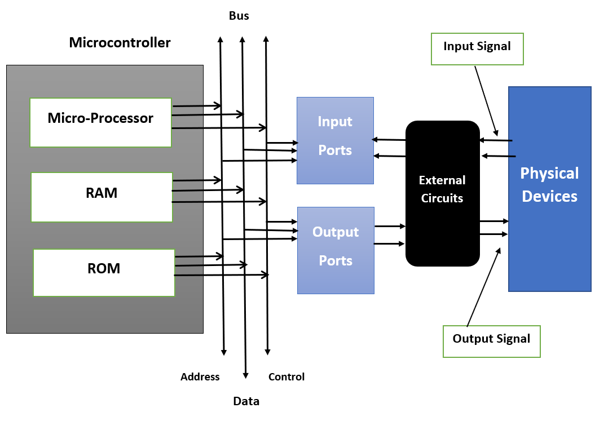
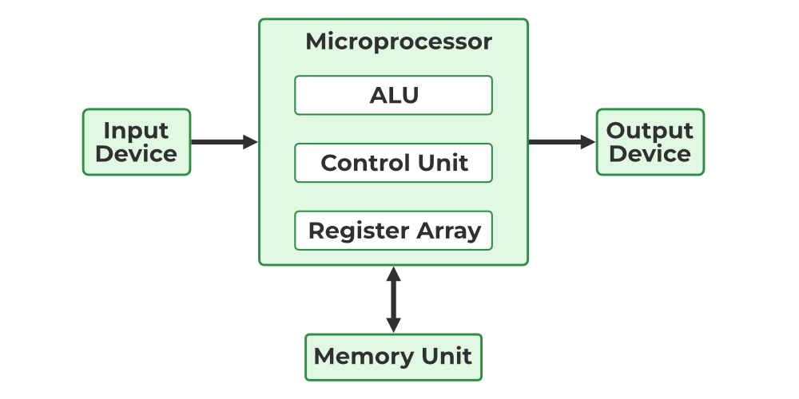
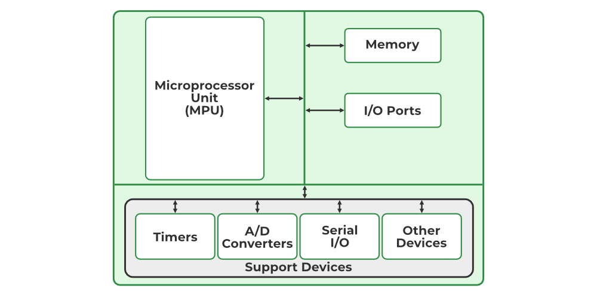
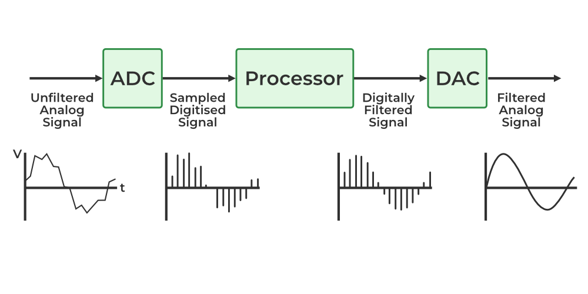

## What is Embedded System?
Embedded system is a computational system that is developed based on an `integration of both hardware and software` in order to perform a given task. 
It can be said as a dedicated computer system has been developed for some particular reason. But it is not our traditional computer system or general-purpose computers, these are the Embedded systems that may work independently or attached to a larger system to work on a few specific functions. These embedded systems can work without human intervention or with little human intervention. 

- Components of Embedded Systems
1. Hardware 2. Software 3. Firmware

- Application of Embedded System
Home appliances
Transportation
Health care
Business sector & offices
Defense sector
Aerospace
Agricultural Sector

# Embedded processor
A Processor is a hardware that performs data input/output, processing, and storage functions for a computer system.

## Types of Embedded Processors

1. General Purpose Processors (GPPs) :
> General-Purpose Processors (GPPs) in embedded systems are often microprocessors (MPUs), but they can also be microcontrollers (MCUs).

2. Application specific Instruction set processor (ASIP) : 
- MicroControllers :
A microcontroller (MCU) is a small computer on a single integrated circuit that is designed to control specific tasks within electronic systems. It combines the functions of a central processing unit (CPU), memory, and input/output interfaces, all on a single chip.

MP : 	Only contains the CPU; requires external RAM, ROM, and I/O interfaces. eg: ARM Cortex-M. appl :  laptops  
MC :    Includes CPU, RAM, ROM (Flash), and I/O ports in a single chip. eg : Qualcomm Snapdragon, mc 8051.  appl : smart wearables.

- DSP (Digilal Signal Procesor)

**A single chip with multiple processors is referred a s System on chip (SOC)**
    
3. Single-Purpose Embedded Processor or ASIC
SPEP : It is hardwired for a specific function and cannot be reprogrammed for other tasks.

### GCD using SPP

