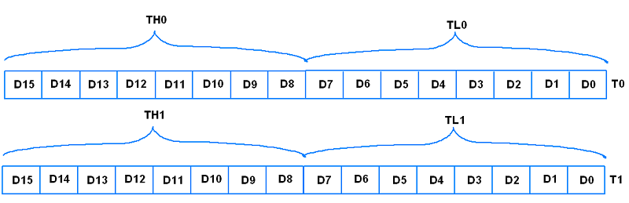
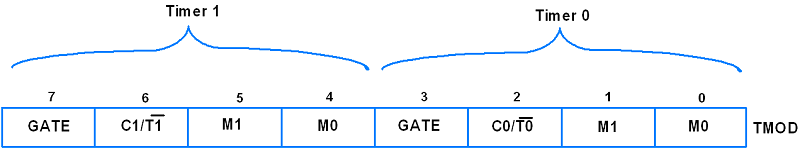
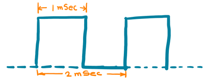

## Timers
8051 has two timers Timer0 (T0) and Timer1 (T1), both are 16-bit wide. Since 8051 has 8-bit architecture, each of these is accessed by two separate 8-bit registers as shown in the figure below. These registers are used to load timer count.


## TMOD register

TMOD is an 8-bit register used to set timer mode of timer0 and timer1.


> Its lower 4 bits are used for Timer0 and the upper 4 bits are used for Timer1
Bit 7,3 – GATE:

          1 = Enable Timer/Counter only when the INT0/INT1 pin is high and TR0/TR1 is set.

          0 = Enable Timer/Counter when TR0/TR1 is set.

Bit 5:4 & 1:0 - M1:M0: Timer/Counter mode select bit

## Mode1 (16-bit timer mode)
Mode 1 is a 16-bit timer mode used to generate a delay, it uses 8-bit of THx and 8-bit of TLx to form a total 16-bit register.

## Let’s generate a square wave of 2mSec time period using an AT89C51 microcontroller with timer0 in mode1 on the P1.0 pin of port1. Assume Xtal oscillator frequency of 11.0592 MHz.



- As Xtal is 11.0592 MHz we have a machine cycle of 1.085uSec.
freq of mach = 11.05/12.
cycle = 12/11.05.

Hence, the required count to generate a delay of 1mSec ( 1KHz freq ). is,

> Count =(1×10^(-3)) / (1.085×10^(-6) ) ≈ 921 

> And mode1 has a max count is 2^16 (0 - 65535) and it increments from 0 to 65535 so we need to load value which is 921 less from its max. count i.e. 65535. 
Also, here in the below program, we need an `additional 13 MC` (machine cycles) from call to return of delay function. Hence value needed to be loaded is,

 `Value=(65535-Count)+Function_MCycles+1` = 64615 = (FC74)Hex

So we need to load FC74 Hex value higher byte in TH0 and lower byte in TL0 as,

TH0 = 0xFC & TL0 = 0x74

```c
#include <reg51.h>		/* Include x51 header file */
sbit test = P1^0;		/* set test pin0 of port1 */ 

void timer_delay()		/* Timer0 delay function */
{
	TH0 = 0xFC;		/* Load higher 8-bit in TH0 */
	TL0 = 0x74;		/* Load lower 8-bit in TL0 */
	TR0 = 1;		/* Start timer0 */
	while(TF0 == 0);	/* Wait until timer0 flag set */
	TR0 = 0;		/* Stop timer0 */
	TF0 = 0;		/* Clear timer0 flag */
}
void main()
{
	TMOD = 0x01;		/* Timer0 mode1 (16-bit timer mode) */
	while(1)
	{
		test = ~test;	/* Toggle test pin */
		timer_delay();	/* Call timer0 delay */
	}
}
```