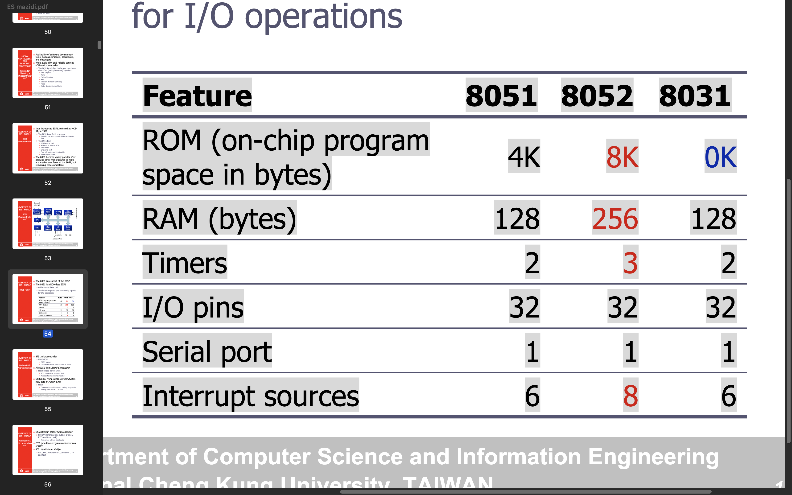

## Assembly Language Prog :
An Assembly language instruction consists of four fields:
- [label:] Mnemonic [operands] [;comment]
- ORG 0H is a `Directive` and diesnt generate any code but us used by assenbler .
- The label field allows the program to refer to a line of code by name
 - MOV R5 , #25 => 7D25 in ROM address of 0000 and 0001

### 8051's Program Counter is 16-bit
   -  16 bits wide : 
   - This means that it can access program addresses 0000 to FFFFH, a total of 64K bytes of code.

### Data Types :
- 8051 microcontroller has only one data type - 8 bits
- The size of each register is also 8 bits
- It is the job of the programmer to break down data larger than 8 bits (00 to FFH, or 0 to 255 in decimal)
- The data types can be positive or negative.
- D after decimal is optional but B and H after binary and Hexa is mandotary.
 
### 🛠️ 8051 Assembler Directives
- Directives are instructions to the assembler, not the microcontroller. They help organize code and allocate memory.

1. 📍 ORG
Set the starting address of code or data.
eg : ORG 0000H ; Start of program

2. 📍 END
Marks the end of the source code file.

3. 📍 DB (Define Byte)
Used to allocate one or more bytes in memory.
DATA1: DB 0AH    ; Store 0AH at label DATA1
STRING: DB "HELLO", 0  ; Store ASCII values of "HELLO" and null terminator

4. 📍 EQU
Defines a constant. Does not allocate memory.
COUNT EQU 10    ; Replace COUNT with 10 everywhere

## FLAG BITS AND PSW REGISTER

### ✅ PSW (Program Status Word) in 8051 Microcontroller
The Program Status Word (PSW) is a Special Function Register (SFR) at address D0h that contains status flags used during program execution. It plays a crucial role in controlling and observing the internal status of the CPU.

📌 PSW Register Overview
| Bit No. | Bit Name | Description                                                            |
| ------- | -------- | ---------------------------------------------------------------------- |
| 7       | **CY**   | Carry flag (set if there is a carry from MSB in arithmetic ops)        |
| 6       | **AC**   | Auxiliary carry (set if there is a carry from bit 3 to 4, used in BCD) |
| 5       | **F0**   | User-defined general purpose flag                                      |
| 4       | **RS1**  | Register bank select bit 1                                             |
| 3       | **RS0**  | Register bank select bit 0                                             |
| 2       | **OV**   | Overflow flag (set when result exceeds signed range)                   |
| 1       | **—**    | Reserved (not used)                                                    |
| 0       | **P**    | Parity flag (1 if accumulator has odd number of 1s)                    |

- 
1. CY (Carry Flag)
Set during addition if there's a carry out of bit 7.
Used in multi-byte arithmetic.

2. AC (Auxiliary Carry)
Used in BCD (Binary-Coded Decimal) operations.
Set if carry from bit 3 to bit 4.

3. The result of signed number operation is too large, causing the high-order bit to overflow into the sign bit

4. 
| RS1 | RS0 | Register Bank  |
| --- | --- | -------------- |
| 0   | 0   | Bank 0 (R0–R7) |
| 0   | 1   | Bank 1         |
| 1   | 0   | Bank 2         |
| 1   | 1   | Bank 3         |

6. Parity : Set if the accumulator has odd number of 1s, otherwise cleared.

## REGISTER BANKS AND STACK :
there are 128 bytes of RAM in the 8051
- Assigned addresses 00 to 7FH
The 128 bytes are divided into three different groups as follows:
1) A total of 32 bytes from locations 00 to 1F hex are set aside for register banks and the stack
2. A total of 16 bytes from locations 20H to 2FH are set aside for bit-addressable read/write memory
3. A total of 80 bytes from locations 30H to 7FH are used for read and write storage, called scratch pad.

### Register Banks : 
The 8051 microcontroller has 4 register banks, and each bank contains 8 general-purpose registers: R0 to R7. These are used for arithmetic, logic, data movement, and looping operations.
- 🧠 Memory Layout of Register Banks
  - Located in internal RAM from address 00H to 1FH.
  - Each bank takes 8 bytes.
| Bank   | Address Range | Registers         |
| ------ | ------------- | ----------------- |
| Bank 0 | 00H – 07H     | R0 – R7 (default) |
| Bank 1 | 08H – 0FH     | R0 – R7           |
| Bank 2 | 10H – 17H     | R0 – R7           |
| Bank 3 | 18H – 1FH     | R0 – R7           |

- All register banks share the same register names (R0–R7), but point to different memory locations.
- Only one bank is active at a time, controlled via PSW.
- Bank 0 is selected by default on reset.

🔧 Example: Switching to Bank 2
MOV PSW, #10H   ; 0001 0000b → RS1=1, RS0=0 → Bank 2
MOV R0, #25H    ; R0 of Bank 2 (address 10H)

#### 🛠️ Selecting a Register Bank
The Program Status Word (PSW) register controls which bank is active using the bits RS1 and RS0:
| RS1 | RS0 | Selected Bank    |
| --- | --- | ---------------- |
| 0   | 0   | Bank 0 (default) |
| 0   | 1   | Bank 1           |
| 1   | 0   | Bank 2           |
| 1   | 1   | Bank 3           |

### STACK : 
- The CPU also uses the stack to save the address of the instruction just below the CALL instruction 
- This is how the CPU knows where to resume when it returns from the called subroutine

### Data Transfer Instructions

1.` MOV destination, source `
; copy source to dest.
The instruction tells the CPU to move (in reality, `COPY`) the source operand to the destination operand

> MOV A, Rn → Move register Rn to accumulator.
> mov @r1 , a == move to memory pointefd by r1 .
ie M[r1]<-a
> MOV A, direct → Move direct address content to accumulator.
> MOVX A, @DPTR → Move external data memory content to accumulator.
> MOVC A, @A+DPTR      ; Read from external ROM
- MOVC = Move Code memory to Accumulator.
It reads a byte from CODE (ROM) memory, not RAM, and stores it in the accumulator A.
The address it reads from is formed by adding the contents of A to either DPTR or PC.

- EXAMPLE :
MOV A,#55H ;load value 55H into reg. A
MOV R0,A ;copy contents of A into R0 ;(now A=R0=55H)
MOV R1,A ;copy contents of A into R1 ;(now A=R0=R1=55H)
MOV R2,A ;copy contents of A into R2 ;(now A=R0=R1=R2=55H)
MOV R3,#95H ;load value 95H into R3 ;(now R3=95H)
MOV A,R3 ;copy contents of R3 into A ;now A=R3=95H

- NOTES :
  - Value (proceeded with #) can be loaded directly to registers A, B, or R0 – R7
   MOV A, #23H
  
  - MOV R5, #0F9H  ; Add a 0 to indicate that F is a hex number and not a letter 

  - “MOV A, #5”, the result will be A=05; i.e.  If values 0 to F moved into an 8-bit register, the rest of the bits are assumed all zeros = 00000101 in binary

  - Moving a value that is too large into a register will cause an error
  > MOV A, #7F2H ; ILLEGAL: 7F2H>8 bits (FFH)

--- 

PUSH direct → Push content to stack.
POP direct → Pop content from stack.

Arithmetic Instructions.
- ADD A, Rn → Add register Rn to accumulator
SUBB A, direct → Subtract direct address content from A with borrow
MUL AB → Multiply A and B (16-bit result in A and B)
DIV AB → Divide A by B (A = quotient, B = remainder)

Logical Instructions
- ANL A, Rn → AND operation between A and register Rn
- ORL A, direct → OR operation between A and direct address content
XRL A, #data → XOR immediate data with A
CPL A → Complement accumulator
- INC Rx – Increment the contents of register Rx by 1
- DEC Rx – Decrement the contents of register Rx by 1
DJNZ Rn, label - DJNZ (Decrement and Jump if Not Zero)

Branching (Jump & Call) Instructions
- SJMP label → Short jump (within ±127 bytes)
- LJMP address → Long jump (16-bit address)
AJMP address → Absolute jump (11-bit address)
JZ label → Jump if A is zero
JNZ label → Jump if A is nonzero
CALL address → Call subroutine at given address
RET → Return from subroutine
-  DJNZ R1 , LOOP : 
Decrement and jump.
- CJMP A, Temp , l3 : 
compare and jump.
- 

Bit Manipulation Instructions
- SETB C → Set carry flag
  SETB P0.7  ===> SET 87H , 1 is 90.
- CLR C → Clear carry flag
CPL C → Complement carry flag
- JB bit, label → Jump if bit is set
acc.7
- JNB bit, label → Jump if bit is not set