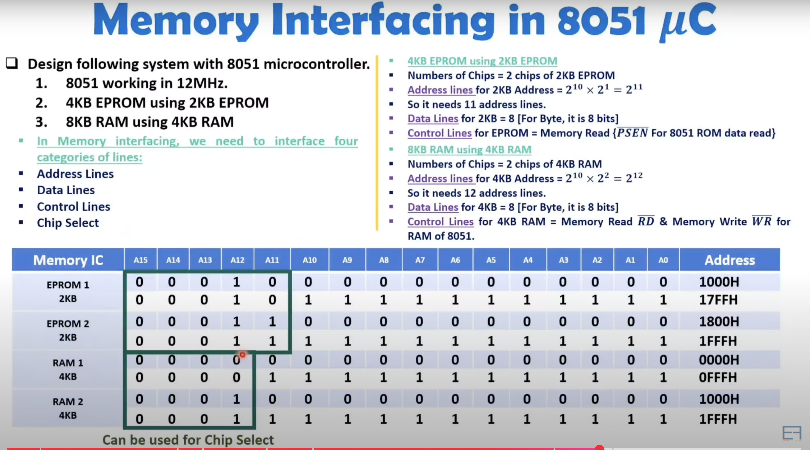
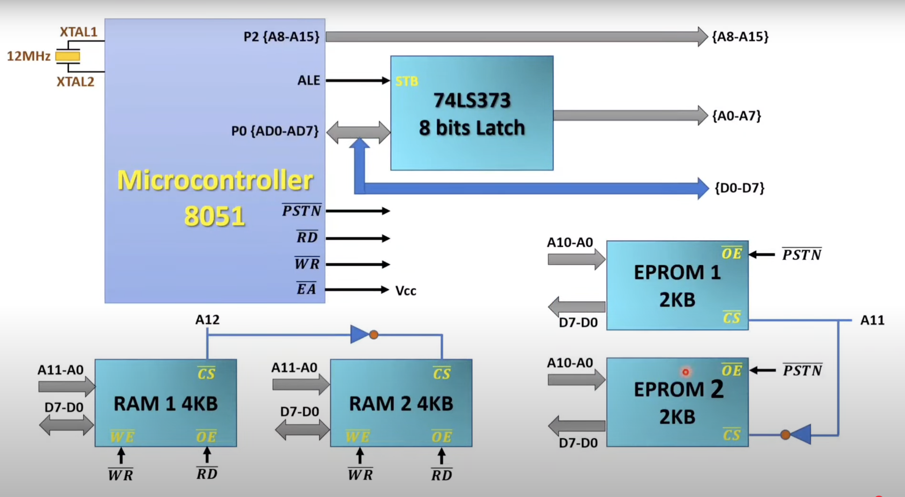

## 8031/51 INTERFACING TO EXTERNAL MEMORY
- The number of bits that a semiconductor memory chip can store is called `chip capacity`
It can be in units of Kbits (kilobits), Mbits Memory (megabits), and so on
- This must be distinguished from the storage capacity of computer systems
While the memory capacity of a memory IC chip is always given bits, the memory capacity of a computer system is given in bytes
- 16M memory chip – 16 megabits
- A computer comes with 16M memory – 16 megabytes

### To summarize
- A memory chip contain 2x location, where x is the number of address pins
- Each location contains ybits, where y is the number of data pins on the chip
> The entire chip will contain `2x × y` bits.

## 8051 DATA MEMORY SPACE
To bring externally stored data into the CPU , we use 
> MOVX A,@DPTR

- In writing data to external data RAM, we use the instruction
> MOVX @DPTR,A

### (a) Write a program to read 200 bytes of data from P1 and save the data in external RAM starting at RAM location 5000H.
Solution:
```YML
RAMDATA EQU 5000H
COUNT EQU 200
    MOV DPTR,#RAMDATA
    MOV R3,#COUNT
    AGAIN: MOV A,P1
    MOVX @DPTR,A
    # ACALL DELAY
    INC DPTR
    DJNZ R3,AGAIN
    HERE: SJMP HERE
```

## MEMORY INTERFACING OF 8051 TO EXTERNAL RAM AND ROM
### Interface 2*2KB ROMs(EPROMs) and 2*4KB RAMs
1. 2KB EPROMs
 - address lines = 2*2^10=2^11 => 11 address lines .
 - Data lines = 8 bcz Bytes are used.
 - control lines = PSEN(bar) for ROM data read.
 - Chip select is determined .

 2. 4KB RAM.
 - address liens = 12.
 - data = 8.
 - control = 2 (RD(bar) and WR(bar) ) for RAM interface of 8051.


1. Microcontroller .
- P0(AD0-1D7) is connected to ALE to enable Address and then to Rest External RAMs and ROMs.
- D0-D7 from P0 again to ALL. 
- P2(AD8-AD15).
- PSEN => to 2 EPROMs
- RD => to RAMS 
- WR => ..
- (EA (External Access)) => to VCC to enable internal RAM aslo.


2. Exrernal ROMs and RAMs
- input is 
  - Data lines
  - Addres lines only upto respective number .
  - OE(Output Enable) in all from PSEN or RD .
  - CS in all is particular address line ie A12 or A11 and ~ to 2nd RAM or ROM .
  - WE (write enable ) in RAMs.
