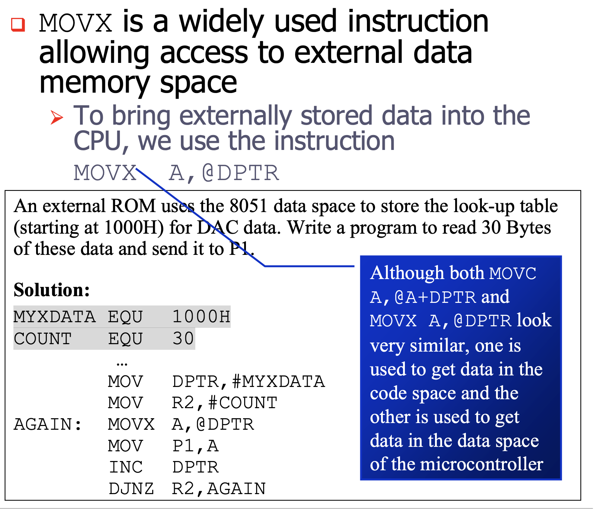

## 8031/51 INTERFACING TO EXTERNAL MEMORY
- The number of bits that a semiconductor memory chip can store is called `chip capacity`
It can be in units of Kbits (kilobits), Mbits Memory (megabits), and so on
- This must be distinguished from the storage capacity of computer systems
While the memory capacity of a memory IC chip is always given bits, the memory capacity of a computer system is given in bytes
- 16M memory chip – 16 megabits
- A computer comes with 16M memory – 16 megabytes

### To summarize
- A memory chip contain 2x location, where x is the number of address pins
- Each location contains ybits, where y is the number of data pins on the chip
> The entire chip will contain `2x × y` bits.

## 8051 DATA MEMORY SPACE
To bring externally stored data into the CPU , we use 
> MOVX A,@DPTR

- In writing data to external data RAM, we use the instruction
> MOVX @DPTR,A

### (a) Write a program to read 200 bytes of data from P1 and save the data in external RAM starting at RAM location 5000H.
Solution:
```YML
RAMDATA EQU 5000H
COUNT EQU 200
    MOV DPTR,#RAMDATA
    MOV R3,#COUNT
    AGAIN: MOV A,P1
    MOVX @DPTR,A
    ACALL DELAY
    INC DPTR
    DJNZ R3,AGAIN
    HERE: SJMP HERE
```