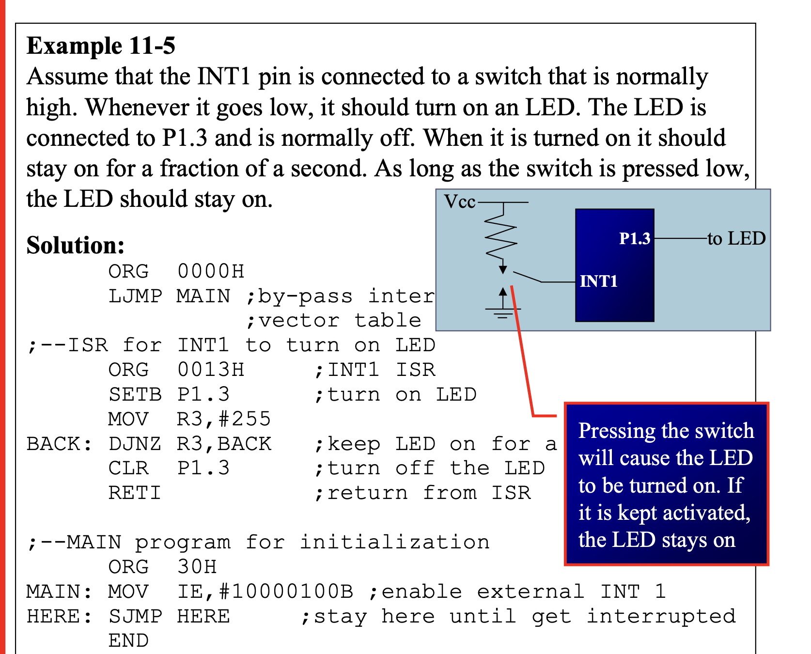
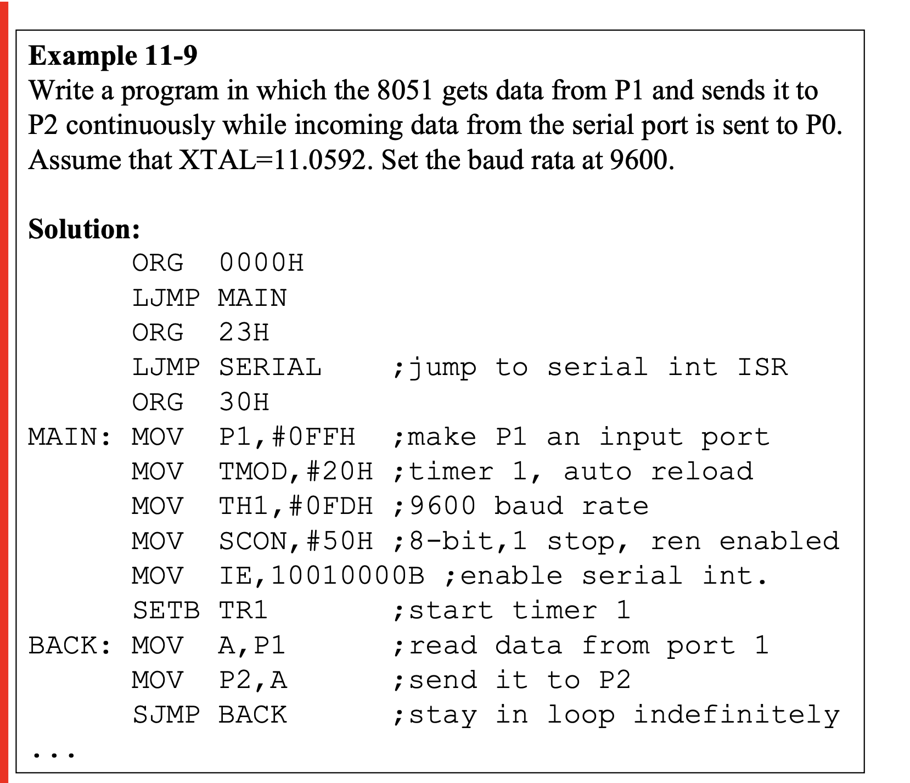
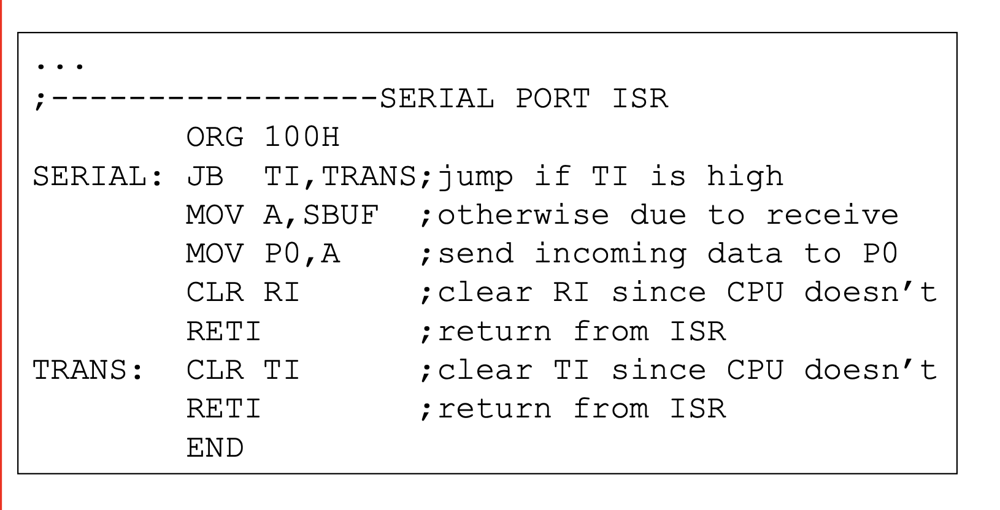

## Six interrupts are allocated as follows
1. Reset – power-up reset
2. Two interrupts are set aside for the timers:
 - one for timer 0 and one for timer 1
4. Two interrupts are set aside for hardware external interrupts
- P3.2 and P3.3 are for the external hardware interrupts INT0 (or EX1), and INT1 (or EX2)
6. Serial communication has a single interrupt that belongs to both receive and transfer

## Interrupt vector table 
| **Interrupt**                    | **Vector Address** | **Interrupt Number** | **Priority Order**         | **Associated Flag**   |
| -------------------------------- | ------------------ | -------------------- | -------------------------- | --------------------- |
| **Reset**                        | `0000H`            | —                    | Highest (but not maskable) | —                     |
| **External Interrupt 0 (INT0)**  | `0003H`            | 0                    | 1st (if enabled)           | `IE0` (in TCON)       |
| **Timer 0 Overflow**             | `000BH`            | 1                    | 2nd                        | `TF0` (in TCON)       |
| **External Interrupt 1 (INT1)**  | `0013H`            | 2                    | 3rd                        | `IE1` (in TCON)       |
| **Timer 1 Overflow**             | `001BH`            | 3                    | 4th                        | `TF1` (in TCON)       |
| **Serial Communication (RI/TI)** | `0023H`            | 4                    | 5th                        | `RI` / `TI` (in SCON) |

> Only three bytes of ROM space assigned to the reset pin. We put the LJMP as the first instruction and redirect the processor away from the interrupt vector table.

- Upon reset, all interrupts are disabled (masked), meaning that none will be responded to by the microcontroller if they are activated

### IE (Interrupt Enable) Register
| Bit No. | Bit Name | Description                          |
| ------- | -------- | ------------------------------------ |
| 7       | EA       | **Global Interrupt Enable**          |
| 6       | —        | **Reserved** (Always 0)              |
| 5       | ET2      | Timer 2 Interrupt Enable (8052 only) |
| 4       | ES       | **Serial Interrupt Enable**          |
| 3       | ET1      | **Timer 1 Interrupt Enable**         |
| 2       | EX1      | **External Interrupt 1 Enable**      |
| 1       | ET0      | **Timer 0 Interrupt Enable**         |
| 0       | EX0      | **External Interrupt 0 Enable**      |

- Bit D7 of the IE register (EA) must be set to high to allow the rest of register to take effect

###  timer flag (TF) is raised when the timer rolls over . problrm in polling ?
- Using interrupts solves this problem and, avoids tying down the controller
- If the timer interrupt in the IE register is enabled, whenever the timer rolls over, TF is raised, and the microcontroller is interrupted in whatever it is doing, and jumps to the interrupt vector table to service the ISR
- In this way, the microcontroller can do other until it is notified that the timer has rolled over

## Timer Interrupts

### Write a program that continuously get 8-bit data from P0 and sends it to P1 while simultaneously creating a square wave of 200 μs period on pin P2.1. Use timer 0 to create the square wave. Assume that
XTAL = 11.0592 MHz.

<!-- ;--upon wake-up go to main, avoid using
;memory allocated to Interrupt Vector Table -->
ORG 0000H
LJMP MAIN ;by-pass interrupt vector table
;
<!-- ;--ISR for timer 0 to generate square wave -->
ORG 000BH ;Timer 0 interrupt vector table
CPL P2.1 ;toggle P2.1 pin
RETI ;return from ISR

<!-- ;--The main program for initialization -->
ORG 0030H ;after vector table space
MAIN: 
MOV TMOD,#02H ;Timer 0, mode 2
MOV P0,#0FFH ;make P0 an input port
MOV TH0,#-92 ;TH0=A4H for -92
MOV IE,#82H ;IE=10000010 (bin) enable
            ;Timer 0
SETB TR0 ;Start Timer 0
BACK: MOV A,P0 ;get data from P0
MOV P1,A ;issue it to P1
SJMP BACK ;keep doing it loop
            ;unless interrupted by TF0
END

### IMPS
1. ORG 0000H
    LJMP MAIN
;by-pass interrupt vector table
;--upon wake-up go to main, avoid using
;memory allocated to Interrupt Vector Table

2. ISR for timer 0 to generate square wave
ORG 000BH ;Timer 0 interrupt vector table
CPL P2.1 ;toggle P2.1 pin
RETI ;return from ISR

3. MAIN ORG IS AFTER 2B ie 30
ORG 0030H ;after vector table space
MAIN: MOV TMOD,#10H ;Timer 1, mode 1

4. EXTRA INSTRUCTIONS :
MOV IE,#88H ;10001000 enable Timer 1 int

### 

- Pins P3.2 and P3.3 are used for normal I/O unless the INT0 and INT1 bits in the IE register are enabled.

| **Instruction** | **Full Form** | **Jump Range**                   | **Bytes Used** | **Use Case**                  |
| --------------- | ------------- | -------------------------------- | -------------- | ----------------------------- |
| `LJMP`          | Long Jump     | **Anywhere in 64KB code memory** | 3 bytes        | When target is far (anywhere) |
| `SJMP`          | Short Jump    | **-128 to +127 bytes** from PC   | 2 bytes        | When target is nearby         |

## SERIAL COMMUNICATION INTERRUPT

### ISR
- ORG 23H
LJMP SERIAL ;jump to serial int ISR

- ;-----------------SERIAL PORT ISR
ORG 100H
SERIAL: 
JB TI,TRANS;jump if TI is high
MOV A,SBUF ;otherwise due to receive
CLR RI ;clear RI since CPU doesn’t
RETI ;return from ISR
TRANS: CLR TI ;clear TI since CPU doesn’t
RETI ;return from ISR
END

- MAIN: 
MOV P1,#0FFH ;make P1 an input port
MOV TMOD,#20H ;timer 1, auto reload
MOV TH1,#0FDH ;9600 baud rate
MOV SCON,#50H ;8-bit,1 stop, ren enabled
MOV IE,10010000B ;enable serial int.

