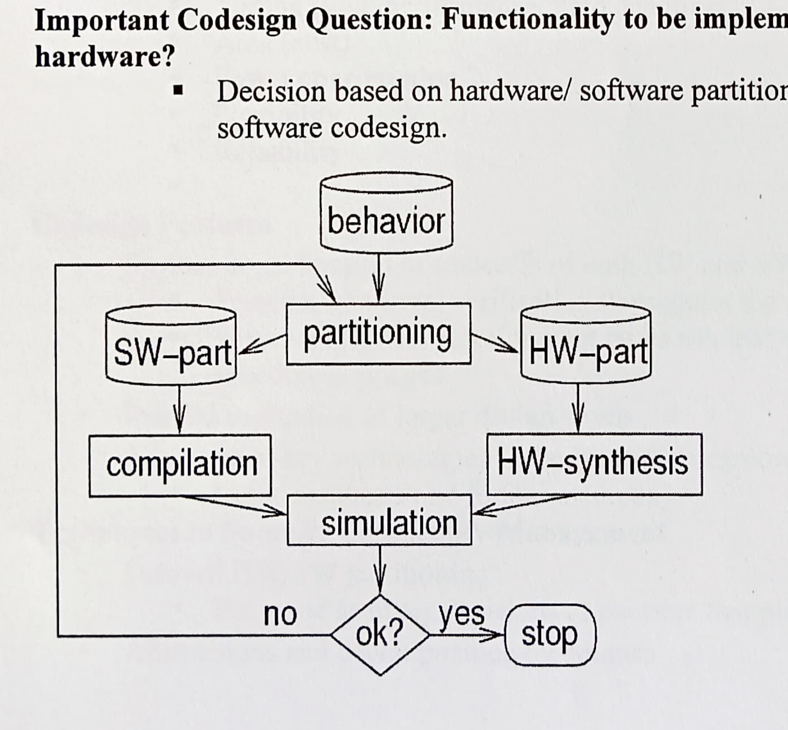
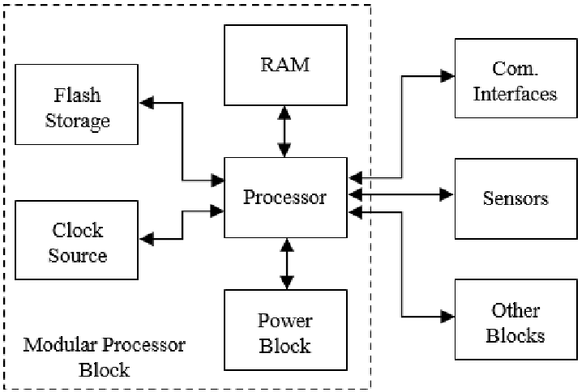

## Create a 3*3 grid with the three processor technologies along the x-axis and the three (6) IC technologies along the y-axis. For each axis, put the most programmable form closest to the origin, and the most customized form at the end of the axis. Explain features and possible occasions for using each of the combinations of the two technologies.

### ✅ Axes Explanation
Processor Technologies (X-axis):
1. General-Purpose Processors (GPPs) – Most programmable (e.g., CPUs)
2. Application-Specific Instruction-set Processors (ASIPs) – Medium customization
3. Application-Specific Integrated Circuits (ASICs) – Least programmable, most customized

IC Technologies (Y-axis):
1. Programmable Logic Devices (PLDs) – Most programmable (e.g., FPGAs)
2. Semi-Custom ICs (Standard Cell based) – Medium level customization
3. Full-Custom ICs – Most customized, least programmable.

|                      | GPP (Most Programmable) | ASIP  | ASIC (Most Customized) |   |
| -------------------- | ----------------------- | ----- | ---------------------- | - |
| **PLD (Most Prog.)** | (1,1)                   | (1,2) | (1,3)                  |   |
| **Semi-Custom IC**   | (2,1)                   | (2,2) | (2,3)                  |   |
| **Full-Custom IC**   | (3,1)                   | (3,2) | (3,3)                  |   |

## Hardware-Software Co-Design 
is an integrated approach to developing embedded systems, where both hardware and software components are designed concurrently. This methodology ensures that hardware and software are optimized together, leading to improved system performance, efficiency, and reliability. 
- 
### Challenges: 
#### Hardware challenges 
1. Selecting the Appropriate Model  
2. Decision based on hardware/ software partitioning - a special case of hardware/ software codesign.

3. Resource Constraints

#### Software Challenges 
1. Integration Challenges
2. Debugging and Testing
3. Adaptability to Technological Evolution

### Objectives
1. Optimize:
    - Timing (high performance, hard deadlines)
    - Area (cost)
    - Power consumption
    - Flexibility
    - Reliability

## An actuator 
is a device that converts electrical signals into physical actions, enabling embedded systems to interact with the physical environment. In embedded system design, actuators play a crucial role by executing commands from the system's processor to perform tasks such as movement, control, or adjustment.
- force, torque, or displacement, when an electrical, pneumatic or hydraulic input is supplied to it in a system
- While sensors collect data from the environment (input), actuators act on that data to perform tasks (output).
Sensor → Microcontroller → Actuator → Physical Action.

### 📌 Example: Automatic Door System
System:
An automatic door opens when it detects a person nearby.

- Components:
Sensor: IR/Ultrasonic sensor detects a person
Microcontroller: Processes sensor input
Actuator: DC motor controls door opening/closing

- Process:
IR sensor detects a person approaching.
Sends a signal to the microcontroller.
Microcontroller triggers a DC motor (actuator).
Door opens/closes accordingly.

In embedded systems, actuators serve as the "hands and feet," translating digital decisions into tangible actions. - Their roles include:
1. Physical Interaction: Actuators enable systems to affect the physical world, such as moving components, opening valves, or emitting sounds.
2. Control Mechanisms: They are integral to control systems, allowing for automation and precise control of processes.
3. Feedback Systems: When combined with sensors, actuators help create closed-loop systems that can adjust actions based on real-time data.

## For a particular product, you determine the NRE cost and the unit cost to be the following for the three listed IC technologies: 
FPGA: (Rs 10000, Rs 50); ASIC: (Rs 50000, Rs 10); VLSI: (Rs 200,000, Rs 5).
Determine precise volumes for which each technology yields the lowest total cost.
Also, draw the graphs between:
(i) Number of units(volume) and total cost
(ii) Number of units (volume) and per product cost
---

The Total Cost (TC) for producing N units is calculated as:
- TC = NRE + (Unit Cost × N)
- compare , get equations and slove .
- make graph 

##  Block Diagram of an Embedded System
A typical embedded system comprises the following components:
1. Input Devices: Sensors or interfaces that collect data from the environment (e.g., temperature sensors, buttons).
2. Processor (Microcontroller/Microprocessor): The central unit that processes input data and executes control algorithms.
3. Memory: Stores the system's firmware and temporary data. It includes:
4. ROM/Flash: Holds the permanent program code.
5. RAM: Used for temporary data storage during operation.
Wikipedia
5. Output Devices: Actuators or interfaces that perform actions based on processed data (e.g., motors, displays).
6. Communication Interfaces: Allow the system to communicate with other systems or networks (e.g., UART, SPI, I2C, Ethernet).
7. Power Supply: Provides the necessary electrical power for the system's operation

##
(b)
On what parameters embedded systems are classified and how do these classifications impact the design and application of embedded systems in different domains? Give examples to illustrate your explanation. (6)

OR

(b′)
For an embedded system product, four different technologies are available. Technologies can be summarized and compared with each other in terms of production costs as shown in the following Table:

## DESIGN TECHNOLOGIES :
- Design technology plays a pivotal role in enhancing the productivity of embedded system products by streamlining development processes, optimizing performance, and ensuring cost-effectiveness. Here's how various design methodologies contribute to this enhancement:
Discuss the role of design technology for enhancing productivity of an embedded system product. (6)
Design technology significantly affects time-to-market, performance, cost, and reliability.

Roles of Design Technology:
1. Hardware/Software Co-Design – Enables optimization of hardware and software to achieve better performance.

2. Use of High-Level Design Tools – Reduces development time (e.g., MATLAB/Simulink, VHDL, etc.).

3. Rapid Prototyping – Early validation of system design via FPGA or simulators.

4. Automation – Use of tools for synthesis, simulation, and debugging improves efficiency.

5. Reuse of IP Cores – Reduces design cost and time by using pre-verified modules.

6. Design for Testability and Scalability – Helps in reducing production time and error rate.

## CLASSIFICATION OF ES :

1. based on Functionality:

    1. Stand-alone Embedded Systems: Operate independently without external computing resources.
    Example: Digital watches, microwave ovens.

    2. Real-time Embedded Systems: Provide timely responses to external events.
    Example: Airbag systems in vehicles.

        1. Hard Real-time Systems: Strict timing constraints; missing deadlines can lead to catastrophic failures.
        Example: Pacemakers.

        2. Soft Real-time Systems: Timing is important but not critical.
        Example: Multimedia streaming devices.

    3. Networked Embedded Systems: Connected to a network to perform tasks.
    Example: Home automation systems.

    4. Mobile Embedded Systems: Portable devices with embedded computing.
    Example: Smartphones, tablets.

2. based on Performance and Functional Requirements:

    1. Small-scale Embedded Systems: Simple applications with limited resources.
    Example: Electronic toys.

    2. Medium-scale Embedded Systems: More complex applications requiring real-time processing.
    Example: Washing machines.

    3. Sophisticated Embedded Systems: High-performance systems with complex functionalities.
    Example: Automated industrial control systems.

## 
- 50x+1000=10x+5000. ie same x ie same no of items .
-  + loss to NRE for 2nd case.

2. Most Price-Efficient Technology (Ignoring Time-to-Market Loss)

| **Unit Range**   | **Most Cost-Efficient Technology** |
| ---------------- | ---------------------------------- |
| 0 ≤ x < 100      | A                                  |
| 100 ≤ x < 500    | B                                  |
| 500 ≤ x < 2000   | C                                  |
| 2000 ≤ x < 50000 | D                                  |
| x ≥ 50000        | D                                  |

3. Most Price-Efficient Technology (Including Time-to-Market Loss)

| **Unit Range**   | **Most Cost-Efficient Technology** |
| ---------------- | ---------------------------------- |
| 0 ≤ x < 500      | A                                  |
| 500 ≤ x < 1167   | B                                  |
| 1167 ≤ x < 3859  | C                                  |
| 3859 ≤ x < 90000 | D                                  |
| x ≥ 90000        | D                                  |

## 
| **Feature**          | **Embedded Systems**                                                                               | **Personal Computers**                                                                                        |
| -------------------- | -------------------------------------------------------------------------------------------------- | ------------------------------------------------------------------------------------------------------------- |
| **Purpose**          | Designed to perform a specific task or set of tasks.                                               | Designed for general-purpose computing, supporting a wide range of applications.                              |
| **Functionality**    | Highly specialized and optimized for specific functions (e.g., washing machines, medical devices). | Versatile and capable of running multiple types of applications (e.g., word processing, gaming, development). |
| **Hardware**         | Typically has specialized hardware designed for specific tasks.                                    | Flexible hardware that can be upgraded and supports various peripherals (e.g., monitor, keyboard, mouse).     |
| **Operating System** | Often runs a Real-Time Operating System (RTOS) or no OS at all, depending on the application.      | Runs a general-purpose operating system like Windows, macOS, or Linux.                                        |
| **Performance**      | Optimized for efficiency and low power consumption.                                                | High processing power, memory, and graphics capabilities for a wide range of tasks.                           |
| **Cost**             | Typically low cost due to specific hardware requirements.                                          | Generally higher cost due to more versatile and powerful hardware.                                            |
| **Size**             | Compact and designed to fit in small devices.                                                      | Larger and designed to handle a wide range of tasks, often with more physical space.                          |
| **Examples**         | Microwave ovens, medical monitoring systems, automotive control systems, robots.                   | Desktop computers, laptops, gaming PCs, workstations.                                                         |
