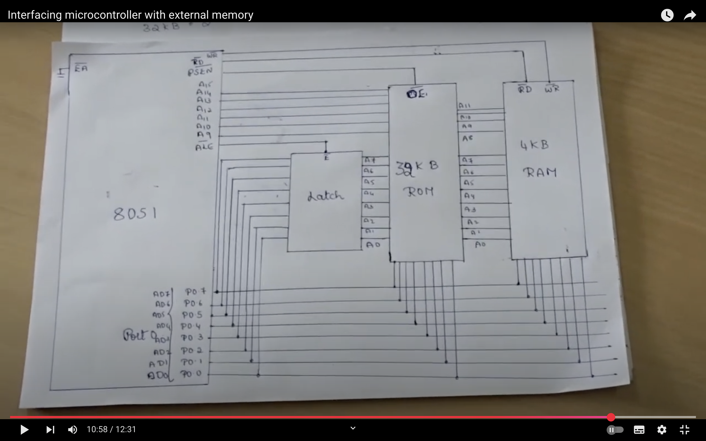

## 

ORG 0000H

    MOV R0, #10          ; Counter for 10 bytes
    MOV DPTR, #1000H     ; Source address in external ROM
    MOV R1 , 00H
NEXT_BYTE:
    CLR A
    MOV A, R1            ; Use offset for relative ROM address
    MOVC A, @A+DPTR      ; Read from external ROM
    MOV R2, A            ; Save a copy in R2
    ANL A, #01H          ; Check if odd (LSB == 1)
    JZ STORE             ; If even, jump to STORE
    MOV A, R2            ; If odd, reload original byte
    ANL A, #0FEH         ; Make it even (clear LSB)
STORE:
    MOV DPTR , 2000H
    MOV R3, #00H         ; Clear upper byte for addition
    MOV A, R3     ; Load R3 (DPL) into A
    ADD A, R1     ; Add R0 (e.g., loop counter)
    MOV R3, A     ; Store result back to R3 (new DPL)
    MOV DPL, R3
    MOVX @DPTR, A        ; Store in external RAM 2000 and ahead
    MOV DPTR, #1000H     ; Reset source pointer
    INC R1

    DJNZ R0, NEXT_BYTE

END


```java
; Save 2000H in R2-R3
MOV R2, #20H     ; DPH
MOV R3, #00H     ; DPL

; Later, when needed:

; Now DPTR points to 2000H
```


## An application needs 256 KB external memory for storing data. Can you devise a method using which microcontroller 8051 can access this External memory? If your answer is yes, explain with the help of suitable diagram and example.
- Yes, the 8051 microcontroller can access 256 KB of external data memory, but not directly because it has a 16-bit address bus, allowing only 64 KB (2¹⁶) addressable external memory space at a time.
However, by using bank switching or paging, we can access more than 64 KB (like 256 KB) of external memory.

### APPROACH :
1. We divide the 256 KB external memory into 4 banks of 64 KB each and use an external latch or logic to switch between these banks.
🧱 Components Required:
8051 microcontroller
1. External RAM (256 KB) – organized as 4 × 64 KB banks
2. Address latch (e.g., 74LS373) – to demultiplex lower address
3. Bank selection logic (using flip-flops or I/O port bits) (Port 1.0, 1.1)

📊 Memory Division:
| Bank No. | Address Range | Bank Select Bits |
| -------- | ------------- | ---------------- |
| Bank 0   | 0000H – FFFFH | 00               |
| Bank 1   | 0000H – FFFFH | 01               |
| Bank 2   | 0000H – FFFFH | 10               |
| Bank 3   | 0000H – FFFFH | 11               |

🖼️ Block Diagram (Text-Based Representation):
```YML
               8051 Microcontroller
            -------------------------
           | Port 0     (A0–A7/Data) |<-----+--- Demultiplexed via ALE ----> Address Bus (A0–A7)
           | Port 2     (A8–A15)     |<-----------> Higher Address Bus (A8–A15)
           | Port 1.0, 1.1 (Bank Sel)|---------> Bank Select Lines (to decoder/latch)
           | ALE / RD / WR           |---------> Control Signals
            -------------------------

                          |
                   External Decoder
                (e.g., 2-bit latch or flip-flop)
                          |
        +-----------------+-----------------+-----------------+
        |                 |                 |                 |                 
   External RAM     External RAM      External RAM      External RAM       
   Bank 0 (64 KB)   Bank 1 (64 KB)    Bank 2 (64 KB)    Bank 3 (64 KB)

```



## Write a program in assembly to transfer 50 bytes of data from external data ROM to external data RAM. The external data ROM address starts at 3000H and the external data RAM address starts at 8000H 
    ORG 0000H          ; Program start address

    MOV R0, #50    ; Initialize byte counter to 50

    MOV DPTR, #3000H  ; Load DPTR with source address (ROM)
    MOV R1, #00H      ; Initialize R1 to hold low byte of destination address (RAM)
    MOV R2, #80H      ; Initialize R2 to hold high byte of destination address (RAM)

TRANSFER_LOOP:
    MOVC A, @A+DPTR   ; Read byte from code memory at DPTR
    PUSH DPL          ; Save current DPTR
    PUSH DPH

    MOV DPL, R1       ; Load DPL with low byte of destination address
    MOV DPH, R2       ; Load DPH with high byte of destination address
    MOVX @DPTR, A     ; Write accumulator to external RAM at address in DPTR

    POP DPH           ; Restore original DPTR
    POP DPL

    INC DPTR          ; Increment source address
    INC R1            ; Increment low byte of destination address
    CJNE R1, #00H, SKIP_INC_R2
    INC R2            ; If R1 overflows, increment high byte

SKIP_INC_R2:
    DJNZ R0, TRANSFER_LOOP  ; Decrement counter and repeat if not zero

    SJMP $            ; Infinite loop to end program


## Differentiate between the following:

| Category           | Embedded System                              | Personal Computer                               |
| ------------------ | -------------------------------------------- | ----------------------------------------------- |
| **Purpose**        | Special-purpose, dedicated to specific tasks | General-purpose, supports multiple applications |
| **Resources**      | Limited resources (CPU, memory, power)       | High resources and performance                  |
| **User Interface** | Minimal or no interface                      | Full-fledged GUI/CLI                            |
| **Flexibility**    | Fixed functionality                          | Highly flexible and upgradeable                 |
| **Examples**       | Microwave, Washing Machine, ECU in cars      | Laptops, Desktops                               |

| Category              | Microcontroller                               | Microprocessor                             |
| --------------------- | --------------------------------------------- | ------------------------------------------ |
| **Definition**        | Integrated chip with CPU, RAM, ROM, I/O ports | Only the CPU; needs external RAM, ROM, I/O |
| **System Design**     | Self-contained system on chip                 | Needs external components                  |
| **Power Consumption** | Low                                           | High                                       |
| **Cost**              | Low                                           | Higher                                     |
| **Examples**          | 8051, PIC, AVR                                | Intel 8086, i3, i5 processors              |

| Category     | MOVC                             | MOVX                                      |
| ------------ | -------------------------------- | ----------------------------------------- |
| **Use**      | Move data from Code Memory (ROM) | Move data from external Data Memory (RAM) |
| **Syntax**   | `MOVC A, @A+DPTR`                | `MOVX A, @DPTR`                           |
| **Used For** | Lookup tables, constants in ROM  | Accessing external RAM                    |


## Overview of 8051 Family:
The 8051 microcontroller family is a popular 8-bit microcontroller developed by Intel. Its core features include:
- 8-bit CPU
- 4 KB ROM (on-chip)
- 128 bytes of RAM
- 32 I/O lines (4 ports)
- Two 16-bit timers/counters
- One serial communication port
- 64 KB external code memory support
- Interrupt control with 5 sources
- Applications: Traffic lights, washing machines, industrial automation, etc.


##  ADDITION OF -VE NUMS :
- 2s complement ie 1s complement +1 .
SUBTRACT IS ADDITION OF -VE NUMS .
PSW : C | AC | User purposes |  R1 | R0 | OF | RESERVED | PARITY.


## Which pin connection of the 8051 has to be changed:
1. If External Program ROM is to be Added:
📌 Pin to Change: EA (Pin 31)
Change: Connect EA (External Access) pin to GND.
Reason: Tells the 8051 to fetch code entirely from external program memory instead of internal ROM.

Also Used:
Port 0: Multiplexed address/data bus (A0–A7 / D0–D7)
Port 2: Higher address lines (A8–A15)
PSEN (Pin 29): Program Store Enable, used to enable external ROM

🧠 Summary:
Signal	Purpose
EA = 0	Use external program memory
PSEN	Activates external ROM (read)

2. If External Data ROM is to be Added:
📌 No pin needs to be changed, but you must use:

Port 0: For address/data bus
Port 2: For higher address lines
/RD (Pin 17): Used to read data from the external ROM

- However, 8051 does not support direct MOVX access to external data ROM, only to RAM. So to use external ROM for data:
Treat it like a memory-mapped device.
Custom logic might be required to make the ROM readable on MOVX.

3. If External Data RAM is to be Added:
📌 Pins Used:
Port 0 (Pins 32–39): Multiplexed Address/Data (A0–A7 / D0–D7)
Port 2 (Pins 21–28): Higher Address (A8–A15)
/RD (Pin 17): For reading from RAM
/WR (Pin 16): For writing to RAM

No need to change EA pin for RAM access — this only controls program memory access.


##  packed BCD number,
 an 8-bit register is able to hold two BCD digits, such as one digit for upper 4-bits and another digit for lower 4-bits

```yml
; Assume A contains the packed BCD
; Example: A = 0x45 -> MSD = 4, LSD = 5 -> ASCII '4' and '5'

MOV R0, A         ; Backup packed BCD from A
ANL A, #0Fh       ; Mask upper nibble to get lower digit (LSD) ; LOGICAL AND WITH 00001111
ADD A, #30h       ; Convert LSD to ASCII  ; ADD 48 TO CONVERT TO ASCII
MOV R6, A         ; Store ASCII of LSD in R6

MOV A, R0         ; Restore original packed BCD
# ANL A, #F0h       ; Mask lower nibble to get upper digit  ; This or SWAP A => Lower nibble to higher , then AND with #OFH
SWAP A            ; Swap nibbles: now MSD is in lower nibble
ANL A, #0Fh       ; Clear upper nibble just in case
ADD A, #30h       ; Convert MSD to ASCII
MOV R2, A         ; Store ASCII of MSD in R2

END

```


## When an output device wants data from P2 of 8051, it sends a ‘low’ on its ‘DATA REQ’ line connected to P1.1. Ten milliseconds after the data is received, the device sends a low on its ACK line connected to P1.2. This indicates the end of one transaction and the ‘data request’ line is monitored again for a new request. Write a program for this scenario in assembly language of 8051.

```yml
ORG 0000H      ; Start of program

MAIN:  
    JB P1.1, MAIN       ; Wait until P1.1 is LOW (Data Request)
    
    MOV A, #55H         ; Example data to send (can be any)
    MOV P2, A           ; Send data to output port P2
    
    ACALL DELAY_10MS    ; Wait 10 milliseconds
    
WAIT_ACK: JB P1.2, WAIT_ACK   ; Wait until P1.2 is LOW (ACK received)
    
    SJMP MAIN           ; Repeat for next data request

;-----------------------------------------
; Delay Subroutine (approx 10 ms @ 11.0592 MHz)
;-----------------------------------------
DELAY_10MS:
    MOV R2, #250
D1: MOV R1, #250
D2: DJNZ R1, D2
    DJNZ R2, D1
    RET

END
```
🧠 Logic Flow:
- Monitor P1.1 for LOW (DATA REQ)
- Send data from P2
- Wait for 10 milliseconds
- Monitor P1.2 for LOW (ACK)
- Repeat from step 1


## 10 percentages from ROM (starting at address 400H), store them in RAM starting at 40H, and classify them into ranges as specified:
```sh
ORG 0000H

; Pointer initializations
MOV DPTR, #0400H     ; DPTR points to ROM starting at 400H
MOV R0, #40H         ; RAM pointer to store original values
MOV R1, #50H         ; Pointer for < 50
MOV R2, #60H         ; Pointer for 50–74
MOV R3, #90H         ; Pointer for >= 75
MOV R4, #0AH         ; Counter for 10 students

READ_LOOP:
    ; Read from code memory
    CLR A
    MOVC A, @A+DPTR      ; Read code memory into A
    MOV @R0, A           ; Store in RAM (40H onwards)
    INC R0               ; Move to next RAM location

    ; Check conditions
    MOV B, A             ; Save value to B for comparisons

    CJNE A, #50, CHECK_50
    SJMP STORE_50_74     ; If A == 50, go to 50–74 group

CHECK_50:
    JC STORE_LESS_50     ; If A < 50, store in <50 group

    CJNE B, #75, CHECK_75
    SJMP STORE_75_UP     ; If A == 75, go to ≥75 group

CHECK_75:
    JC STORE_50_74       ; If A < 75, go to 50–74 group
    SJMP STORE_75_UP     ; Else, ≥75

STORE_LESS_50:
    MOV @R1, B           ; Store in <50 group
    INC R1
    SJMP NEXT

STORE_50_74:
    MOV @R2, B           ; Store in 50–74 group
    INC R2
    SJMP NEXT

STORE_75_UP:
    MOV @R3, B           ; Store in ≥75 group
    INC R3

NEXT:
    INC DPTR             ; Next ROM location
    DJNZ R4, READ_LOOP   ; Loop until 10 students processed

END
```

## Q1: Count data values between limits from ROM and send result to P2
```sh
ORG 0000H         ; Starting address
MOV DPTR, #0200H  ; ROM address pointer starts at 200H
MOV R0, #100      ; Number of bytes to process
MOV R4, #00H      ; Counter register to store result

NEXT_BYTE:
MOVC A, @A+DPTR   ; Read code byte from ROM
INC DPTR          ; Increment ROM pointer
MOV B, A          ; Copy byte to B

; Compare with lower limit in R2
MOV A, B
CLR C
> SUBB A, R2
> JC NEXT           ; If A < R2, skip

; Compare with upper limit in R3
MOV A, R3
CLR C
SUBB A, B
JC NEXT           ; If B >= R3, skip

INC R4            ; If within range, increment count

NEXT:
DJNZ R0, NEXT_BYTE

MOV P2, R4        ; Send result to port P2

END
```

## Write a well-documented program in assembly language of 8051 to calculate and test the checksum byte for a data taken from ROM locations starting at 400H.

- sum all bytes and drop carries .
checksum Byte = 2s complement of above.
- add all nums and CheckSum byte 
- if result = 0 , then valid.

```sh
ORG 0000H          ; Program start address

; Define the number of data bytes
NUM_BYTES EQU 04H  ; Example: 4 data bytes

; Initialize data pointer to the start of ROM data
MOV DPTR, #0400H   ; DPTR points to ROM address 400H

; Initialize registers
CLR A              ; Clear accumulator for sum
MOV R0, #NUM_BYTES ; Set loop counter for data bytes

; Calculate the sum of data bytes
SUM_LOOP:
    MOVC R1, @A+DPTR   ; Read byte from code memory into R1
    ADD A, R1          ; Add R1 to accumulator A
    INC DPTR           ; Increment DPTR to point to next byte
    DJNZ R0, SUM_LOOP  ; Decrement R0 and repeat loop if not zero

; Calculate two's complement of sum to get checksum byte
CPL A              ; Complement accumulator
INC A              ; Add 1 to get two's complement
MOV R2, A          ; Store checksum byte in R2

; Verify checksum by adding all data bytes and checksum byte
MOV DPTR, #0400H   ; Reset DPTR to start of ROM data
CLR A              ; Clear accumulator for verification sum
MOV R0, #NUM_BYTES ; Reset loop counter for data bytes

VERIFY_LOOP:
    MOVC R1, @A+DPTR   ; Read byte from code memory into R1
    ADD A, R1          ; Add R1 to accumulator A
    INC DPTR           ; Increment DPTR to point to next byte
    DJNZ R0, VERIFY_LOOP ; Decrement R0 and repeat loop if not zero

ADD A, R2          ; Add checksum byte to the sum

; Check if the final sum is zero
JZ CHECKSUM_OK     ; If zero, checksum is correct
; If not zero, checksum is incorrect
; Handle error (e.g., set an error flag or output error code)
SJMP END_PROGRAM

CHECKSUM_OK:
; Handle successful checksum verification
; (e.g., set a success flag or output success code)

END_PROGRAM:
SJMP END_PROGRAM   ; Infinite loop to end program
```