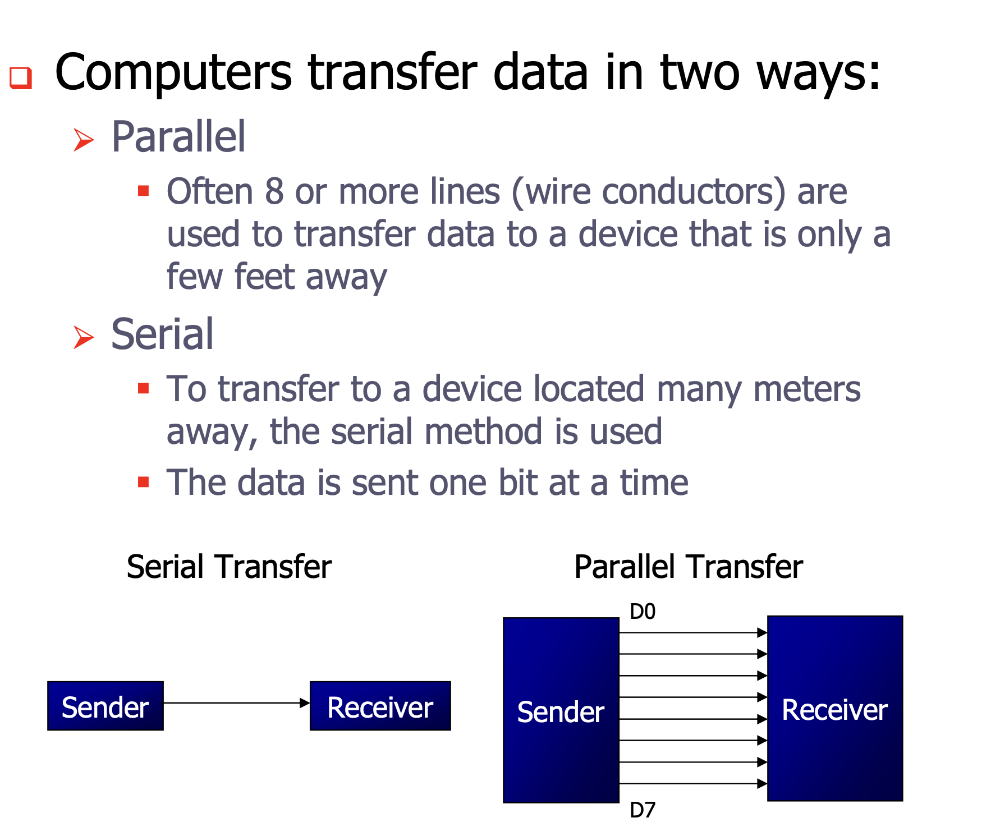

## BASICS OF SERIAL COMMUNICATION

- Serial communication is the process of sending data one bit at a time over a communication channel.
- Used to communicate between microcontrollers, computers, sensors, and other devices.
| Feature          | Serial                     | Parallel              |
| ---------------- | -------------------------- | --------------------- |
| Bits Transferred | One bit at a time          | Multiple bits at once |
| Speed            | Slower for short distances | Faster                |
| Wires Required   | Fewer (TX, RX, GND)        | More                  |
| Cost             | Lower                      | Higher                |
| Example          | UART, RS-232               | Internal data bus     |

### SCON Register (Serial Control Register) 
The SCON (Serial Control Register) is an 8-bit special function register used to configure and control serial communication in the 8051 microcontroller.

- 📌 SCON Register Format (Bit-wise Explanation)
| Bit | Symbol  | Description                                            |
| --- | ------- | ------------------------------------------------------ |
| 7   | **SM0** | Serial mode bit 0                                      |
| 6   | **SM1** | Serial mode bit 1                                      |
| 5   | **SM2** | Multiprocessor communication enable                    |
| 4   | **REN** | Receiver enable (1 = enable reception)                 |
| 3   | **TB8** | Transmit bit 8 (in modes 2 and 3)                      |
| 2   | **RB8** | Receive bit 8 (in modes 2 and 3)                       |
| 1   | **TI**  | Transmit interrupt flag (set when byte is transmitted) |
| 0   | **RI**  | Receive interrupt flag (set when byte is received)     |

- 🔁 Serial Modes (SM0 & SM1)
| SM0 | SM1 | Mode | Description            | Baud Rate          |
| --- | --- | ---- | ---------------------- | ------------------ |
| 0   | 0   | 0    | 8-bit shift register   | fosc / 12          |
| 0   | 1   | 1    | 8-bit UART             | Variable (Timer 1) |
| 1   | 0   | 2    | 9-bit UART, fixed baud | fosc / 64          |
| 1   | 1   | 3    | 9-bit UART, variable   | Variable (Timer 1) |

### BAUD RATES :
1. Crystal Frequency (XTAL) = 11.0592 MHz
- Machine cycle = XTAL / 12 = 921.6 kHz
- In UART, Timer 1 is further divided by 32, so: 
    921600÷32= 28800 Hz
So, the frequency available to set baud rate via Timer 1 is 28,800 Hz.

#### Common Baud Rates and TH1 Calculation
TH1 = 256− (28800 / Baud Rate )

| Baud Rate | Division | TH1 Decimal | TH1 Hex |
| --------- | -------- | ----------- | ------- |
| 9600      | 3        | 253         | FD      |
| 2400      | 12       | 244         | F4      |
| 1200      | 24       | 232         | E8      |

- SBUF is the Serial Buffer Register.
- TI (Transmit Interrupt flag) is set when the last bit is transmitted.
   This waits in a loop until TI becomes 1.

- SCON register is loaded with the value 50H, indicating serial mode 1, where an 8- bit data is framed with start and stop bits.

### Double the Baud Rate in 8051
- SETB SMOD
MOV PCON, #80H  ; Sets SMOD=1, rest of PCON bits = 0

### Find the baud rate if TH1 = -2, SMOD = 1, and XTAL = 11.0592 MHz. Is this baud rate supported by IBM compatible PCs?
Solution:
With XTAL = 11.0592 and SMOD = 1, we have 
timer frequency = 57,600 Hz. 
- The baud rate is 57,600/2 = 28,800. 
- This baud rate is not supported by the BIOS of the PCs; however, the PC can be programmed to do data transfer at such a speed. Also, HyperTerminal in Windows supports this and other baud rates.
