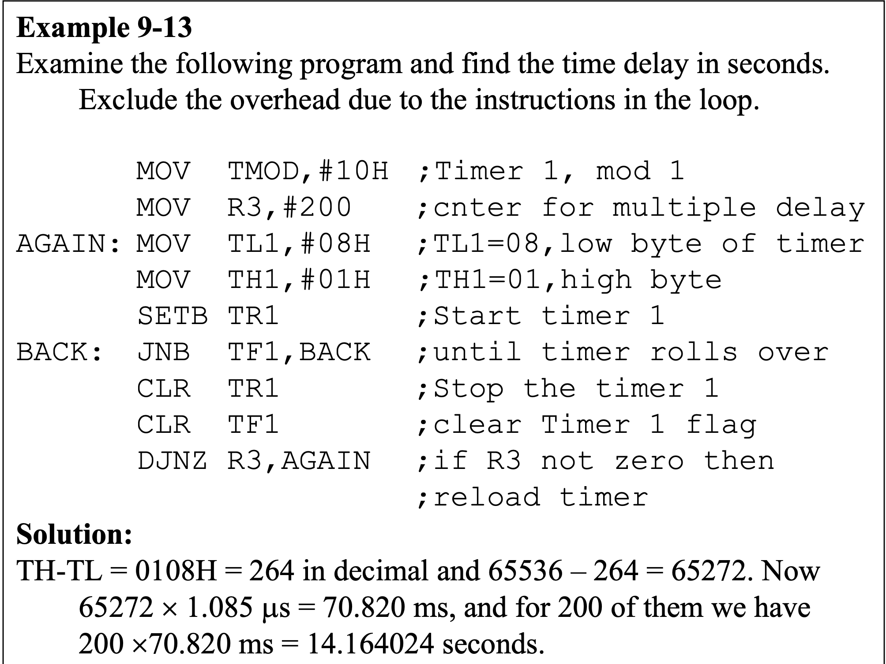
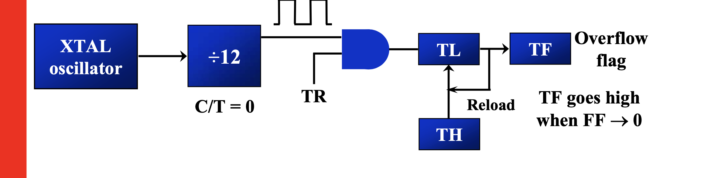

## Timers : 
The 8051 has two timers/counters, they can be used either as Timers to generate a time delay or as Event counters to count events happening outside the microcontroller
- Both Timer 0 and Timer 1 are 16 bits wide
- Since 8051 has an `8-bit architecture`, each 16-bits timer is accessed as two separate registers of low byte and high byte.
- Accessed as low byte and high byte
The low byte register is called `TL0/TL1`(D0-D7)
and
The high byte register is called `TH0/TH1`(D8-D15)
example : MOV TL0, #4FH
MOV R5,TH0

### TMOD Register:
In the 8051 microcontroller, the TMOD (Timer Mode) register is used to configure the operation mode of Timer 0 and Timer 1. It is an 8-bit register, where:
- The lower 4 bits configure Timer 0.
- The upper 4 bits configure Timer 1.
| GATE | C/T | M1 | M0 | GATE | C/T | M1 | M0 |
|  T1  | T1  | T1 | T1 |  T0  | T0  | T0 | T0 |

- Bit Descriptions (for both Timer 0 and Timer 1):
| Bit  | Name | Description                                                                  |
| ---- | ---- | ---------------------------------------------------------------------------- |
| 7, 3 | GATE | 1 = Timer only runs when INTx pin is high and TRx bit is set.                |
| 6, 2 | C/T  | 0 = Timer mode (uses internal clock), 1 = Counter mode (external input pin). |
| 5, 1 | M1   | Mode select bit 1                                                            |
| 4, 0 | M0   | Mode select bit 0                                                            |

- Timer Modes (M1 M0):
| M1 | M0 | Mode | Description                                    |
| -- | -- | ---- | ---------------------------------------------- |
| 0  | 0  | 0    | 13-bit Timer (only in Timer 0)                 |
| 0  | 1  | 1    | 16-bit Timer                                   |
| 1  | 0  | 2    | 8-bit auto-reload                              |
| 1  | 1  | 3    | Split timer mode (Timer 0 as two 8-bit timers) |

MOV TMOD, #00000001B ; Set Timer 0 in Mode 1 (16-bit timer mode)

### Timer’s clock frequency
> timer’s clock frequency = 1/12 * crystal frequency.
> period = 1/timer’s clock frequency = 12/crystal frequency.

### Timers of 8051 do starting and stopping by either software or hardware control 
1. Software Control
In software control, the programmer starts or stops the timer using instructions that manipulate bits in the TCON (Timer Control) register.

| Bit | Name   | Description                                   |
| --- | ------ | --------------------------------------------- |
| TF1 | TCON.7 | Timer 1 overflow flag                         |
| TR1 | TCON.6 | Timer 1 run control bit (1 = start, 0 = stop) |
| TF0 | TCON.5 | Timer 0 overflow flag                         |
| TR0 | TCON.4 | Timer 0 run control bit (1 = start, 0 = stop) |

```java
MOV TMOD, #00000001B ; Timer 0, Mode 1 (16-bit timer)
MOV TH0, #0xFC       ; Load high byte for delay
MOV TL0, #0x66       ; Load low byte for delay
> SETB TR0             ; Start Timer 0
AGAIN: JNB TF0, AGAIN ; Wait until Timer 0 overflows
> CLR TR0              ; Stop Timer 0
> CLR TF0              ; Clear overflow flag
```
2. Hardware Control
Hardware control means the timer only runs when a corresponding external interrupt pin is held high (logic 1) and the TRx bit is set.
- This is useful when you want to start a timer only when an external event occurs, such as a switch press or signal from another device.

| Bit   | Name   | Function                                                                       |
| ----- | ------ | ------------------------------------------------------------------------       |
| GATE1 | TMOD.7 | When set to 1, Timer 1 runs only if **INT1(P3.3) pin is high** and **TR1 = 1** |
| GATE0 | TMOD.3 | When set to 1, Timer 0 runs only if **INT0(P3.2) pin is high** and **TR0 = 1** |


```java
MOV TMOD, #00001001B ; Timer 0, Mode 1 with GATE = 1
SETB TR0             ; Set Timer 0 Run bit
; Timer 0 will only start if INT0 is high
```
> Here, GATE0 = 1, so Timer 0 runs only if: TR0 = 1 AND External interrupt pin INT0 is high (logic 1).

## Mode 1 programming
Mode 1 is a 16-bit timer mode. The timer/counter uses THx (high byte) and TLx (low byte) to form a full 16-bit register (range: 0000H to FFFFH, or 0 to 65535 in decimal).
- Useful for creating precise delays or counting large numbers.
- Timer overflows from FFFFH to 0000H, setting the corresponding TFx flag.

### 🧠 Basic Steps to Program Timer 0 in Mode 1
| Step | Action                                                          |
| ---- | --------------------------------------------------------------- |
| 1    | Configure `TMOD` register: set Timer 0 in Mode 1 (`TMOD = 01H`) |
| 2    | Load initial value into `TH0` and `TL0`                         |
| 3    | Set `TR0 = 1` to start the timer                                |
| 4    | Wait for `TF0 = 1` (overflow flag)                              |
| 5    | Clear `TR0` and `TF0`                                           |
| 6    | (Optional) Repeat or return                                     |


### 💻 Example Assembly Program (Delay using Timer 0, Mode 1)
```java
ORG 0000H           ; Start of program memory
START:
    MOV TMOD, #01H  ; Timer 0 Mode 1 (16-bit)
    MOV TH0, #0FCH  ; Load high byte (for delay)
    MOV TL0, #66H   ; Load low byte
    SETB TR0        ; Start Timer 0
WAIT: JNB TF0, WAIT   ; Wait for TF0 to become 1 (overflow)
    CLR TR0         ; Stop Timer 0
    CLR TF0         ; Clear overflow flag
    SJMP START      ; Repeat the loop
END
```

EXAMPLE :


### CALCULATION OF DEALY :
- The timer works with a clock frequency of 1/12 of the XTAL frequency; therefore, we have 11.0592 MHz / 12 = 921.6 kHz as the timer frequency. As a result, each clock has a period of T = 1/921.6kHz = 1.085us. In other words, Timer 0 counts up each 1.085 us resulting in `delay = number of counts × 1.085us.`
- The number of counts for the roll over is FFFFH – FFF2H = 0DH (13 decimal). However, we add one to 13 because of the extra clock needed when it rolls over from FFFF to 0 and raise the TF flag. This gives 14 × 1.085us = 15.19us for half the pulse. For the entire period it is T = 2 × 15.19us = 30.38us as the time delay generated by the timer.

### OVERHEAD DELAY
- 14 CYCLES EXTRA


### HIGHEST DELAY:


### REPEATED DELAY:


### Assume that XTAL = 11.0592 MHz, write a program to generate a square wave of 2 kHz frequency on pin P1.5.
- T = 1 / f = 1 / 2 kHz = 500 us the period of square wave.
- 1 / 2 of it for the high and low portion of the pulse is 250 us.
- 250 us / 1.085 us = 230 and 65536 – 230 = 65306 which in hex is FF1AH.

```java
ORG 0000H          ; Program start

START:
    MOV TMOD, #01H ; Timer 0 Mode 1 (16-bit timer)

TOGGLE:
    CPL P1.5       ; Toggle P1.5
    ACALL DELAY    ; Call delay for 250 µs
    SJMP TOGGLE    ; Repeat forever

; --- Delay Subroutine: 250 µs using Timer 0 ---
DELAY:
    MOV TH0, #0FFH ; Load high byte
    MOV TL0, #026H ; Load low byte
    SETB TR0       ; Start Timer 0
WAIT:
    JNB TF0, WAIT  ; Wait until overflow
    CLR TR0        ; Stop timer
    CLR TF0        ; Clear overflow flag
    RET            ; Return from delay

END
```

## MODE 2 PROG
- Mode 2 is an 8-bit timer mode with auto-reload.
- It uses only TLx for counting (low byte).
- The value to be reloaded is stored in THx.
- When TLx overflows (from 0xFF → 0x00):
- Timer flag TFx is set,
- TLx is automatically reloaded from THx,
- No need to manually reload every time.


- AUTO RELOAD OF VALUES.


- The advantage of using negative values is that you don’t need to calculate the value loaded to THx.
EG : -12 is F4H (2s complement) => 12 count.


## COUNTER PROGRAMMING

| Feature      | **Timer Mode**                  | **Counter Mode**                          |
| ------------ | ------------------------------- | ----------------------------------------- |
| Input source | Internal clock (machine cycles) | External pulses on T0 (P3.4) or T1 (P3.5) |
| Use case     | Delay generation, timekeeping   | Event counting (e.g., counting people)    |
| Control bit  | `C/T` = 0 (Timer)               | `C/T` = 1 (Counter)                       |

🛠 Step-by-step Setup:
1. Set TMOD Registe
Use C/T = 1 (bit 2 for Timer 0, bit 6 for Timer 1)
Mode 0/1/2 for 13-bit, 16-bit, or 8-bit auto-reload
Example:
MOV TMOD, #05H ; Timer 0, Mode 1, Counter mode (00000101)

2. Apply External Pulses to P3.4 (for T0) or P3.5 (for T1)
Every rising edge on the pin will increment the counter.

3. Start the Counter
SETB TR0  ; Start counting external pulses

4. Check Count Value in TL0/TH0
Read how many pulses have been counted.

5. Detect Overflow (optional)
Use TF0 to detect when counter overflows.


### Mode 1 and Mode 2 counter diagrams 


### 🔍 Overview of TCON Register

Bit:   | TF1 | TR1 | TF0 | TR0 | IE1 | IT1 | IE0 | IT0 |
       |-----|-----|-----|-----|-----|-----|-----|-----|
Bit #: |  7  |  6  |  5  |  4  |  3  |  2  |  1  |  0  |
