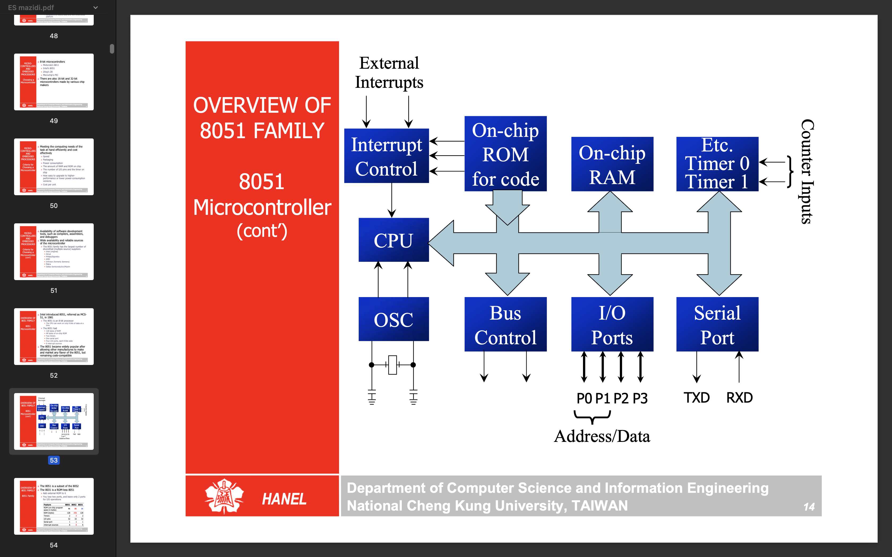

## Overview of the 8051 family:
The 8051 is an 8-bit microcontroller developed by Intel in 1980. It became a standard due to its simplicity, versatility, and ease of use in embedded system development.

### ✅ 2. Key Features
- 8-bit CPU (data bus is 8-bit wide)

- Harvard architecture (separate program and data memory)

- Clock speed: Typically 12 MHz (with 1 instruction per 1 µs)

- 128 bytes of RAM

- 4 KB of ROM (on-chip)

- 32 I/O lines (4 ports: P0–P3, each 8-bit)

- 2 Timers/Counters (Timer 0 and Timer 1)

- 1 Serial port (UART)

- 5 interrupt sources (2 external, 3 internal)

### other poinbts
- The 8051 is a subset of the 8052
- The 8031 is a ROM-less 8051

- 8051 vs 8031 vs 8052

### Registers in 8051 
- The vast majority of 8051 register are 8-bit registers.(D7(MSB)-D0(LSB))
- Any data larger than 8 bits must be broken into 8-bit chunks before it is processed.

✅ 1. General Purpose Registers (R0–R7)
- Located in Register Bank 0–3 (each bank has 8 registers)
- Address range: 00H to 1FH
- You can select which bank is active via PSW (bits RS0 and RS1)
| Bank   | Address Range |
| ------ | ------------- |
| Bank 0 | 00H–07H       |
| Bank 1 | 08H–0FH       |
| Bank 2 | 10H–17H       |
| Bank 3 | 18H–1FH       |

✅ 2. Special Function Registers (SFRs)
- Located in upper RAM area: 80H to FFH
- Used to control internal operations like I/O, timers, serial port, etc.

| Register | Description                       | Address |
| -------- | --------------------------------- | ------- |
| A        | Accumulator                       | E0H     |
| B        | Used in multiplication/division   | F0H     |
| PSW      | Program Status Word (flags, bank) | D0H     |
| SP       | Stack Pointer                     | 81H     |
| DPL/DH   | Data Pointer Low/High (DPTR)      | 82H/83H |
| P0–P3    | Port latches                      | 80H–B0H |
| TMOD     | Timer Mode                        | 89H     |
| TCON     | Timer Control                     | 88H     |
| SCON     | Serial Control                    | 98H     |
| SBUF     | Serial Buffer                     | 99H     |
| IE       | Interrupt Enable                  | A8H     |
| IP       | Interrupt Priority                | B8H     |
