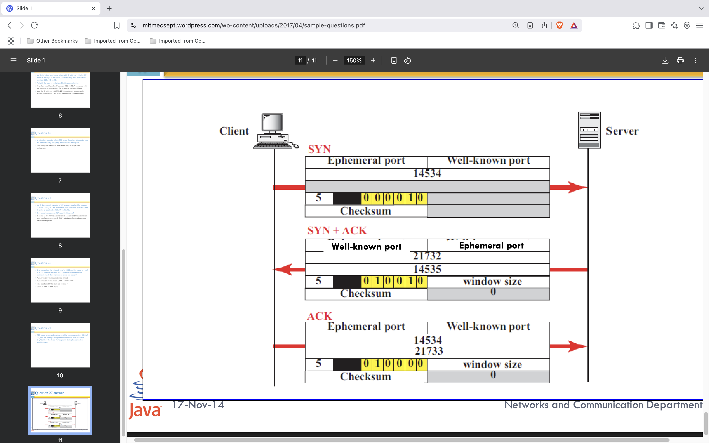

## 15363049 163A92BC 00004199 700207FF 00000000 02040155 03030700

Options Used

Option 1: Maximum Segment Size (MSS)
Option 2: No-Operation (NOP)
Option 3: Window Scale
i. Values of the Options Used

MSS Value: 0x0155 (341 in decimal)
Window Scale Factor: 0x03 (3 in decimal)

## A router receives an IP packet with source IP address 130.45.3.3 and destination IP address 201.23.4.6. The router cannot find the destination IP address in its routing table. Fill in the fields for the ICMP message sent.
Answer:
Since the destination is unreachable, the router sends an ICMP Destination Unreachable message.

Type: 3 (Destination Unreachable)
Code: 0 (Network Unreachable)
Source IP: 130.45.3.3 (Router's IP)
Destination IP: 201.23.4.6 (Original packet’s sender)
Data: Includes the original packet’s IP header and first 8 bytes of data.

## An ICMP message has arrived with the header (in hexadecimal):
---
05  00   11 12   11 08 03 02
│   │     ││      └───────┬── last 4 bytes [Extended addrres ] => new better route (IP Address: 17.8.3.2)
│   │     │└─ checksum
│   │     └── checksum
│   └── code
└── type

05 00 11 12 11 08 03 02
(a) What is the type of message?
The first byte 05 indicates Redirect Message (ICMP Type 5).
(b) What is the code?
The second byte 00 represents Redirect Datagram for the Network.
(c) What is the purpose of the message?
An ICMP Redirect message informs the sender that there is a better route available for the packet.
(d) What is the value of the last 4 bytes and what do they signify?
The last four bytes (11 08 03 02) indicate the new gateway address to which the sender should send future packets.

## TCP opens a connection using an initial sequence number (ISN) of 14,534. The other party opens the connection with an ISN of 21,732.
- SYN , SYN+ACK , ACK => respective flags UA PRS F

2. Show the contents of the segments during the data transmission if the initiator sends a segment containing the message "Hello dear customer" and the other party answers with a segment containing "Hi there seller."
ANSWER:
---
1. Client → Server:
Sequence Number (SEQ): 14,535
Acknowledgment Number (ACK): 21,733
Flags: PSH, ACK
Payload: "Hello dear customer"

2. Server → Client:
Sequence Number (SEQ): 21,733
> Acknowledgment Number (ACK): 14,555 (14,535 + 20)
Flags: PSH, ACK
Payload: "Hi there seller."

3. Client → Server:
Sequence Number (SEQ): 14,555
> Acknowledgment Number (ACK): 21,749 (21,733 + 16)
Flags: ACK
Payload: None
---

3. iii. Show the contents of the segments during the connection termination.
TCP terminates a connection using a four-step process, often referred to as a four-way handshake. This ensures that both parties have concluded their data transmission and acknowledge the termination.

1. Initial Context:
Client's Initial Sequence Number (ISN): 14,534
Server's ISN: 21,732
Data Exchanged:
Client sent: "Hello dear customer" (20 bytes)
Server replied: "Hi there seller." (16 bytes)

2. Sequence Number Progression:
After data transmission:
Client's sequence number: 14,534 (ISN) + 20 (data) = 14,554
Server's sequence number: 21,732 (ISN) + 16 (data) = 21,748

3. Now, let's walk through the connection termination steps:

    1. Client Initiates Termination (FIN)
    Sequence Number (SEQ): 14,554
    Acknowledgment Number (ACK): 21,748
    Flags: FIN, ACK

    2. Server Acknowledges FIN
    Sequence Number (SEQ): 21,748
    Acknowledgment Number (ACK): 14,555 (Client's SEQ + 1)
    Flags: ACK

    3. Server Sends Its Own FIN
    Sequence Number (SEQ): 21,748
    Acknowledgment Number (ACK): 14,555
    Flags: FIN, ACK

    4. Client Acknowledges Server's FIN
    Sequence Number (SEQ): 14,555
    Acknowledgment Number (ACK): 21,749 (Server's SEQ + 1)
    Flags: ACK

## A computer sends a timestamp request to another computer. It receives the corresponding timestamp reply at 3:46:07 AM. The values of the:

---
All values are in milliseconds since midnight.

Timestamps:

T1 (Originate time) = time request was sent = 13,560,000 ms

T2 (Receive time) = time request arrived at remote = 13,562,000 ms

T3 (Transmit time) = time reply left remote = 13,564,000 ms

T4 = time reply was received = ?

We’re told that the reply is received at 3:46:07 AM.
Convert to milliseconds since midnight:

3 hrs = 3 × 3600 = 10,800 s

46 mins = 46 × 60 = 2760 s

7 s

Total seconds = 10,800 + 2760 + 7 = 13,567 s

In ms: 13,567,000 ms = T4

1. Sending Trip Time
This is the time for the request to reach the other computer:
> Sending time = T2 - T1 = 13,562,000 - 13,560,000 = 2,000 ms
Sending time = Recieve time - send time 

2. Receiving Trip Time
This is the time for the reply to return to the original sender:
> Receiving time = T4 - T3 = 13,567,000 - 13,564,000 = 3,000 ms
Receiving time= RECIEVED TIME - TRNASMIT TIME 

3. Round Trip Time (RTT)
> RTT = Sending + Receiving = 2,000 + 3,000 = 5,000 ms

4. Clock Difference
> Clock difference = ((T2 - T1) - (T4 - T3)) / 2
= (2000 - 3000)/2 = -500 ms

So the receiver clock is ahead of the sender clock by 500 ms.

✅ Final Answers:
Sending trip time = 2,000 ms

Receiving trip time = 3,000 ms

Round trip time = 5,000 ms

Clock difference = -500 ms (receiver is 500 ms ahead)

