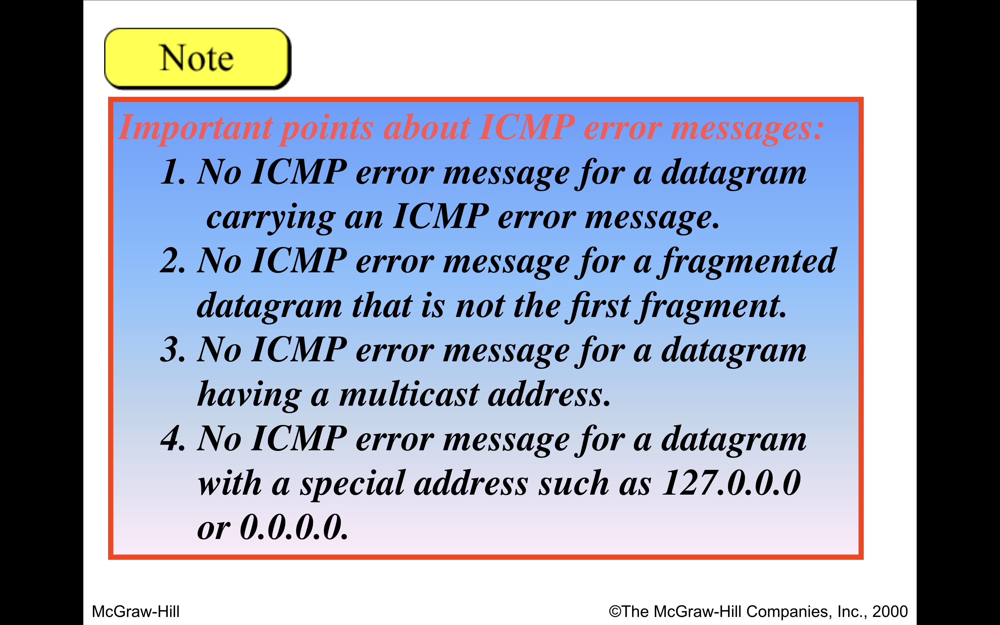

# TRANSPORT LAYER

## TCP/IP
Transmission Control Protocol/Internet Protocol

## TCP Header

-------------------------------------------------
|  Source Port        |  Destination Port       |  4 Bytes
-------------------------------------------------
|            Sequence Number                    |  4 Bytes
-------------------------------------------------
|       Acknowledgment Number                   |  4 Bytes
-------------------------------------------------
| HL | Reserved | Flags  |  Window Size         |  4 Bytes
-------------------------------------------------
|    Checksum     |   Urgent Pointer            |  4 Bytes
-------------------------------------------------
|   Options (if any)  |  Data                    | Variable
-------------------------------------------------

- The header of a TCP segment can range from 20-60 bytes. 
- 40 bytes are for options. If there are no options, a header is 20 bytes (32bits(4bytes)*5) else it can be of upmost 60 bytes. 
- Source Port Address – 
A 16-bit field that holds the port address of the application that is sending the data segment. 
eg : 80 for HTTPS requests.

- Destination Port Address – 
A 16-bit field that holds the port address of the application in the host that is receiving the data segment. 
 
- Sequence Number – 
A 32-bit field that holds the sequence number, i.e, (the byte number of the first byte that is sent in that particular segment). It is used to reassemble the message at the receiving end of the segments that are received out of order.
 
- Acknowledgement Number – 
A 32-bit field that holds the acknowledgement number, i.e,( the byte number that the receiver expects to receive next). 
It is an acknowledgement for the previous bytes being received successfully. 
 
- Header Length (HLEN) – 
This is a 4-bit field that indicates the length of the (TCP header by a number of 4-byte words in the header), i.e if the header is 20 bytes(min length of TCP header), then this field will hold 5 (because 5 x 4 = 20) and the maximum length: 60 bytes, then it’ll hold the value 15(because 15 x 4 = 60). 
Hence, the value of this field is always between `5 and 15`. 
 
- Control flags – 
These are 6 1-bit control bits that control connection establishment, connection termination, connection abortion, flow control, mode of transfer etc. Their function is: 
> UA PRS F
- URG: Urgent pointer is valid
- ACK: Acknowledgement number is valid( used in case of cumulative acknowledgement)
- PSH: Request for push
- RST: Reset the connection
- SYN: Synchronize sequence numbers
- FIN: Terminate the connection

- Window size – 
This field tells the window size of the sending TCP in bytes.
Specifies the number of bytes the receiver can accept.

- Checksum – 
This field holds the checksum for error control. It is mandatory in TCP as opposed to UDP. 
 
- Urgent pointer – 
This field (valid only if the URG control flag is set) is used to point to data that is urgently required that needs to reach the receiving process at the earliest. The value of this field is added to the sequence number to get the byte number of the last urgent byte. 

- options :
2 (MSS)	4	05DC (1500 in hex)
3 (Window Scale)	3	06 (Scale factor of 6)
8 (Timestamp)	10	0000AABB 0000CCDD (Timestamps)
1 (NOP)	1	-
0 (EOL)	1	-

## TCP Handshake 
The TCP handshake is a three-way process that occurs between a client and a server to establish a TCP connection. It involves a series of steps where the client and server exchange specific TCP packets. 

1. Step 1: SYN (Synchronize) packet
Example: The client (192.168.1.10) initiates the handshake by sending a TCP packet to the server (10.0.0.1) with the SYN (Synchronize) flag set to 

Packet Format:
Source IP address: 192.168.1.10
Source port number: 4321
Destination IP address: 10.0.0.1
Destination port number: 80
Flags: SYN=1, ACK=0 (other flags, such as FIN or RST, are set to 0)
Sequence number: 1001
Acknowledgment number: 0 (not applicable in this packet)

2. Step 2: SYN-ACK (Synchronize-Acknowledgment) packet
Example: Upon receiving the SYN packet, the server (10.0.0.1) responds with a TCP packet of its own.

Packet format:
Source IP address: 10.0.0.1
Source port number: 80
Destination IP address: 192.168.1.10
Destination port number: 4321
Flags: SYN=1, ACK=1 (other flags are set to 0)
Sequence number: 2001
Acknowledgment number: 1002 (acknowledging the client’s ISN)

3. Step 3: ACK (Acknowledgment) packet
Example: Upon receiving the SYN-ACK packet, the client (192.168.1.10) sends a final TCP packet to the server (10.0.0.1).

Packet format:
Source IP address: 192.168.1.10
Source port number: 4321
Destination IP address: 10.0.0.1
Destination port number: 80
Flags: SYN=0, ACK=1 (other flags are set to 0)
Sequence number: 1002
Acknowledgment number: 2002 (acknowledging the server’s ISN)

### Timers in TCP
- Retransmission Timer – To retransmit lost segments, TCP uses retransmission timeout (RTO). When TCP sends a segment the timer starts and stops when the acknowledgment is received. If the timer expires timeout occurs and the segment is retransmitted. RTO (retransmission timeout is for 1 RTT) to calculate retransmission timeout we first need to calculate the RTT(round trip time).

- Persistent Timer – To deal with a zero-window-size deadlock situation, TCP uses a persistence timer. When the sending TCP receives an acknowledgment with a window size of zero, it starts a persistence timer. When the persistence timer goes off, the sending TCP sends a special segment called a probe. This segment contains only 1 byte of new data. It has a sequence number, but its sequence number is never acknowledged; it is even ignored in calculating the sequence number for the rest of the data. The probe causes the receiving TCP to resend the acknowledgment which was lost.

- Keep Alive Timer – A keepalive timer is used to prevent a long idle connection between two TCPs. If a client opens a TCP connection to a server transfers some data and becomes silent the client will crash. In this case, the connection remains open forever. So a keepalive timer is used. Each time the server hears from a client, it resets this timer. The time-out is usually 2 hours. If the server does not hear from the client after 2 hours, it sends a probe segment. If there is no response after 10 probes, each of which is 75 s apart, it assumes that the client is down and terminates the connection.

- Time Wait Timer – This timer is used during tcp connection termination. The timer starts after sending the last Ack for 2nd FIN and closing the connection.
After a TCP connection is closed, it is possible for datagrams that are still making their way through the network to attempt to access the closed port. The quiet timer is intended to prevent the just-closed port from reopening again quickly and receiving these last datagrams.

## UDP
User Datagram Protocol (UDP) is a Transport Layer protocol. UDP is a part of the Internet Protocol suite, referred to as UDP/IP suite. Unlike TCP, it is an unreliable and connectionless protocol. So, there is no need to establish a connection before data transfer. The UDP helps to establish low-latency and loss-tolerating connections over the network. The UDP enables process-to-process communication.

Source Port: Source Port is a 2 Byte long field used to identify the port number of the source.
Destination Port: It is a 2 Byte long field, used to identify the port of the destined packet.
Length: Length is the length of UDP including the header and the data. It is a 16-bits field.
Checksum: Checksum is 2 Bytes long field. It is the 16-bit one’s complement of the one’s complement sum of the UDP header, the pseudo-header of information from the IP header, and the data, padded with zero octets at the end (if necessary) to make a multiple of two octets.

## UDP VS TCP

# NETWORK LAYER

## IP Header

IPv4 Datagram Header
- VERSION: Version of the IP protocol (4 bits), which is 4 for IPv4 
- HLEN: IP header length (4 bits), which is the number of 32 bit words in the header. The minimum value for this field is 5 and the maximum is 15.
- Type of service: Low Delay, High Throughput, Reliability (8 bits) 
Differentiated Services Code Point (DSCP).
3 bits	Precedence (Priority)
4 bits	Delay, Throughput, Reliability ,C=Cost 
1 bit	Explicit Congestion Notification (ECN)
PPPDTRCE

- Total Length: Length of header + Data (16 bits), which has a minimum value 20 bytes and the maximum is 65,535 bytes. 
- Identification: Unique Packet Id for identifying the group of fragments of a single IP datagram (16 bits) 
- Flags: 3 flags of 1 bit each : reserved bit (must be zero), do not fragment flag, more fragments flag (same order) 
- Fragment Offset: Represents the number of Data Bytes ahead of the particular fragment in the particular Datagram. Specified in terms of number of 8 bytes, which has the maximum value of 65,528 bytes. 
- Time to live: Datagram’s lifetime (8 bits), It prevents the datagram to loop through the network by restricting the number of Hops taken by a Packet before delivering to the Destination.
- Protocol: Name of the protocol to which the data is to be passed (8 bits).
names of protocols used in upper layer.
- Header Checksum: 16 bits header checksum for checking errors in the datagram header 
- Source IP address: 32 bits IP address of the sender 
- Destination IP address: 32 bits IP address of the receiver 
- Option: Optional information such as source route, record route. Used by the Network administrator to check whether a path is working or not.
 - Record Routing : 
 
 max of 9 (36+4 extra info)
- Strict source Route 

predefine all routes of source .
- Loose source Route : 
some defined
- Padding : 
Padding is used to ensure that the IP packet header has a length that is a multiple of 32 bits.

## ICMP
Internet Control Message Protocol is known as ICMP. The protocol is at the network layer. It is mostly utilized on network equipment like routers and is utilized for error handling at the network layer. Since there are various kinds of network layer faults, ICMP can be utilized to report and troubleshoot these errors.
- Format of ICMP Messgaes : 

- Commonly used tools:
ping: Sends ICMP Echo Request and listens for Echo Reply to check if a host is reachable.
traceroute: Uses ICMP (or sometimes UDP) to map the path packets take to a destination.
- imp points 

1. query messages: 
Unlike error-reporting ICMP messages (like Destination Unreachable or Time Exceeded), ICMP query messages are used for network diagnostics and operational checks. They involve requests and replies—often used to test connectivity or gather network info.
    | Type | Code | Message                  | Purpose                              |
    | ---- | ---- | ------------------------ | ------------------------------------ |
    | 0    | 0    | **Echo Reply**           | Response to an Echo Request          |
    | 8    | 0    | **Echo Request**         | Sent to check if a host is reachable |
    | 13   | 0    | **Timestamp Request**    | Requests time info from a host       |
    | 14   | 0    | **Timestamp Reply**      | Replies with time info               |
    | 15   | 0    | **Information Request**  | (Obsolete) Ask for host address info |
    | 16   | 0    | **Information Reply**    | (Obsolete) Reply with address info   |
    | 17   | 0    | **Address Mask Request** | Request a subnet mask                |
    | 18   | 0    | **Address Mask Reply**   | Reply with subnet mask               |

 - router alicitation and advertisement : when new router is introduced . Type = 10.
 - Echo messages and reply : Used to check host availability (ping command).
 - Timestamp messages : to a timestamp request for Round time trip.

### What is Agent Solicitation?
Agent Solicitation is a mechanism used by mobile nodes (devices) to request agent advertisements from routers (typically in Mobile IP scenarios). It helps the device discover whether it is in a home or foreign network and determine how to route traffic appropriately.

- ICMP Router Solicitation Message (Type 10 in ICMPv6 or Type 133 in ICMPv4 for Mobile IP) is reused for Agent Solicitation.

- Since agent solicitation and router solicitation share similar goals—discovering network information from routers—no extra fields are required.

- The ICMP message format remains the same; it's simply interpreted differently in Mobile IP.

2. Error reporting messages :
> always reports errors to original source .
 -  Destination Unreachable	: 	Packet could not be delivered (e.g., host down, network unreachable).
 - 	Source Quench (Deprecated)	:	Used for congestion control (now obsolete).
 -	Redirect Message	:	Suggests a better route for packets.
 -	Time Exceeded	:	TTL expired before reaching the destination (used in traceroute).
    | Code | Meaning                               |
    | ---- | ------------------------------------- |
    | 0    | **TTL Exceeded in Transit**           |
    | 1    | **Fragment Reassembly Time Exceeded** |

 -	Parameter Problem :	An issue with the IP header (e.g., missing fields).
    | Code | Meaning                  |
    | ---- | -------------------------|
    | 0    | Main header problem.     |
    | 1    | option field problem.    |
    - Pointer to Error (1 byte) 

| Type | Code | Message Name                   | When It’s Used                                                                            |
| ---- | ---- | ------------------------------ | ----------------------------------------------------------------------------------------- |
| 3    | 0–15 | **Destination Unreachable**    | Sent when a packet cannot reach its destination (e.g., port closed, network unreachable). |
| 4    | 0    | **Source Quench (Deprecated)** | Used to tell a sender to slow down (now obsolete).                                        |
| 5    | 0–3  | **Redirect Message**           | Sent when a router tells the sender to use a better route.                                |
| 11   | 0–1  | **Time Exceeded**              | Sent when TTL (Time to Live) reaches zero (used in `traceroute`).                         |
| 12   | 0–1  | **Parameter Problem**          | Sent when a packet header has invalid or missing fields.                                  |

- extended header is unised all 0s
- error message is ICMP header + IP header and 8 bytes of datagram data ; 

## IGMP (Internet Group Management Protocol) 
is a communication protocol used in IPv4 networks to manage multicast group memberships. It allows devices (hosts and routers) to communicate about joining or leaving multicast groups.
IGMP Version	Features
IGMPv1 (1989)	Hosts can join a multicast group; routers periodically query.
IGMPv2 (1997)	Supports leave messages for faster group departure.
IGMPv3 (2002)	Allows source filtering (join multicast groups from specific sources).

- IGMP Message Types
IGMP messages are exchanged between hosts and routers. The main message types are:
1. Membership Query (Type 0x11)	Sent by routers to ask which devices want multicast traffic.	v1, v2, v3
Message Type: 0x11

Who Sends It?: Router

Purpose: Asks hosts if they are still interested in receiving multicast traffic for a group.

🔹 Variants:
Query Type	    IGMP Version	                Meaning
General Query	v2 & v3	                    Sent to 224.0.0.1 asking all hosts to report all group memberships.
Group-Specific Query	v2 & v3	           Sent to a specific group (e.g. 224.1.1.1) to check if any hosts still want this group.
Group-and-Source-Specific Query	IGMPv3      only	Checks if hosts still want data from specific sources of a group.

2. Membership Report (Type 0x16, 0x22)	Sent by hosts to join a multicast group.	v1, v2, v3

✅ 2. Membership Report
Message Type (v2): 0x16

Message Type (v3): 0x22

Who Sends It?: Host

Purpose: Informs routers that the host wants to join or is already a member of a multicast group.

🔹 IGMPv2:
Simple: Just tells the router, "I want to join group X."

🔹 IGMPv3 (Enhanced):
Supports source filtering:

INCLUDE mode: "I want traffic only from these sources."

EXCLUDE mode: "I want traffic from all sources except these."

This allows source-specific multicast (SSM), which improves security and efficiency.

3. Leave Group (Type 0x17)	Sent by hosts to leave a multicast group (v2 and later).	v2, v3

✅ 3. Leave Group
Message Type: 0x17

Who Sends It?: Host

Purpose: Sent by a host when it no longer wants to receive multicast traffic for a group.

🔹 Behavior:
Sent to the multicast group address.

Router may follow up with a Group-Specific Query to check if any other host still wants the group.

### mESSAGE FORMAT 

+-+-+-+-+-+-+-+-+-+-+-+-+-+-+-+-+-+-+-+-+-+-+-+-+-+-+-+-+-+-+-+-+
|  Type (8)     | Max Resp Time |       Checksum                |
+-+-+-+-+-+-+-+-+-+-+-+-+-+-+-+-+-+-+-+-+-+-+-+-+-+-+-+-+-+-+-+-+
|                         Group Address                         |
+-+-+-+-+-+-+-+-+-+-+-+-+-+-+-+-+-+-+-+-+-+-+-+-+-+-+-+-+-+-+-+-+

- Multicast group IP address (e.g., 224.0.0.1)
- Set to 0.0.0.0 in general queries

### points :
1. Protocol Field is Set to 2 in the IPv4 header to indicate that the payload is an IGMP message and TTL is set 1.

## X.25
X.25 is a protocol suite developed by the International Telecommunication Union (ITU-T) for packet-switched wide area network (WAN) communication. It was designed to facilitate reliable data transmission over public data networks, particularly those utilizing analog telephone lines, which were prone to errors.

🧱 X.25 Protocol Layers
X.25 corresponds to the lower three layers of the OSI (Open Systems Interconnection) model:

1. Physical Layer (Layer 1):
Function: Defines the electrical and mechanical aspects of the physical connection between DTE and DCE.
Example: Specifies voltage levels, connector types, and transmission rates.

2. Data Link Layer (Layer 2):
Protocol: Link Access Procedure Balanced (LAPB)
- Although Link Access Protocol (LAP) can be used with X.25, most commonly LAPB (a variation on the HDLC frame format) is used to provide balanced relationships where either device can send commands and receive responses.

Function: Ensures error-free transmission between DTE and DCE by handling framing, error detection, and retransmission of corrupted frames.

3. Packet Layer (Layer 3):
Protocol: Packet Layer Protocol (PLP)

   1. General Format Identifier (GFI): This defines the sequencing requirements and contains; the Qualifier (Q) bit which identifies information destined for PADs; the Delivery (D) bit which calls for end to end acknowledgment and the Sequence Number (SN) which describes whether the number sequence used is modulo 8 or modulo 128.
    2. Logical Channel Identifier (LCI): This identifies the virtual circuit (whether Switched or Permanent) between the two end stations and is made up of the 4-bit Logical Channel Group Number (LCGN) and the 8-bit Logical Channel Number (LCN). The virtual circuit is locally significant and can change from call setup to call setup.
    3. Packet Type Identifier (PTI): This describes the packet type as tabled below:
    Hex Code	DTE to DCE	DCE to DTE
    0B	Call Request	Incoming Call
    OF	Call Accept	Call Connected
    13	Clear Request	Clear Indication
    17	DTE Clear Confirmation	DCE Clear Confirmation
    x1	DTE RR	DCE RR
    x5	DTE RNR	DCE RNR
    x9	DTE REJ	DCE REJ
    1D	Reset Request	Reset Indication
    1F	DTE Reset Confirmation	DCE Reset Confirmation
    FD	Restart Request	Restart Indication
    FF	DTE Restart Confirmation	DCE Restart Confirmation
    Using the above PTI types, PLP operates in five stages:
    Call Setup
    Data Transfer
    Idle - used once the SVC is up but no data transfer is occurring.
    Call Clearing
    Restarting
    PVCs are permanently in Data Transfer mode.
    
Function: Manages the establishment, maintenance, and termination of virtual circuits, and handles packet sequencing and flow contrOL.

