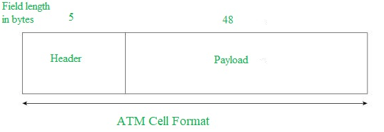
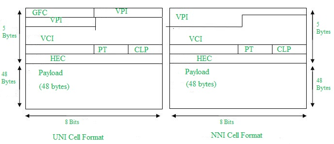
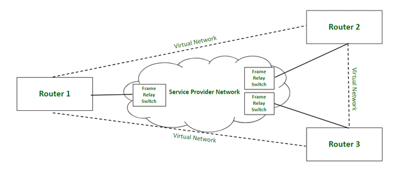
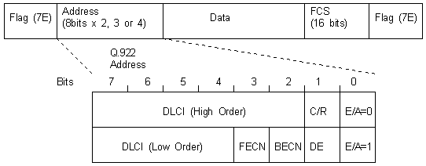
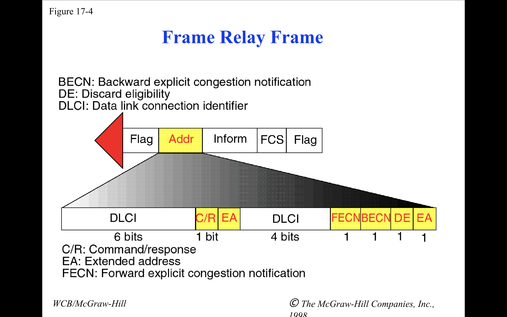
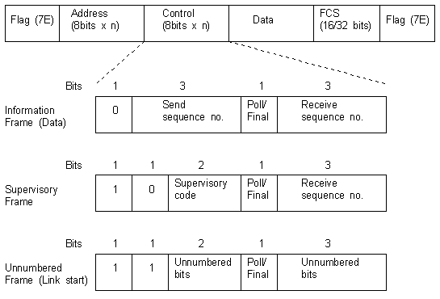

## ATM networks ( Asynchronous Transfer Mode )
It is an International Telecommunication Union- Telecommunications Standards Section (ITU-T) efficient for call relay and it transmits all information including multiple service types such as data, video, or voice which is conveyed in small fixed-size packets called cells. Cells are transmitted asynchronously and the network is connection-oriented. 

### Why ATM networks? 
1. Driven by the integration of services and performance requirements of both telephony and data networking: “broadband integrated service vision” (B-ISON). 
 
2. Telephone networks support a single quality of service and are expensive to boot. 
 
3. Internet supports no quality of service but is flexible and cheap. 
 
4. ATM networks were meant to support a range of service qualities at a reasonable cost- intended to subsume both the telephone network and the Internet. 

### ATM Cell Format – 
As information is transmitted in ATM in the form of fixed-size units called cells. As known already each cell is 53 bytes long which consists of a 5 bytes header and 48 bytes payload. 

 
- Asynchronous Transfer Mode can be of two format types which are as follows: 

1. UNI (User-Network Interface) Header: This is used within private networks of ATMs for communication between ATM endpoints and ATM switches. It includes the Generic Flow Control (GFC) field. 

1. NNI (Networkx-Network Interface) Header: is used for communication between ATM switches, and it does not include the Generic Flow Control(GFC) instead it includes a Virtual Path Identifier (VPI) which occupies the first 12 bits. 

### Working of ATM: 
ATM standard uses two types of connections. i.e., Virtual path connections (VPCs) which consist of Virtual channel connections (VCCs) bundled together which is a basic unit carrying a single stream of cells from user to user. A virtual path can be created end-to-end across an ATM network, as it does not rout the cells to a particular virtual circuit. In case of major failure, all cells belonging to a particular virtual path are routed the same way through the ATM network, thus helping in faster recovery. 

## Frame Relay :
Frame Relay is a packet-switching network protocol or virtual circuit network protocol that is designed to work at the data link layer of the network. It is used to connect Local Area Networks (LANs) and transmit data across Wide Area Networks (WANs).

- Frame relay frame 
 
 
- Frame Relay normally modifies the HDLC header from a 1 byte address field to a 2 byte address field, as seen above. You can have a 3 or 4 byte format as well. In addition, there is no Control field!
Starting Delimiter Flag - 0x7E
High order 6 bits of DLCI address
Command/Response used by higher order applications for end-to-end control
Extended Address bit which indicates whether this octet is the last one in the header. 0 means more to follow and 1 means that this is the end.
Low order 4 bits of DLCI address
Forward Explicit Congestion Notification (FECN) bit
Backward Explicit Congestion Notification (FECN) bit
Discard Eligibility (DE) bit
Extended Address bit. In this case, this is a 1, but there can be more address bits to follow to give 17 bits (3-byte address field) or 24 bits (4-byte address field).
Data - can be up to 16,000 octets, but the 16-bit FCS generally limits the whole frame size to 4096 octets.
Frame Check Sequence (FCS)
Ending Delimiter Flag - 0x7E

## 🛰️ HDLC (High-Level Data Link Control)
HDLC is a bit-oriented protocol used for data communication over point-to-point and multipoint links. It is defined by ISO and is used at the Data Link Layer (Layer 2) of the OSI model.
| Feature                      | Description                                        |
| ---------------------------- | -------------------------------------------------- |
| **Protocol Type**            | Bit-oriented protocol                              |
| **Layer**                    | Data Link Layer (Layer 2)                          |
| **Communication**            | Point-to-point and multipoint                      |
| **Error Control**            | Yes (uses CRC)                                     |
| **Flow Control**             | Yes                                                |
| **Framing**                  | Uses flags (`01111110`) to define frame boundaries |
| **Synchronous Transmission** | Yes                                                |

📥 Types of HDLC Frames:

| Frame Type  | Meaning           | Use Case                                         |
| ----------- | ----------------- | ------------------------------------------------ |
| **I-frame** | Information frame | Carries user data and control info               |
| **S-frame** | Supervisory frame | Used for flow and error control                  |
| **U-frame** | Unnumbered frame  | For link management (setup, disconnection, etc.) |

