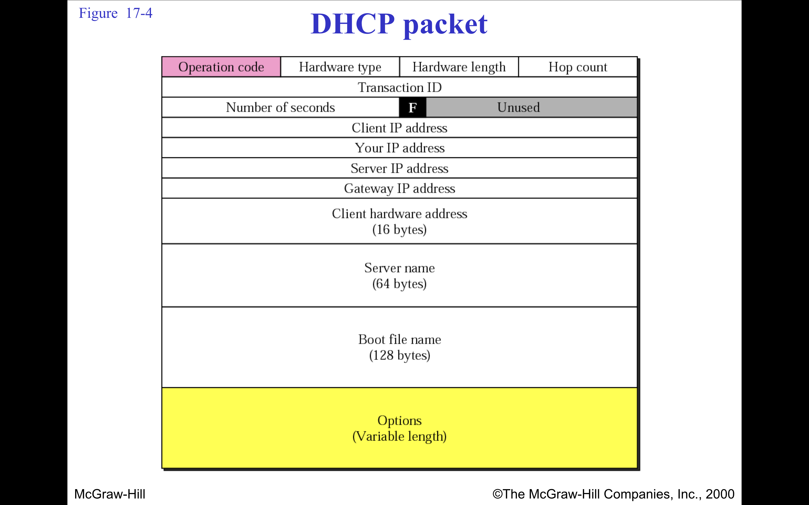

## 1. 🧭 ARP (Address Resolution Protocol)
When a device wants to communicate with another device on the same LAN and knows its IP address but not its MAC address, it uses ARP to discover the MAC address:
Steps:
1. ARP Request: The sender broadcasts an ARP request packet to all devices on the LAN, asking, "Who has IP address X.X.X.X?"

2. ARP Reply: The device with the matching IP address responds with an ARP reply, providing its MAC address.

3. Caching: The sender stores this IP-to-MAC mapping in its ARP cache for future communications, reducing the need for repeated ARP requests.

**Used to resolve IP address to MAC address.**

Address Resolution Protocol (ARP) is a protocol or procedure that connects an ever-changing Internet Protocol (IP) address to a fixed physical machine address, also known as a media access control (MAC) address, in a local-area network (LAN).
or 
- PHYSICAL ADD -----ARP-----> LOGICAL ADD .
- LOGICAL ADD  -----RARP----> PHYSICAL ADD .
 - This mapping procedure is important because the lengths of the IP and MAC addresses differ, and a translation is needed so that the systems can recognize one another. The most used IP today is IP version 4 (IPv4). An IP address is 32 bits long. However, MAC addresses are 48 bits long. ARP translates the 32-bit address to 48 and vice versa.

- An ARP request is broadcast;   an ARP reply is unicast. (rarp as well)
- The RARP request packets are  broadcast;  the RARP reply packets are  unicast.

### 📄 ARP Packet Format (28 bytes):

| Field Name              | Size (bytes) | Description                              |
|-------------------------|--------------|------------------------------------------|
| Hardware Type           | 2            | Type of hardware (Ethernet = 1)          |
| Protocol Type           | 2            | Type of protocol (IP = 0x0800)           |
| Hardware Address Length | 1            | Length of MAC address (usually 6)        |
| Protocol Address Length | 1            | Length of IP address (usually 4)         |
| Operation               | 2            | Request (1) or Reply (2)                 |
| Sender Hardware Address | 6            | MAC address of sender                    |
| Sender Protocol Address | 4            | IP address of sender                     |
| Target Hardware Address | 6            | MAC address of target (0 for request)    |
| Target Protocol Address | 4            | IP address of target                     |

---

> RARP same packet format and encapsulartion , Operation is 3 and 4 respectively for request and reply .
- Alternatives of RARP are DHCP , BOOTP , THEY PROVIDE extra info like router IP , SUBNET MASK etc otehr than its own IP.

## Encapsulation of ARP
Encapsulation in computer networks is the process of wrapping data with the necessary protocol information before transmission over a network. It is a core concept of the OSI and TCP/IP reference models.
- Although ARP itself does not belong strictly to one layer, it is encapsulated in a frame at the Data Link Layer (e.g., Ethernet) for transmission on the local network.

## 4 cases of using ARP
1. Host A sending to Host B on the same LAN
- Host To Host
Use Case:
When Host A (e.g., 192.168.1.10) wants to send data to Host B (e.g., 192.168.1.20) but doesn’t know Host B’s MAC address.

ARP Action:
Host A sends an ARP Request asking "Who has 192.168.1.20?"
Host B replies with its MAC address.

2. Host sending to a device on another network (via default gateway)
-  Host to Router 
Use Case:
Host A wants to communicate with a remote IP (e.g., 8.8.8.8). Since it's not on the same subnet, the packet must go to the default gateway (router).

ARP Action:
Host A sends an ARP Request for the IP address of the gateway (router), e.g., "Who has 192.168.1.1?"
The router replies with its MAC address, and Host A sends the packet to it.

3. Router forwarding a packet to the next hop
- Router to another Router.
Use Case:
A router needs to forward a packet to the next hop (either to a host or another router), but doesn't have the MAC address of the next hop.

ARP Action:
The router sends an ARP Request for the next hop's IP.
When it gets the MAC in the ARP Reply, it forwards the packet.

4. Router recieves a packet to send to a host on same network .
- Router to Host.

# 📦 Packet Formats for ARP, DHCP, and RIP

---

### 🔹 Ethernet Frame Format Carrying ARP:

| Ethernet Frame Field | Size (bytes) | Description                                  |
|----------------------|--------------|----------------------------------------------|
| Destination MAC      | 6            | Broadcast (`FF:FF:FF:FF:FF:FF`) for request   |
| Source MAC           | 6            | MAC of the sender                            |
| EtherType            | 2            | `0x0806` → Indicates ARP                     |
| ARP Payload          | 28           | The ARP message itself (request or reply)    |
| FCS (CRC)            | 4            | Frame Check Sequence for error checking      |

---

## 2. 📡 DHCP (Dynamic Host Configuration Protocol)

**Used to dynamically assign IP addresses to devices.**

The DHCP process consists of 4 steps, often abbreviated as **DORA**:

1. **Discover**:  
   The client sends a broadcast to locate available DHCP servers.

2. **Offer**:  
   The server responds with an available IP address and config.

3. **Request**:  
   The client requests to lease the offered IP address.

4. **Acknowledge**:  
   The server confirms the IP address assignment.

⌛ Lease Time
IPs are leased for a limited period.

Clients must renew leases before expiration.

If not renewed, IP returns to the DHCP pool.

### 📄 DHCP Packet Format (Based on BOOTP, 236+ bytes):

| Field Name            | Size (bytes) | Description                              |
|-----------------------|--------------|------------------------------------------|
| op                    | 1            | Message type: 1 = request, 2 = reply     |
| htype                 | 1            | Hardware type (Ethernet = 1)             |
| hlen                  | 1            | Hardware address length (Ethernet = 6)   |
| hops                  | 1            | Relay agent hops                         |
| xid                   | 4            | Transaction ID                           |
| secs                  | 2            | Seconds since client started trying      |
| flags                 | 2            | Flags                                    |
| ciaddr                | 4            | Client IP address (if already assigned)  |
| yiaddr                | 4            | 'Your' (client) IP address               |
| siaddr                | 4            | Server IP address                        |
| giaddr                | 4            | Gateway IP address                       |
| chaddr                | 16           | Client hardware address                  |
| sname                 | 64           | Optional server host name                |
| file                  | 128          | Boot file name                           |
| options               | variable     | DHCP options (e.g., lease time, router)  |

---

3. 🔄 BOOTP (Bootstrap Protocol)
BOOTP is a network protocol used by a diskless client computer to obtain an IP address and other configuration parameters from a BOOTP server, typically during the booting process.
- BOOTP laid the groundwork for **DHCP**, which is more dynamic.

| Feature                       | Description                                                        |
| ----------------------------- | ------------------------------------------------------------------ |
| **Purpose**                   | Automatically assigns IP address and boot configuration to clients |
| **Transport Layer Protocol**  | Uses **UDP**                                                       |
| **Port Numbers**              | Client: UDP port **68**, Server: UDP port **67**                   |
| **Direction**                 | Client sends a **BOOTP Request** → Server sends a **BOOTP Reply**  |
| **Supports Diskless Clients** | Used in early networks to help computers boot over the network     |
| **Predecessor of DHCP**       | BOOTP laid the groundwork for **DHCP**, which is more dynamic      |

⚙️ What BOOTP Provides:
IP Address
Subnet Mask
Default Gateway
Boot file name (e.g., operating system image file)
TFTP Server IP (for downloading the boot file)

🖥️ How BOOTP Works (Simplified Steps):

1. Client Broadcasts Request:
The client has no IP yet, so it sends a broadcast BOOTP request on the network.

2. Server Responds with Configuration:
The BOOTP server matches the request using the client’s MAC address, and replies with:
   Assigned IP address
   Boot file location (via TFTP)
   Other network settings

3. Client Boots Using Info:
The client downloads the boot file via TFTP and begins booting.

## BOOTP PACKET FORMAT

### BOOTP OPERATION :

## Mobile IP:
- Mobile IP has two addresses  for a mobile host:  one home address and one care-of address.  The home address is permanent;  the care-of address changes as the mobile  host moves from one network to another.
- When the mobile host and  the foreign agent are the same,  the care-of address is  called a co-located  care-of address.

Summary of Inefficiencies
1. Increased Latency: Due to the use of tunneling and multiple hops (home agent → foreign agent → mobile node).

2. Triangle Routing: Inefficient routing paths leading to unnecessary delays and network load.
   Cause: When a mobile device moves to a new network, packets are initially routed from the sender to the home agent (HA), then to the care-of address (CoA), resulting in a "triangle" route.

   Impact: This inefficient routing path increases the number of hops that data must take, which can lead to higher latency and packet loss, as well as inefficient use of network resources.

   Example: Consider a user moving from one country to another. The data would first go to the home country’s server and then be routed back to the new location, resulting in unnecessary network load and increased time.

3. Scalability Problems: Large-scale networks face difficulty managing large binding tables and high mobility.

4. Security Vulnerabilities: Susceptibility to attacks such as man-in-the-middle or DoS attacks due to tunneling.

5. Home Agent Load: Excessive processing and memory usage at the home agent, especially in large networks.

QoS Challenges: Lack of integrated QoS features for applications requiring stable and high-performance networking.

Handoff Issues: Frequent handoffs cause interruptions, delays, and packet loss, especially in high-mobility environments.

8. Foreign Agent Overhead: Added complexity and resource consumption at the foreign agent.