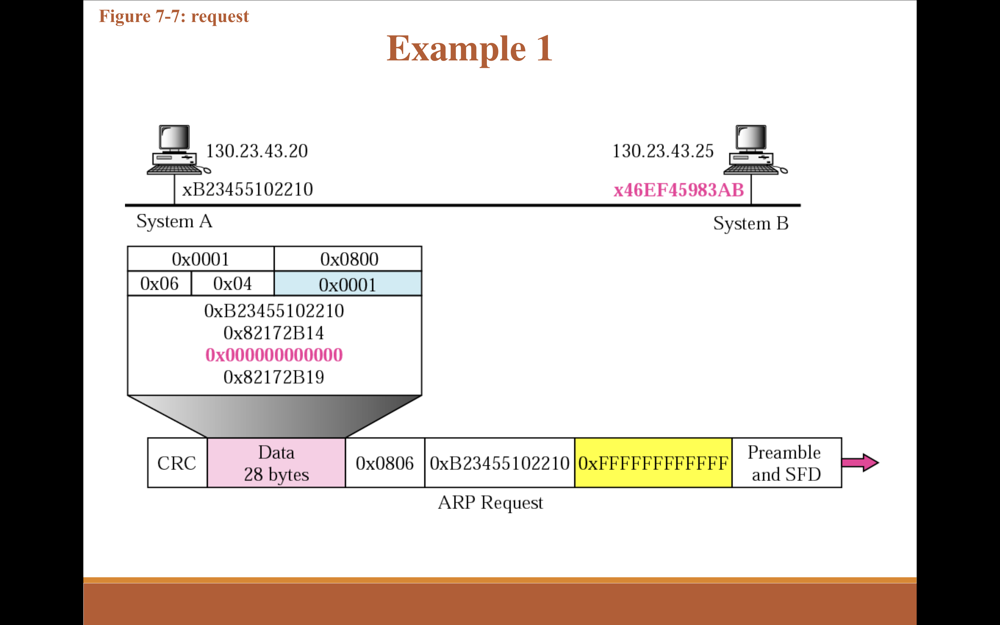
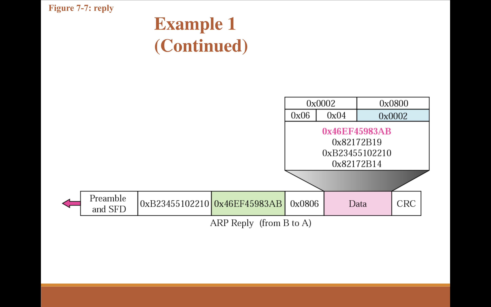

## A host with IP address 130.23.43.20 and physical address 0xB23455102210 has a packet to send to another host with IP address 130.23.43.25 and physical address 0xA46EF45983AB. The two hosts are on the same Ethernet network. Show the ARP request and reply packets encapsulated in Ethernet frames.

- sender 

- reciever

## A router on an Ethernet network has received a multicast IP packet with t groupid 226. 17. 18.4. When the host checks its multicast group table, it finds this address. Show how the router sends this packet to the recipients by encapsulating the IP packet in an Ethernet frame. Show all the entries of the Ethernet frame. The outgoing IP address of the router is 185.23.5.6, and its outgoing physical address is 4A22451 2E1E2. Does the router need the services of ARP?
 
- 📌 Given:
IP Multicast address: 226.17.18.4
Outgoing router IP: 185.23.5.6
Outgoing MAC address: 4A:22:45:12:E1:E2
IP multicast group address is in Class D (224.0.0.0 to 239.255.255.255)

✅ Step 1: Convert IP Multicast to Ethernet Multicast Address
Multicast IPs are mapped to Ethernet multicast addresses using this rule:
- 01:00:5E:0x:xx:xx
Where:
> The first 25 bits of the Ethernet address are fixed: 01:00:5E:0
> The next 23 bits come from the lower 23 bits of the IP multicast address

IP Multicast Address (in binary): 226.17.18.4
Convert to binary:
226 = 1110 0010
17 = 0001 0001
18 = 0001 0010
4 = 0000 0100

=> Ethernet Multicast Address = 01:00:5E:0 0010001 00010010 00000100
                                            17        18        4
>                                01:00:5E:11:12:04
So final MAC address OF eTHERNET IS  01:00:5E:11:12:04

✅ Step 2: Ethernet Frame Format
| Field               | Value                                                |
| ------------------- | ---------------------------------------------------- |
| **Destination MAC** | `01:00:5E:11:12:04` (multicast)                      |
| **Source MAC**      | `4A:22:45:12:E1:E2` (router's MAC)                   |
| **Type**            | `0x0800` (IPv4)                                      |
| **Payload**         | IP Packet (starting with 226.17.18.4 as destination) |
| **FCS**             | Calculated at transmission                           |

✅ Step 3: Does the Router Need ARP?
No, the router does not need ARP.

ARP (Address Resolution Protocol) is used to resolve an IP address to a MAC address.

In multicast, the MAC address is derived algorithmically from the multicast IP (as we did above).

Therefore, no ARP request is needed.

## We have the following information:
Mobile host home address: 130.45.6.7/1 6
Mobile Host Care-of address: 14.56.8.9/8
Remote Host Address: 200.4.7. 14/24
Home Agent address: 130.45. 10.20/16
Foreign agent address: 14.67.34.6/8
Show the contents of the IP datagram header sent from the remote host to the home agent?
---
A Remote Host (200.4.7.14) sends a packet to the Mobile Host (MH) at its home address (130.45.6.7).
Since the MH is away from home, the Home Agent (HA) intercepts the packet and tunnels it to the MH’s Care-of Address (14.56.8.9).

🔹 IP Header Fields
| Field                      | Value                  | Explanation                |
| -------------------------- | ---------------------- | -------------------------- |
| **Version**                | 4                      | IPv4                       |
| **Header Length**          | 20 bytes               | No options                 |
| **Type of Service**        | 0                      | Default                    |
| **Total Length**           | Depends on data        | e.g., 60 bytes             |
| **Identification**         | Arbitrary (e.g., 1000) | For fragmentation          |
| **Flags/Fragment Offset**  | 0                      | Not fragmented             |
| **Time To Live (TTL)**     | 64                     | Default                    |
| **Protocol**               | 6                      | TCP                        |
| **Header Checksum**        | Calculated at runtime  | Error detection            |
| **Source IP Address**      | `200.4.7.14`           | Remote Host                |
| **Destination IP Address** | `130.45.6.7`           | Mobile Host's home address |

> ❗ Note: This is what the Remote Host sends, it does not know MH is away from home.

📩 Then What Happens?
- The Home Agent (130.45.10.20): Intercepts this packet,
- Encapsulates it in a new IP packet (tunnel),
- Sends it to the Care-of Address 14.56.8.9.

🔁 Final Encapsulated Header (HA → FA → MH)

| Field              | Value                       |
| ------------------ | --------------------------- |
| **Source IP**      | `130.45.10.20` (Home Agent) |
| **Destination IP** | `14.56.8.9` (Care-of Addr)  |
| **Protocol**       | 4 (IPv4 encapsulation)      |

## Suppose a router receives an IP packet containing 1300 data bytes and has to forward the packet to a network with maximumn data transmission unit of 300 bytes. Assume that the IP header is 20 bytes long. Show the fragments that the router creates and specify the relevant values in each fragment header (i.e. total length, fragment offset, and more bit).

1. Maximum Data per Fragment:
Each fragment must include its own IP header (20 bytes).
- However, IP fragmentation requires that all fragments (except possibly the last) have data payloads that are multiples of 8 bytes.
280 is divisible by 8 (280 ÷ 8 = 35), so it's acceptable.
2. Number of Fragments Needed:
Total data to send: 1300 bytes.
Number of full 280-byte fragments: 1300 ÷ 280 = 4.642857...
This means we'll have 4 full fragments of 280 bytes and a final fragment with the remaining data.

| Fragment | Data Bytes | Fragment Offset | More Fragments (MF) Flag | Total Length |   
| -------- | ---------- | --------------- | ------------------------ | ------------ | - 
| 1        | 280        | 0               | 1                        | 300          |   
| 2        | 280        | 35              | 1                        | 300          |   
| 3        | 280        | 70              | 1                        | 300          |   
| 4        | 280        | 105             | 1                        | 300          |   
| 5        | 180        | 140             | 0                        | 200          |   

- rest fields are not given info .

## A router with IP address 125.45.23.12 and Ethernet physical address 23:45:AB:4F:67:CD has received a packet for a host destination with IP address 125.11.78.10 and Ethernet physical address AA:BB:A2:4F:67:CD.

🔹 ARP Request Packet:
| Field              | Value               |
| ------------------ | ------------------- |
| Sender MAC Address | 23:45\:AB:4F:67\:CD |
| Sender IP Address  | 125.45.23.12        |
| Target MAC Address | 00:00:00:00:00:00   |
| Target IP Address  | 125.11.78.10        |
| Operation          | Request (1)         |

🔹 ARP Response Packet:
| Field              | Value                |
| ------------------ | -------------------- |
| Sender MAC Address | AA\:BB\:A2:4F:67\:CD |
| Sender IP Address  | 125.11.78.10         |
| Target MAC Address | 23:45\:AB:4F:67\:CD  |
| Target IP Address  | 125.45.23.12         |
| Operation          | Reply (2)            |

🔹 Data Link Frame (Encapsulated):
| Field           | Value                |
| --------------- | -------------------- |
| Destination MAC | 23:45\:AB:4F:67\:CD  |
| Source MAC      | AA\:BB\:A2:4F:67\:CD |
| Type            | 0x0806 (ARP)         |
| Payload         | ARP Response Packet  |

## differentiate between  the following in detail

| Feature/Protocol                        | **BOOTP**                              | **DHCP**                                       | **RARP**                                   |
| --------------------------------------- | -------------------------------------- | ---------------------------------------------- | ------------------------------------------ |
| **Primary Purpose**                     | IP address and boot file assignment    | Dynamic IP address allocation and more         | IP address resolution based on MAC address |
| **IP Address Assignment**               | Static                                 | Dynamic (with lease renewal)                   | Static (via RARP server lookup)            |
| **Configuration Info**                  | Basic (IP address, boot file)          | IP address, gateway, DNS, NTP, etc.            | Only IP address                            |
| **Lease Expiration**                    | No                                     | Yes (IP address leases expire and are renewed) | No                                         |
| **Support for Advanced Configurations** | Limited (with extensions)              | Extensive (gateway, DNS, NTP, etc.)            | None                                       |
| **Main Use Case**                       | Diskless workstations and network boot | General network IP assignment                  | Diskless workstations needing IP address   |
| **Replacement**                         | Replaced by DHCP                       | Commonly used in modern networks               | Superseded by DHCP and BOOTP               |
