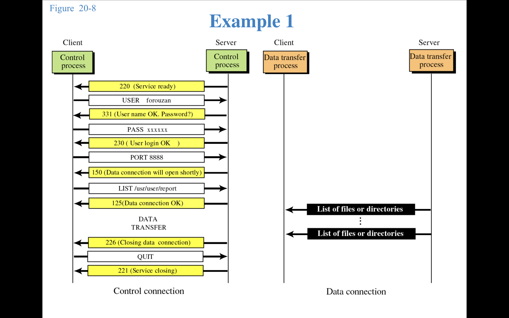
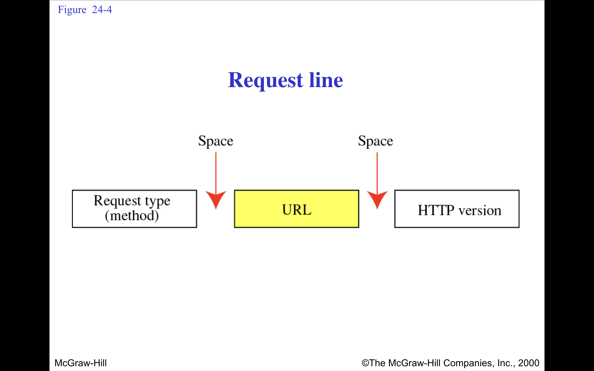

## 1. FTP (File Transfer Protocol)
FTP (File Transfer Protocol) is a standard network protocol used for transferring files between a client and a server over a TCP/IP network (like the Internet). It was developed in the early 1970s and is specified in RFC 959.
- NEEDS 2 TCP CONNECTIONS :
    Control connection: Port **21**
    Data connection: Port **20** (or passive mode port)

| Feature             | Description                                                                            |
| ------------------- | -------------------------------------------------------------------------------------- |
| **Protocol Type**   | Application layer protocol (TCP-based)                                                 |
| **Ports Used**      | Control connection: Port **21** Data connection: Port **20** (or passive mode port) |
| **Connection Type** | Stateful — requires login and maintains session                                        |
| **Transfer Modes**  | ASCII mode (text) and Binary mode (images, videos, software, etc.)                     |
| **Authentication**  | Typically uses username and password; supports anonymous access as well                |
| **Direction**       | Supports both upload (PUT) and download (GET)                                          |

### 🔹 Working of FTP
1. Client Initiation:
FTP client (like FileZilla, WinSCP, or command-line) connects to the FTP server on port 21.

2. Authentication:
The user logs in with a username and password. Anonymous access can be allowed by the server.

3. Control Connection Established:
A persistent TCP connection is created for sending commands and responses (control information).

4. Data Connection Established:
A separate connection is made for the actual file transfer.
  - Two types:
    - Active Mode: Server initiates the data connection from port 20 to the client.
    - Passive Mode: Server provides a port number, and the client initiates the data connection.

5. File Operations:
Commands like LIST, RETR (retrieve), STOR (store), DELE, MKD, and RMD are issued.
Data (file contents) is transferred over the data connection.

6. Termination:
The session ends with a QUIT command.

⚠️ FTP is not secure by default (credentials are sent in plain text). Secure versions include FTPS or SFTP.

## 🌐 2. HTTP (HyperText Transfer Protocol)
HTTP (HyperText Transfer Protocol) is an application-layer protocol used for transmitting hypermedia documents (like HTML). It is the foundation of data communication on the World Wide Web, enabling clients (usually web browsers) to communicate with web servers.

- uses services of TCP on port 80.
- Standardized by: IETF (Internet Engineering Task Force)
- Default Port: 80 (HTTP), 443 for HTTPS (secure version)
- Stateless: Each HTTP request is independent of the previous one

🔹 How HTTP Works: Step-by-Step
1. Client Sends Request:
    - A user enters a URL in the browser (https://example.com/index.html).
    - The browser creates an HTTP request for that resource.
    
    
    

2. Server Processes Request:
    The server receives the request, processes it (maybe querying a database or reading a file), and prepares a response.

3. Server Sends Response:
    The server responds with:
        - Status line (e.g., 200 OK)
        - Headers (e.g., Content-Type: text/html)
        - Body (HTML, JSON, image, etc.)
    
    
    
4. Client Renders Content:
    - The browser processes the response and displays the content to the user.
---
example :

## 🖥️ 3. Telnet
Telnet (TELecommunication NETwork) is a network protocol used to provide command-line access to remote devices over a TCP/IP network.
- Works on Port 23
- Enables users to remotely control another computer
- Unencrypted, meaning it sends data (including passwords) in plain text ❌
SSH is now commonly used instead of Telnet.

Examples:
telnet google.com 80        # Test HTTP connection
telnet 192.168.1.1 23       # Connect to a router via Telnet

### NVT
NVT (Network Virtual Terminal) is a conceptual model used in Telnet to standardize communication between computers with different hardware and software systems.

It defines a universal interface for sending and receiving characters and commands so that devices using Telnet can communicate without needing to know each other’s internal character formats or command systems.

- Client and server both convert their local input/output to the NVT standard format when sending/receiving.
- Data transferred over the Telnet connection is always in NVT format.
- NVT uses 7-bit ASCII for text and defines control characters like Carriage Return (CR) and Line Feed (LF).

## 🕸️ 4. WWW (World Wide Web)
Purpose: A system of interlinked hypertext documents and multimedia accessed via the Internet.

Not a protocol, but a service built on top of HTTP.

Usage: The "web" part of the internet, where websites and apps live.

Example: www.google.com – the "www" is just a subdomain of the Google domain.

## Classify and Discuss the Different Types of Web Documents
1. Static Web Documents:
Stored in the server’s file system.

Delivered as-is to the client.

Written in HTML.

Example: .html, .css, images.

2. Dynamic Web Documents:
Generated at the time of request by a server-side program.

Output varies based on user input, session, etc.

Technologies: PHP, ASP.NET, Node.js.

3. Active Web Documents:
Contains code that is executed on the client side.

Uses technologies like JavaScript, Java Applets, Flash.

Enables interactive web pages.

 
 
