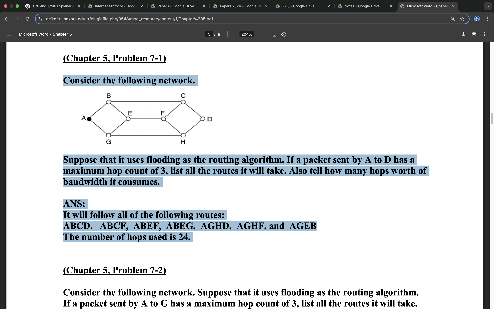
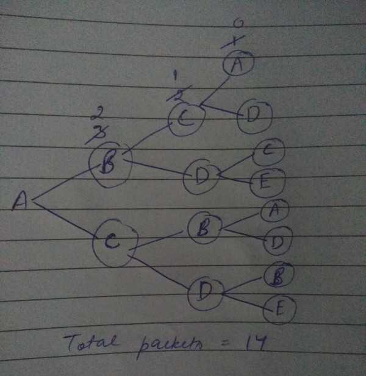

## Router A sends four records (its routing table) to its neighbors: B, C, and D.
Router A sends to B, C, and D:

A advertises:
Net1 at cost 1 → B/C/D will see it at cost 1 (A→Dest) + 1 (to A) = 2
Net2 at cost 1 → same as above → cost = 2
Net4 at cost 1 → cost = 2
Net5 at cost 1 → cost = 2

✅ Final Answer:
Changes in Routing Tables:

Router B adds: Net1 (2,A), Net4 (2,A), Net5 (2,A)
Router C adds: Net1 (2,A), Net2 (2,A), Net4 (2,A)
Router D adds: Net1 (2,A), Net2 (2,A), Net5 (2,A)

## (b) Discuss the different types of Link State Update messages along with their packet formats.

🔷 Common Link State Update Types in OSPF:
Router LSA (Type 1):
Describes the router’s links, interfaces, metrics, and neighbors within an area.

Network LSA (Type 2):
Generated by the designated router (DR) to describe all routers on a broadcast/multi-access network.

Summary LSA (Type 3 and 4):
Used by Area Border Routers (ABRs) to advertise routes between areas.

AS External LSA (Type 5):
Used to advertise routes external to the autonomous system (e.g., from BGP or static routes).

NSSA LSA (Type 7):
Used in Not-So-Stubby Areas to carry external routes like Type 5.

## (c) What is multicasting? Explain the procedure of joining and leaving a host to a multicast group.
Multicasting is a network communication method where one sender transmits data to multiple specific receivers (a group), without broadcasting to everyone. It is more efficient than unicast (one-to-one) and broadcast (one-to-all) for group communication.

🔶 Procedure to Join/Leave a Multicast Group:
1. Joining a Group:
The host sends an IGMP Membership Report message to the local router.
This tells the router it wants to receive data for a specific multicast group (e.g., 224.0.0.1).
The router then ensures that multicast data for that group is forwarded to the host.

2. Leaving a Group:
The host sends an IGMP Leave Group message.
The router checks if other hosts on the same network still want to receive the group traffic.
If not, it stops forwarding that multicast stream.

## 3 (b) Explain the terms Unicasting, Multicasting, and Broadcasting along with their application areas

1. Unicasting:
Definition: Communication between a single sender and a single receiver.
Example: A user accessing a website (client-server model).
Applications: Web browsing, emails, SSH connections.

2. Multicasting:
Definition: Communication between a single sender and multiple selected receivers.
Example: Streaming live video to selected subscribers.
Applications: IPTV, video conferencing, financial data distribution.

3. Broadcasting:
Definition: Communication from one sender to all devices on the network.
Example: ARP request in a LAN.
Applications: DHCP discovery, routing protocol updates in LAN.

## Consider the network as shown in the figure, using flooding as the routing algorithm.
If a packet sent by 2 to 6 has a maximum hop count of 3:

List all the routes it will take.

Also tell how many packets are generated.
Assume no duplicate is discarded.
---

- all paths with hop count = 3 from B 

So now u can count all the packets as circled nodes in this diagram, which is equal to 14.

