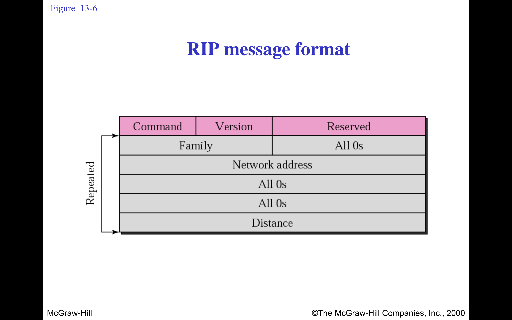

# Routing Information Protocol (RIP)

## 🧠 Overview

**Routing Information Protocol (RIP)** is one of the oldest **distance-vector** routing protocols, used in both LANs and WANs. It helps routers dynamically exchange routing information and determine the best path to reach a destination based on **hop count**.

---

## 📌 Key Characteristics

- **Type**: Distance Vector
- **Metric**: Hop count
- **Maximum Hop Count**: 15 (16 = unreachable)
- **Update Frequency**: Every 30 seconds
- **Transport Protocol**: UDP (Port 520)

---

## 🧰 How RIP Works

1. Each router maintains a **routing table**.
2. Routers periodically **broadcast** their routing tables to neighboring routers.
3. Routers update their own tables based on neighbors’ info using **Bellman-Ford algorithm**.
4. Routes with fewer hops are preferred.
5. If no update is received for 180 seconds, the route is considered **invalid**.

---

## 📦 Types of RIP

| Version | Description                          |
|---------|--------------------------------------|
| RIP v1  | Classful, no subnet info, no authentication |
| RIP v2  | Classless (supports CIDR), supports authentication |
| RIPng   | RIP for IPv6 networks                |

---

## 🔐 Loop Prevention Techniques

| Technique         | Description                                       |
|------------------|---------------------------------------------------|
| Split Horizon     | Prevents route info from being sent back the way it came |
| Route Poisoning   | Marks failed route with a hop count of 16 (infinite) |
| Hold-down Timer   | Prevents immediate updates to avoid flapping     |
| Triggered Updates | Sends updates immediately when a route changes   |

---

## ⚠️ Limitations of RIP

- **Scalability Issues**: Not suitable for large networks (due to 15-hop limit)
- **Slow Convergence**: Takes time to detect failures and update routes
- **No QoS Support**: Can't differentiate traffic based on priority
- **Only One Metric**: Considers only hop count, not bandwidth or delay

---

## ✅ Use Cases

- Small to medium-sized networks
- Educational environments
- Legacy systems

---

## 📖 Conclusion

RIP is a simple and easy-to-configure routing protocol but is largely outdated for modern, large-scale networks. It's primarily used today for **teaching**, **labs**, or **legacy systems**, with more advanced protocols like **OSPF**, **EIGRP**, and **BGP** preferred for production use.

### 📄 RIP Packet Format (20 bytes header + routing entries):
RIP is one of the oldest distance-vector routing protocols used to help routers exchange information about network paths.

| Field Name     | Size (bytes) | Description                            |
|----------------|--------------|----------------------------------------|
| Command        | 1            | Request (1) or Response (2)            |
| Version        | 1            | RIP version (1 or 2)                   |
| Unused         | 2            | Must be zero                           |
| Route Entries  | 20 * N       | One or more route entries              |

### 📄 Route Entry Format (Each entry: 20 bytes):

| Field Name     | Size (bytes) | Description                            |
|----------------|--------------|----------------------------------------|
| Address Family | 2            | AFI (e.g., 2 for IP)                   |
| Route Tag      | 2            | For inter-domain routing               |
| IP Address     | 4            | Destination IP address                 |
| Subnet Mask    | 4            | Subnet mask                           |
| Next Hop       | 4            | IP address of next hop router         |
| Metric         | 4            | Hop count (1 to 16, where 16 = infinity)|

- RIP Packet (V1 format)

---

## Distnace Vector Protocol :
-  intra-Domain protocol. 
- Process:
    - Initialization: Each router knows only its directly connected networks.

    - Exchange: Periodically shares its routing table with neighbors.

    - Update: Updates its table if a better path is found via a neighbor.

    - Convergence: Repeats until all routers agree on paths (network convergence).

### problems :
1. 🔁 Count-to-Infinity Problem (in Distance Vector Routing)
The Count-to-Infinity problem occurs in distance vector routing protocols like RIP when routers continuously increment the hop count to a destination that has become unreachable, without ever realizing the route is broken.
🧯 Example Scenario:
A — B — C
A is connected to B, and B is connected to C.

All routers initially know the correct route to each other.

Step-by-Step Problem:
Link A–B fails → A can no longer reach the destination.
B doesn’t know the link is broken yet, and still advertises to C that it can reach A.
C receives B’s advertisement and thinks: “Oh, I can reach A via B + 1 hop.”
C advertises this back to B, saying: “I can reach A in 2 hops.”
B thinks: “Oh! Maybe C knows a way to A!” and updates to 3 hops.
This loop continues: count increases toward infinity.

- 🔚 In RIP:
Infinity is 16 hops
So, count-to-infinity is limited to 16 steps.

2. Slow Convergence: Takes time for changes to propagate.

## 🌐 Link State Routing Protocol – Overview
Link State Routing is a type of dynamic routing protocol where each router builds a complete map (topology) of the network. It’s faster, more accurate, and more scalable than distance vector routing.

| Term                                     | Description                                                                 |
| ---------------------------------------- | --------------------------------------------------------------------------- |
| **Link State**                           | Information about a router’s directly connected links (cost, status, etc.). |
| **LSA (Link State Advertisement)**       | A packet that advertises a router’s link states to other routers.           |
| **LSDB (Link State Database)**           | A collection of all received LSAs used to build the network topology.       |
| **SPF Algorithm (Dijkstra’s Algorithm)** | Used to compute the shortest path tree and determine routing tables.        |

## 🛠️ Working Steps of Link State Protocol:
1. Neighbor Discovery: Router identifies its directly connected neighbors.

2. Link State Generation: It creates LSAs containing:

Connected interfaces
Costs (delays, bandwidth, etc.)
Neighbor IDs

3. Flooding: LSAs are flooded to all routers in the area, not just to neighbors.

4. Topology Database Construction: Every router builds the same LSDB.

5. SPF Calculation: Each router uses Dijkstra’s algorithm on the LSDB to compute shortest paths and fill its routing table.

⚡ Advantages:
Faster convergence.
Loop-free by design (topology-based, not hop-count-based).
More efficient use of bandwidth after initial flooding.

❗ Disadvantages:
More memory and CPU required.
Complex to implement and configure.

- OSPF is a specific implementation of a Link State protocol.

## Flooding:
Definition: A routing technique where every incoming packet is sent out on all outgoing links except the one it arrived on.
Drawback: Causes packet duplication and high network overhead unless controlled.
Control Method: Hop Count or Time-To-Live (TTL) is used to limit the spread.

