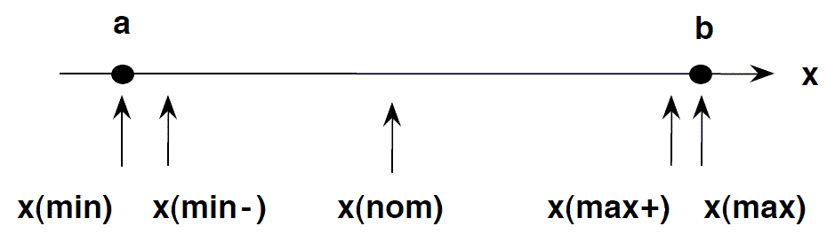
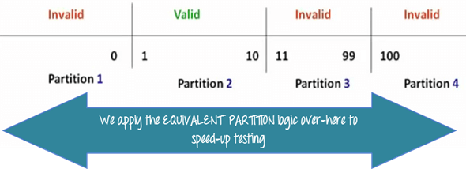

## Write a program or design test cases for the determination of the next date in a calendar. Input: day, month, year where:

1 ≤ MONTH ≤ 12

1 ≤ DAY ≤ 31

1900 ≤ YEAR ≤ 2025

Also: Design boundary value, robust, and worst test cases.

✅ Answer:
The objective is to validate and generate the next date or throw an invalid date error.

- Boundary Value Test Cases:

Test Case	Day	Month	Year	Expected Output
TC1	1	1	1900	02-01-1900
TC2	31	12	2025	Invalid (Year out of range if next date is 01-01-2026)
TC3	31	4	2024	Invalid (April has only 30 days)
Robust Test Cases (invalid values included):

- Test Case	Day	Month	Year	Expected Output

TC4	0	10	2024	Invalid
TC5	15	13	2023	Invalid
TC6	29	2	2024	01-03-2024 (Leap year)

- Worst-case Test Cases (combinations of min/max for all variables):

Test Case	Day	Month	Year	Expected Output
TC7	1	1	1900	02-01-1900
TC8	31	12	2025	Invalid

## Equivalence and Boundary Value

## Decision table

## Why is exhaustive testing not possible?

✅ Answer: Exhaustive testing is not possible because:

The number of possible input combinations is infinite or extremely large.

It is time and cost prohibitive.

Redundant tests do not add value. Hence, practical testing focuses on equivalence partitioning, boundary value, and risk-based approaches.

