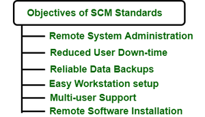

✅ Q No. 1a
> Q: What is the effect of designing a prototype on the overall cost of the software project? Compare V-Model with SPIRAL Model of software development along with a neat diagram.

✅ Effect of Designing a Prototype:
Early validation of requirements reduces rework.

Better user involvement results in higher customer satisfaction.

Reduces risk of failure in complex systems.

Initial cost increases slightly, but overall cost decreases due to fewer errors in later stages.

Helps uncover missing or misunderstood requirements early in the development lifecycle.

> ✅ V-Model (Verification and Validation Model)
Structure: Extension of Waterfall Model with each development stage paired with a testing phase.

📌 Characteristics:
Emphasis on verification and validation.

Each stage must be completed before the next begins.

Test planning occurs in parallel with development.

     Requirements    -->   Acceptance Testing
        ↓                        ↑
   System Design      -->   System Testing
        ↓                        ↑
 Architectural Design --> Integration Testing
        ↓                        ↑
   Module Design       -->   Unit Testing
        ↓                        ↑
          ---------Coding--------> 
✅ Spiral Model:
Combines prototyping and incremental development with risk analysis.

📌 Phases per spiral:
Planning

Risk Analysis

Engineering

Evaluation

Each loop represents a phase of the software process.

✅ Comparison:
Feature	                         V-Model	                                     Spiral Model
Risk Handling               	Minimal	                                       Extensive
Flexibility         	        Rigid	Highly                                   flexible
Cost Estimation             	Defined early	                               Iterative, refined with time
User Involvement            	Limited	                                      High, in every phase
Suitable For                	Simple, clear requirements	                   Complex, high-risk projects

>
✅ Use Case Diagram (Textual Description):
Actors:

Admin

Faculty

Student

Use-Cases:

Login

Manage Courses

Upload Marks

View Results

Publish Results

## 2. Verification and Validation (V&V)
1. Verification:
“Are we building the product right?”
Ensures that the software meets specifications and design requirements (reviews, inspections, walkthroughs).

2. Validation:
“Are we building the right product?”
Ensures the final product meets the user's needs (testing, user acceptance).

## Reuse-Oriented Model
1. Focuses on reusing existing software components, libraries, or services to reduce development time.

2. Consists of component analysis, requirements modification, design adaptation, and integration.

## Configuration Management

1. A discipline for controlling changes to software artifacts.
2. Maintains consistency, integrity, and traceability throughout the software life cycle.
- Key processes: Version Control, Change Management, Build Management.
- Git is used to manage versions of a project. If a developer makes a mistake, they can revert to a previous version → version control in config management.

