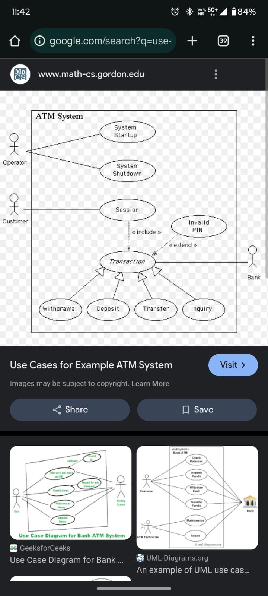
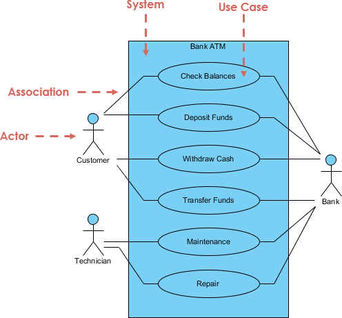

## Compare V Model with Evolutionary Development Model of Software Development.
Feature	                        V Model	                                                                     Evolutionary Development Model
Approach	            Follows a strict sequential approach (verification & validation at each stage).	               Iterative and incremental approach.
Flexibility         	Less flexible, changes are difficult once a phase is completed.                     	More flexible, changes can be made in iterations.
Feedback	            Feedback is received only after testing phase.                                     	Continuous feedback is incorporated at each iteration.
Risk Handling	        Higher risk due to late testing.            	                            Lower risk as early prototypes help in identifying issues.

## Fast-Facilitated Application Specification (FAST):

It is a team-oriented approach to gather and refine software requirements quickly.
Involves structured discussions between developers, users, and stakeholders.
Uses predefined templates and guidelines to speed up requirement documentation.

Feature	                    FAST	                                   Brainstorming
Structure       	Structured with predefined guidelines.	        Unstructured, free-flowing idea generation.
Participants	    Developers, analysts, users.	                 Anyone with creative input.
Goal	            Quickly refine application requirements.	    Generate as many ideas as possible.

## List any 2 points of difference between Throw-away Prototyping & Evolutionary Prototyping.

Feature	            Throw-away Prototyping	                                Evolutionary Prototyping
Purpose         	Used to understand requirements but is discarded.	    Incrementally refined into the final system.
Development Speed	Rapid, focuses on quick model creation.	                Slower but ensures better final system quality.

## Discuss main requirements of ISO 9001 and compare it with SEI-CMM.
ISO 9001 Requirements:

Customer Focus: Ensure customer satisfaction.
Process Approach: Define and standardize processes.
Continuous Improvement: Focus on quality enhancement.
Evidence-based Decision Making: Data-driven strategies.

Feature	            ISO 9001	                          SEI-CMM
Focus	            General quality management. 	    Software process maturity.
Certification	    External audit required.	        Process improvement model, not certification.
Applicability	    Applies to all industries.	        Specifically for software development.

## Difference Between Functional & Non-Functional Requirements
Feature	                Functional Requirements	                                        Non-Functional Requirements
Definition	            Define specific functionalities a system must perform.	            Define quality attributes of the system.
Example	            "User should be able to withdraw ₹5000 from ATM."	                      "The ATM should process withdrawals within 5 seconds."
Focus	            What the system does.	                                                How the system performs.
Testing	                Can be tested using test cases.	                                      Tested using performance metrics (speed, security, usability).

## 

## 

## Compare V-Model with Prototyping Model of Software Development along with a neat diagram

| Criteria         | V-Model                    | Prototyping Model           |
| ---------------- | -------------------------- | --------------------------- |
| Approach         | Sequential and V-shaped    | Iterative and user-driven   |
| Requirements     | Clearly defined from start | Evolving with user feedback |
| Flexibility      | Less flexible              | Highly flexible             |
| User Involvement | Minimal                    | High                        |
| Risk Handling    | Poor                       | Better                      |

