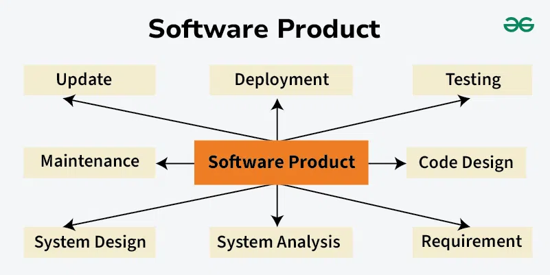
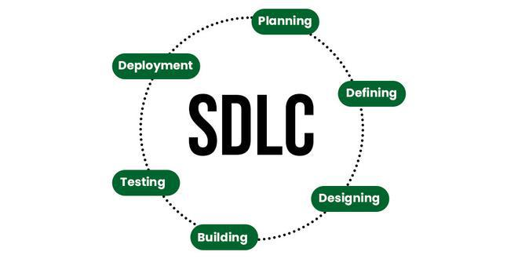
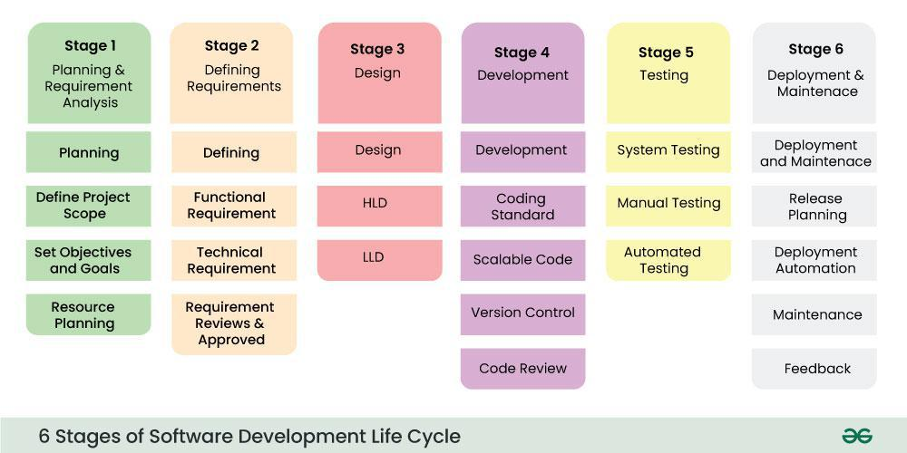
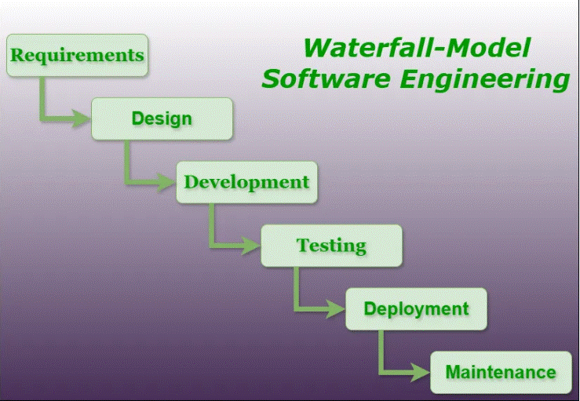
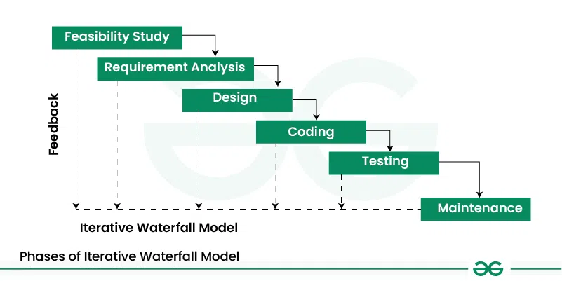
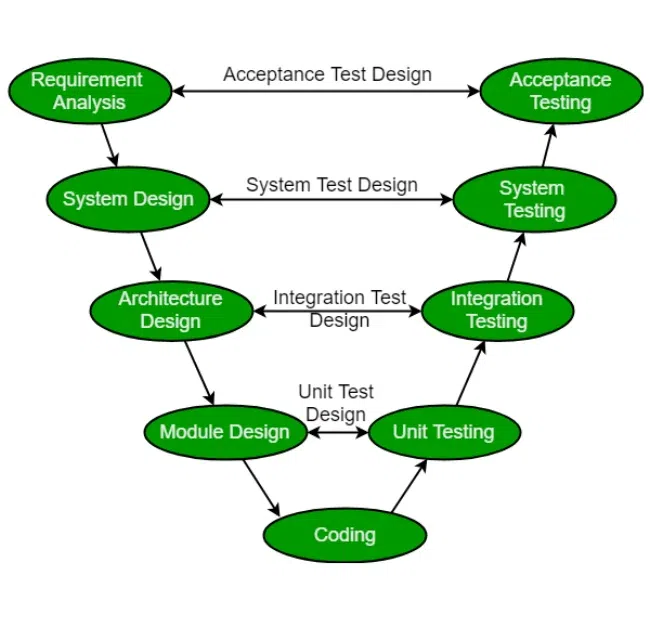
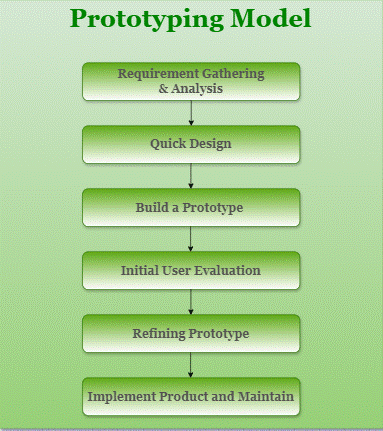
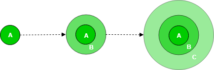
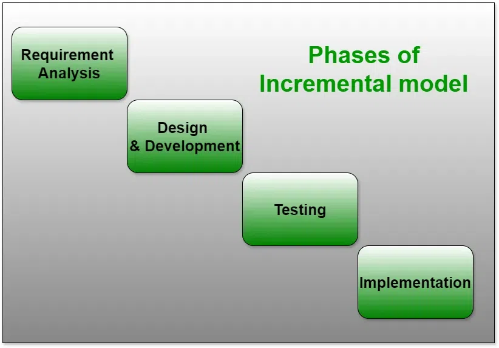

## Software Engineering 
is the process of designing, developing, testing, and maintaining software. It is a systematic and disciplined approach to software development that aims to create high-quality, reliable, and maintainable software. Software engineering includes a variety of techniques, tools, and methodologies, including requirements analysis, design, testing, and maintenance.

## Software development Life cycle 
SDLC is a process followed for software building within a software organization. SDLC consists of a precise plan that describes how to develop, maintain, replace, and enhance specific software. The life cycle defines a method for improving the quality of software and the all-around development process. 

## Waterfall Modlel
The Waterfall Model is a linear sequential software development methodology where each phase must be completed before moving on to the next. It is one of the oldest SDLC (Software Development Life Cycle) models.

### Advantages of the Waterfall Model
- Simple and Easy to Understand

Best suited for projects with well-defined requirements.
- Well-Defined Phases

Each phase (Requirement → Design → Implementation → Testing → Deployment → Maintenance) is well-documented and completed before moving forward.
Easier to Manage

Since phases are completed one at a time, it is easier for project managers to track progress and allocate resources accordingly.
- Better Documentation

Due to the structured nature, detailed documentation is maintained, which helps in future maintenance and training.
- Early Detection of Issues

Errors can be identified early in the development cycle, especially in the requirement and design phases.
- Best for Small and Simple Projects

Works well when project requirements are clear, stable, and unlikely to change.

### Disadvantages of the Waterfall Model
- Rigid and Inflexible

Once a phase is completed, it is difficult to go back and make changes.
- Not suitable for projects with evolving requirements.
- Late Testing Phase

The testing phase occurs only after development, which may lead to late detection of critical bugs.
- Fixing major issues at a later stage can be expensive and time-consuming.
- Poor Adaptability to Changes

If requirements change mid-project, the model does not support easy modifications, leading to delays and increased costs.
Not Suitable for Large and Complex Projects

For large-scale software, this model lacks flexibility and may lead to failures if requirements are not well understood initially.
- High Risk and Uncertainty

Since working software is delivered only at the end, stakeholders cannot see progress early, increasing project risks.
- Client Involvement is Limited

Clients provide input mainly at the beginning. If requirements were misunderstood, they might not see the issues until the final delivery.

## Iterative Waterfall Model
The Iterative Waterfall Model is a software development approach that combines the sequential steps of the traditional Waterfall Model with the flexibility of iterative design. It allows for improvements and changes to be made at each stage of the development process, instead of waiting until the end of the project. The Iterative Waterfall Model provides feedback paths from every phase to its preceding phases, which is the main difference from the classical Waterfall Model. 

## V-Shaped Model : 
The V-Model is a software development life cycle (SDLC) model that provides a systematic and visual representation of the software development process. It is based on the idea of a “V” shape, with the two legs of the “V” representing the progression of the software development process from requirements gathering and analysis to design, implementation, testing, and maintenance.

Advantages of V-Model
This is a highly disciplined model and Phases are completed one at a time.
V-Model is used for small projects where project requirements are clear.
Simple and easy to understand and use.
This model focuses on verification and validation activities early in the life cycle thereby enhancing the probability of building an error-free and good quality product.
It enables project management to track progress accurately.
Clear and Structured Process: The V-Model provides a clear and structured process for software development, making it easier to understand and follow.
Emphasis on Testing: The V-Model places a strong emphasis on testing, which helps to ensure the quality and reliability of the software.
Improved Traceability: The V-Model provides a clear link between the requirements and the final product, making it easier to trace and manage changes to the software.
Better Communication: The clear structure of the V-Model helps to improve communication between the customer and the development team.
Disadvantages of V-Model
High risk and uncertainty.
It is not good for complex and object-oriented projects.
It is not suitable for projects where requirements are not clear and contain a high risk of changing.
This model does not support iteration of phases.
It does not easily handle concurrent events.
Inflexibility: The V-Model is a linear and sequential model, which can make it difficult to adapt to changing requirements or unexpected events.
Time-Consuming: The V-Model can be time-consuming, as it requires a lot of documentation and testing.
Overreliance on Documentation: The V-Model places a strong emphasis on documentation, which can lead to an overreliance on documentation at the expense of actual development work.

## Prototype Model:
Prototyping is defined as the process of developing a working replication of a product or system that has to be engineered. It offers a small-scale facsimile of the end product and is used for obtaining customer feedback.

- There are four types of Prototyping Models, which are described below.

1. Rapid Throwaway Prototyping
2. Evolutionary Prototyping
3. ### Incremental Prototyping or Iterative Enhancment Model 

- Advantages of the Incremental Process Model
Prepares the software fast.
Clients have a clear idea of the project.
Changes are easy to implement.
Provides risk handling support, because of its iterations.
Adjusting the criteria and scope is flexible and less costly.
Comparing this model to others, it is less expensive.
The identification of errors is simple.
- Disadvantages of the Incremental Process Model
A good team and proper planned execution are required.
Because of its continuous iterations the cost increases.
Issues may arise from the system design if all needs are not gathered upfront throughout the program lifecycle.
Every iteration step is distinct and does not flow into the next.
It takes a lot of time and effort to fix an issue in one unit if it needs to be corrected in all the units.

4. Extreme Prototyping
