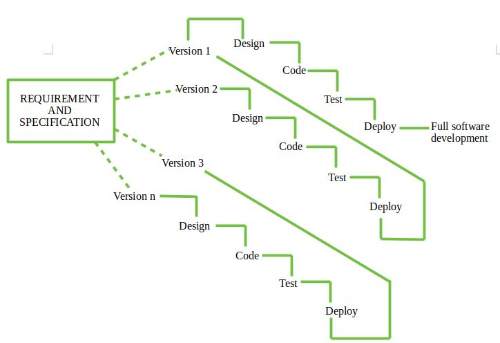

# What is software?

Computer programs and associated documentation.

> Software=Program+Documentation+Operating Procedures

## Software Engineering

is the process of designing, developing, testing, and maintaining software. 

It is a systematic and disciplined approach to software development that aims to create high-quality, reliable, and maintainable software. Software engineering includes a variety of techniques, tools, and methodologies, including requirements analysis, design, testing, and maintenance.

### Challenges in SE

- Source: The Standish Group International, Inc. (CHAOS research)

  IBM report : 
  .
- Data on 28,000 projects completed in 2000

  
- As per the IBM report, “31%of the project get cancelled before they are completed, 53% over- run their cost estimates by an average of 189% and for every 100 projects, there are 94 restarts
- Moore's Law states that the number of transistors on a microchip `doubles` about every two years with a minimal cost increase. In 1965, Gordon E. Moore, the co-founder of Intel, made an observation that eventually became known as Moore's Law.

  ie software have same spedd throughout where as hardwares evolve in productivity overtime.

## Software development Life cycle

SDLC is a process followed for software building within a software organization. SDLC consists of a precise plan that describes how to develop, maintain, replace, and enhance specific software. The life cycle defines a method for improving the quality of software and the all-around development process.

- The period of time that starts when a software product is conceived and ends when the product is no longer available for use.

  

  

## things :
1. early client interaction.
2. Simple docs .
3. Speed and simple model.
4. compatible to changing requirements.
5. Early errors and less errors towards end .

## Build & Fix Model

- Product is constructed without specifications or any attempt at design
- Adhoc approach and not well
- Simple two phase model

{ BUILD -> CODE -> BUILD -> LOOP }

## Waterfall Modlel

- This model is easy to understand and reinforces the notion of “define before design” and “design before code”.
- The model expects complete & accurate requirements early in the process, which is unrealistic

  The Waterfall Model is a linear sequential software development methodology where each phase must be completed before moving on to the next. It is one of the oldest SDLC (Software Development Life Cycle) models.

  

### Advantages of the Waterfall Model

- Simple and Easy to Understand
Best suited for projects with well-defined requirements.

- Well-Defined Phases
Each phase (Requirement → Design → Implementation → Testing → Deployment → Maintenance) is well-documented and completed before moving forward.

- Easier to Manage
Since phases are completed one at a time, it is easier for project managers to track progress and allocate resources accordingly.

- Better Documentation
Due to the structured nature, detailed documentation is maintained, which helps in future maintenance and training.

- Early Detection of Issues
Errors can be identified early in the development cycle, especially in the requirement and design phases.

- Best for Small and Simple Projects
Works well when project requirements are clear, stable, and unlikely to change.

### Disadvantages of the Waterfall Model

- Rigid and Inflexible
Once a phase is completed, it is difficult to go back and make changes.

- Not suitable for projects with evolving requirements.
- Late Testing Phase.
The testing phase occurs only after development, which may lead to late detection of critical bugs.

- Fixing major issues at a later stage can be expensive and time-consuming.
- Poor Adaptability to Changes.
If requirements change mid-project, the model does not support easy modifications, leading to delays and increased costs.

- Not Suitable for Large and Complex Projects
For large-scale software, this model lacks flexibility and may lead to failures if requirements are not well understood initially.

- High Risk and Uncertainty
Since working software is delivered only at the end, stakeholders cannot see progress early, increasing project risks.

- Client Involvement is Limited
Clients provide input mainly at the beginning. If requirements were misunderstood, they might not see the issues until the final delivery.

## Iterative Waterfall Model

The Iterative Waterfall Model is a software development approach that combines the sequential steps of the traditional Waterfall Model with the flexibility of iterative design. It allows for improvements and changes to be made at each stage of the development process, instead of waiting until the end of the project. The Iterative Waterfall Model provides feedback paths from every phase to its preceding phases, which is the main difference from the classical Waterfall Model.

## V-Shaped Model:

The V-Model is a software development life cycle (SDLC) model that provides a systematic and visual representation of the software development process. It is based on the idea of a “V” shape, with the two legs of the “V” representing the progression of the software development process from requirements gathering and analysis to design, implementation, testing, and maintenance.

- SAM design and UISA testing.

### Advantages of V-Model

1. This is a highly disciplined model and Phases are completed one at a time.

2. V-Model is used for small projects where project requirements are clear.

3. Simple and easy to understand and use.

4. This model focuses on verification and validation activities early in the life cycle thereby enhancing the probability of building an error-free and good quality product.

5. It enables project management to track progress accurately.

6. Clear and Structured Process: The V-Model provides a clear and structured process for software development, making it easier to understand and follow.

7. Emphasis on Testing: The V-Model places a strong emphasis on testing, which helps to ensure the quality and reliability of the software.

8. Improved Traceability: The V-Model provides a clear link between the requirements and the final product, making it easier to trace and manage changes to the software.

9. Better Communication: The clear structure of the V-Model helps to improve communication between the customer and the development team.

### Disadvantages of V-Model

1. High risk and uncertainty.

2. It is not good for complex and object-oriented projects.

3. It is not suitable for projects where requirements are not clear and contain a high risk of changing.

4. This model does not support iteration of phases.

5. It does not easily handle concurrent events.

6. Inflexibility: The V-Model is a linear and sequential model, which can make it difficult to adapt to changing requirements or unexpected events.

7. Time-Consuming: The V-Model can be time-consuming, as it requires a lot of documentation and testing.

8. Overreliance on Documentation: The V-Model places a strong emphasis on documentation, which can lead to an overreliance on documentation at the expense of actual development work.

## Prototype Model:

Prototyping is defined as the process of developing a working replication of a product or system that has to be engineered. It offers a small-scale facsimile of the end product and is used for obtaining customer feedback.

- There are four types of Prototyping Models, which are described below.

## 1. Rapid Throwaway Prototyping : 
  Rapid Throwaway Prototyping is a software development approach where a quick and simple version of a system (a prototype) is built to understand requirements or test ideas, but is not intended to be part of the final system. Once it's served its purpose, the prototype is discarded.

### Key Features:
  1. Speed-focused: Built quickly with minimal investment.

  2. Exploratory: Used to clarify user requirements or design options.

  3. Disposable: Not used in the final product; thrown away after feedback is gathered.

  4. User feedback-centric: Created to get early user input before full-scale development.

  ### When to Use:
  1. Requirements are unclear or evolving.

  2. Stakeholders need something visual to react to.

  3. To explore alternative designs quickly.

  ### Advantages:
  1. Reduces misunderstandings about requirements.

  2. Saves time and cost in the long run.

  3. Encourages user involvement early.

## 2. Evolutionary Prototyping:

   The evolutionary model is a combination of the Iterative and Incremental models of the software development life cycle. Delivering your system in a big bang release, delivering it in incremental process over time is the action done in this model. Some initial requirements and architecture envisioning need to be done. It is better for software products that have their feature sets redefined during development because of user feedback and other factors.

   - Evolutionary process model resembles iterative enhancement model. The same phases as defined for the waterfall model occur here in a cyclical fashion. 
   > This model differs from iterative enhancement model in the sense that this does not require a useable product at the end of each cycle. In evolutionary development, requirements are implemented by category rather than by priority.
   - This model is useful for projects using new technology that is not well understood. This is also used for complex projects where all functionality must be delivered at one time, but the requirements are unstable or not well understood at the beginning
   

### Advantages Evolutionary Model

  1. Adaptability to Changing Requirements: Evolutionary models work effectively in projects when the requirements are ambiguous or change often. They support adjustments and flexibility along the course of development.

  2. Early and Gradual Distribution: Functional components or prototypes can be delivered early thanks to incremental development. Faster user satisfaction and feedback may result from this.

  3. User Commentary and Involvement: Evolutionary models place a strong emphasis on ongoing user input and participation. This guarantees that the software offered closely matches the needs and expectations of the user.

  4. Improved Handling of Difficult Projects: Big, complex tasks can be effectively managed with the help of evolutionary models. The development process is made simpler by segmenting the project into smaller, easier-to-manage portions.

### Disadvantages Evolutionary Model

  1. Communication Difficulties: Evolutionary models require constant cooperation and communication. The strategy may be less effective if there are gaps in communication or if team members are spread out geographically.

  2. Dependence on an Expert Group: A knowledgeable and experienced group that can quickly adjust to changes is needed for evolutionary models. Teams lacking experience may find it difficult to handle these model’s dynamic nature.

  3. Increasing Management Complexity: Complexity can be introduced by organizing and managing several increments or iterations, particularly in large projects. In order to guarantee integration and synchronization, good project management is needed.

  4. Greater Initial Expenditure: As evolutionary models necessitate continual testing, user feedback and prototyping, they may come with a greater starting cost. This may be a problem for projects that have limited funding.

## 3.  Incremental Prototyping or Iterative Enhancment Model

   
   
   
   

- Advantages of the Incremental Process Model

  1. Prepares the software fast.
  1. Clients have a clear idea of the project.
  1. Changes are easy to implement.
  1. Provides risk handling support, because of its iterations.
  1. Adjusting the criteria and scope is flexible and less costly.
  1. Comparing this model to others, it is less expensive.
  1. The identification of errors is simple.

- Disadvantages of the Incremental Process Model

  1. A good team and proper planned execution are required.
  1. Because of its continuous iterations the cost increases.
  1. Issues may arise from the system design if all needs are not gathered upfront throughout the program lifecycle.
  1. Every iteration step is distinct and does not flow into the next.
  1. It takes a lot of time and effort to fix an issue in one unit if it needs to be corrected in all the units.

4. Extreme Prototyping

## DIFF BETWEEN ITERATIVE ENHANCEMENT AND EVOLUTIONARY MODEL :

## Spiral Model?

The Spiral Model is a Software Development Life Cycle (SDLC) model that provides a systematic and iterative approach to software development. In its diagrammatic representation, looks like a spiral with many loops. The exact number of loops of the spiral is unknown and can vary from project to project. 

- The spiral model is a systems development lifecycle (SDLC) method used for `risk management` that combines the `iterative development process model with elements of the Waterfall model`. The spiral model is used by software engineers and is favored for large, expensive and complicated projects.

- Each loop of the spiral is called a phase of the software development process.

