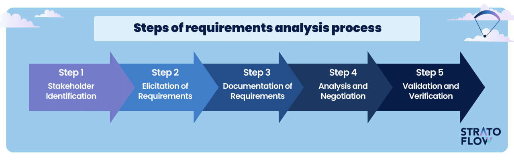
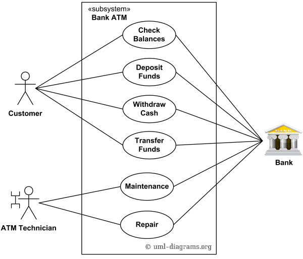

## Requirement Elicitation Techniques & Problems

### Requirement Elicitation Techniques:
1. Interviews – Direct discussion with stakeholders.
1. Questionnaires – Structured set of questions.
1. Brainstorming – Group discussion to generate ideas.
1. Workshops – Facilitated sessions with stakeholders.
1. Observation – Watching users perform tasks.
1. Document Analysis – Studying existing documentation.
1. Prototyping – Developing initial versions for feedback.

### Problems when eliciting from multiple customers:
1. Conflicting Requirements – Different customers want different things.
1. Ambiguity – Requirements may not be clearly stated.
1. Prioritization Issues – Each customer considers their needs highest priority.
1. Communication Gaps – Misunderstanding between customers and analysts.
1. Overload of Requirements – Managing excessive and redundant requirements.

### Steps in Requirement Analysis in RE:  SAVED

1. StakeHolder Identification.
2. Elicitation gathering.
3. Documentation.
4. Analysis and Negotation.
5. Validation and Verificatiion.    

## Use Case Diagram
1. Making a withdrawal at an ATM.
 - use cases : DEPOIST , WITHDRAW , CHANGEPIN , REPAIR 
 - actors : User , ATM-Technician , BANK 

## 1. Difference Between Intermediate COCOMO and Detailed COCOMO. Assume that the size of an organic type software product has been estimated to be 32000 LOC. Assume that the average salary of Software Engineer be Rs1 5000/- per month. Determine the effort required to develop the software product and the nominal development time.

| Feature                 | **Intermediate COCOMO**                          | **Detailed COCOMO**                               |
| ----------------------- | ------------------------------------------------ | ------------------------------------------------- |
| **Cost Drivers**        | Considers cost drivers (15 attributes)           | Considers cost drivers + effort per phase         |
| **Accuracy**            | More accurate than Basic, but less than Detailed | Most accurate and granular                        |
| **Effort Estimation**   | One effort estimate for the entire project       | Effort estimated for each development phase       |
| **Complexity Handling** | Moderate                                         | High                                              |
| **Use Case**            | Suitable for average-size projects               | Suitable for large, complex, or critical projects |
| **Phases Considered**   | No phase-wise breakdown                          | Includes planning, design, coding, testing, etc.  |

### 📌 Step 1: Calculate Effort
- E≈3.2×35.76≈114.43 person-months
### 📌 Step 2: Calculate Development Time
- D=2.5×(114.43)^.38
D≈2.5×6.41≈16.03 months
### 📌 Step 3: Total Cost
- Cost= Effort×Monthly Salary =114.43×15,000≈Rs.17,16,450

### Average Staff Size =  Effort / time
### Productivity= KLOC / Effort

