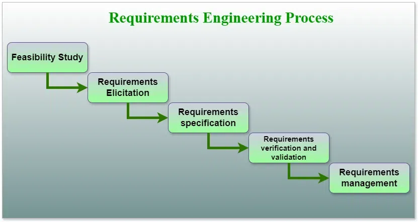

## Requirements Engineering 

is the process of identifying, eliciting, analyzing, specifying, validating, and managing the needs and expectations of stakeholders for a software system.

## Requirement Gathering
Requirement gathering is the first phase of software development, where developers and stakeholders
collect, analyze, and document the needs of the system. It ensures that the final product meets user
expectations and business objectives. 

### Steps in Requirement Gathering:
1. Requirement Elicitation :  POSIBWD
o The process of collecting requirements from stakeholders (clients, users, developers).
o Techniques used:
▪ Interviews – Direct discussions with stakeholders.
▪ Surveys & Questionnaires – Collecting structured feedback.
▪ Observation – Studying users in their work environment.
▪ Prototyping – Creating sample versions of the system.
▪ Brainstorming – Group discussions to generate ideas.

2. Requirement Analysis
o Evaluating requirements for feasibility, conflicts, dependencies, and completeness.
o Categorizing requirements into essential and optional features.
o Ensuring no conflicting or ambiguous requirements.

3. Requirement Specification
o Documenting the finalized requirements in a Software Requirement Specification (SRS) document.
o The SRS includes:
▪ Functional and Non-Functional requirements.
▪ System constraints and limitations.
▪ Performance and security expectations.

4. Requirement Validation
o Ensuring the collected requirements are correct, complete, and aligned with business needs.
o Validation methods:
▪ Prototyping – Demonstrating features before full development.
▪ Requirement Reviews – Stakeholder approval process.
▪ Test Case Development – Ensuring requirements are testable.

### Types of Requirements
1. Functional Requirements
These describe the specific functionalities the system must provide. They define what the system should
do based on user interactions.
Examples:
• User authentication (login/logout).
• Adding, deleting, or updating records in a database.
• Sending notifications or emails.
• Processing payments.
2. Non-Functional Requirements
These define the quality attributes of the system, ensuring performance, security, usability, and reliability.
Examples:
• The system should load within 3 seconds.
• The website should handle 10,000 users at a time.
• Data encryption should be applied for security.
• The application should work on mobile and desktop.
3. User Requirements
These describe the needs and expectations of end-users in a simple, high-level manner. They are often written in natural language.
Examples:
• "The system should allow users to track their orders easily."
• "Users should be able to reset their passwords via email."
• "The dashboard should display analytics and reports."
4. Domain Requirements
These are specific to the industry where the software is being developed. They include rules, standards,
and compliance guidelines.
Examples:
• A banking application must follow RBI or financial security regulations.
• A healthcare system must comply with HIPAA (Health Insurance Portability and Accountability Act).
• An e-commerce website should follow GST taxation rules.

### Requirement Elicitation Techniques & Requirement Documentation
1. Requirement Elicitation Techniques
Requirement elicitation is the process of gathering, identifying, and understanding user needs from
stakeholders. It helps in defining clear and precise software requirements.
- Common Requirement Elicitation Techniques:
   1. Interviews
    • Direct one-on-one discussions with stakeholders.
    • Can be structured (predefined questions) or unstructured (open discussion).
    • Pros: Provides detailed insights and clarifies doubts.
    • Cons: Time-consuming and may lead to biased responses.

   2. Surveys & Questionnaires
    • A set of predefined questions distributed to stakeholders.
    • Used when dealing with a large number of users.
    • Pros: Quick data collection and cost-effective.
    • Cons: Limited depth in responses.
 
   3. Observation
    • Watching how users interact with existing systems to understand real-world challenges.
    • Types:
    o Passive Observation – Watching without intervention.
    o Active Observation – Asking questions during observation.
    • Pros: Unbiased insights into actual workflow.
    • Cons: Users may modify behavior when observed.

    4. Prototyping
    • Creating a sample version (mockup) of the software to get feedback before full development.
    • Helps visualize UI and system functionality.
    • Pros: Reduces misunderstandings and improves requirement clarity.
    • Cons: Time-consuming and may increase project costs.

    5. Brainstorming
    • A group discussion to generate new ideas and solutions for the software.
    • Stakeholders and developers collaborate to define system capabilities.
    • Pros: Encourages innovation and diverse viewpoints.
    • Cons: Can lead to irrelevant ideas if not well-structured.

    6. Document Analysis
    • Reviewing existing reports, manuals, policies, or previous system documentation to gather insights.
    • Useful for projects upgrading an existing system.
    • Pros: Saves time and provides historical context.
    • Cons: Documents may be outdated or incomplete.

    7. Workshops
    • Intensive meetings with key stakeholders to discuss requirements collaboratively.
    • Involves domain experts, developers, and users.
    • Pros: Encourages real-time discussions and quicker decision-making.
    • Cons: Requires proper facilitation to stay productive.

### FAST – Facilitated Application Specification Technique
- It is a requirement elicitation technique used during the early stages of software development to gather requirements from stakeholders. It is especially useful when stakeholders find it hard to articulate requirements formally.

#### ✅ Key Features of FAST:
   1. Facilitated Meetings: Involves structured meetings between clients, developers, and a trained facilitator.

   2. Collaborative: Encourages all stakeholders to contribute ideas in an open environment.

   3. Goal-Oriented: Focuses on identifying goals, constraints, and desired functionality of the system.

   4. Visual Tools: Uses diagrams like DFDs, ER diagrams, and use case models to support communication.

   5. Resolution of Conflicts: Helps resolve inconsistencies or contradictions in requirements.

2. Requirement Documentation:
Requirement documentation involves recording and structuring the gathered requirements in a formal
document. The most common format is the Software Requirement Specification (SRS).
   1. Software Requirement Specification (SRS)
    SRS is a document that defines what the system should do. It serves as a reference for developers, testers, and stakeholders.
   2. Key Sections of SRS:
    1. Introduction – Overview of the project, objectives, and scope.
    2. Functional Requirements – Features the system must have (e.g., user authentication, data storage).
    3. Non-Functional Requirements – Performance, security, reliability, scalability, etc.
    4. System Requirements – Hardware, software, and network dependencies.
    5. Constraints – Limitations like budget, time, and technology stack.
    6. Assumptions & Dependencies – External factors affecting the project (e.g., third-party integrations).

   3. Importance of Requirement Documentation
      • Ensures clarity and eliminates misunderstandings.
      • Serves as a reference for development and testing teams.
      • Helps in project tracking and change management.
      • Assists in future maintenance and updates.

## What is Risk Management?
Risk management is the process of identifying, analyzing, and mitigating risks that may impact a software
project. Risks can cause delays, increased costs, or project failure, so effective risk management ensures
project success.

- Types of Risks in Software Projects : PBET
    1. Project Risks
    • Budget Overrun: Unexpected costs exceeding the planned budget.
    • Schedule Slippage: Project not completed on time due to poor planning or delays.
    • Resource Shortage: Lack of skilled personnel or tools for development.
    • Scope Creep: Continuous changes in requirements leading to uncontrolled expansion.
    2. Technical Risks
    • Unrealistic Requirements: Complex features that are difficult to implement.
    • Technology Limitations: New or untested technologies causing integration issues.
    • Performance Issues: System may not meet speed, security, or scalability requirements.
    • Software Defects: Bugs and vulnerabilities affecting system reliability.
    3. Business Risks
    • Market Risks: Change in user demand or technology trends making the product obsolete.
    • Client Issues: Miscommunication or conflicts with stakeholders.
    • Legal Risks: Violations of data privacy, copyrights, or licensing agreements.
    4. External Risks
    • Regulatory Changes: Government laws affecting the software industry.
    • Economic Conditions: Financial crises affecting project funding.
    • Natural Disasters: Unexpected disruptions like pandemics, floods, or cyber-attacks.

### Risk Management Process

 1. Step 1: Risk Identification
    • Identify potential risks through brainstorming, past experiences, and expert opinions.
    • Use checklists, SWOT analysis (Strengths, Weaknesses, Opportunities, Threats), and historical data.

 2. Step 2: Risk Analysis & Assessment
    • Assess risks based on likelihood (low, medium, high) and impact (minor, moderate, severe).
    • Tools used: Risk Matrix, Failure Mode and Effects Analysis (FMEA).
 3. Step 3: Risk Prioritization
    • Prioritize high-impact, high-probability risks for immediate mitigation.
    • Example: Budget issues are high-priority, whereas minor UI design changes are low-priority.
 4. Step 4: Risk Mitigation & Planning
    • Develop action plans to reduce, transfer, or accept risks.
    - Strategies include:
    o Avoidance: Changing plans to eliminate risks.
    o Mitigation: Implementing solutions to reduce impact (e.g., backup servers for data loss).
    o Transfer: Shifting risk responsibility (e.g. outsourcing development).
    o Acceptance: Preparing for the risk without proactive action (e.g., accepting minor software bugs).
 5. Step 5: Risk Monitoring & Control
    • Continuously track risks throughout the project lifecycle.
    • Conduct regular risk audits and contingency planning.

#### Importance of Risk Management
• Prevents project delays and cost overruns.
• Improves software quality by reducing defects and failures.
• Enhances team confidence and decision-making.
• Ensures regulatory compliance and reduces legal issues.

## Project Estimation Techs 

1. COCOMO Model – Software Engineering
The Constructive Cost Model (COCOMO) is a software cost estimation model that helps predict the effort,
cost, and schedule required for a software development project. Developed by Barry Boehm in 1981,
COCOMO uses a mathematical formula based on the size of the software project, typically measured in
lines of code (LOC).

- Types of Projects in the COCOMO Model
In the COCOMO model, software projects are categorized into three types based on their complexity, size,
and the development environment. These types are:
1. Organic: A software project is said to be an organic type if the team size required is adequately
small, the problem is well understood and has been solved in the past and also the team members
have a nominal experience regarding the problem.
2. Semi-detached: A software project is said to be a Semi-detached type if the vital characteristics
such as team size, experience, and knowledge of the various programming environments lie in
between organic and embedded. The projects classified as Semi-Detached are comparatively less
familiar and difficult to develop compared to the organic ones and require more experience better guidance and creativity. Eg: Compilers or different Embedded Systems can be considered Semi-Detached types.
3. Embedded: A software project requiring the highest level of complexity, creativity, and experience
requirement falls under this category. Such software requires a larger team size than the other two
models and also the developers need to be sufficiently experienced and creative to develop such
complex models.

- Project Size      2 to 50 KLOC - oragnuc
                    50-300 KLOC - semi-detached
                    300 and above KLOC  - Embedded.

### Types of COCOMO Model
There are three types of COCOMO Model:
• Basic COCOMO Model
• Intermediate COCOMO Model
• Detailed COCOMO Model                   

> E = a*(KLOC)^b PM
- Tdev = c*(E)^d
- Person required = Effort/ Time
Where,
E is effort applied in Person-Months
KLOC is the estimated size of the software product indicate in Kilo Lines of Code
Tdev is the development time in months

 
  Software Projects       a        b           c               d 
> Organic                 2.4      1.05        2.5          0.38
  Semi-Detached           3.0      1.12        2.5          0.35
  Embedded                3.6      1.20        2.5          0.32
- d=> decreasing -0.3 
- a => +.6
- b => +.7 , +.8

2. Intermediate COCOMO Model : 15 drives in 4 categs (PPPH)
The basic COCOMO model assumes that the effort is only a function of the number of lines of code and some constants evaluated according to the different software systems. However, in reality, no system’s effort and schedule can be solely calculated based on Lines of Code. 
- For that, various other factors such as reliability, experience, and Capability. These factors are known as `Cost Drivers` (multipliers) and the Intermediate Model utilizes 15 such drivers for cost estimation.

- Classification of Cost Drivers and their Attributes:
The cost drivers are divided into four categories : 
1. Product attributes:
• Required software reliability extent
• Size of the application database
• The complexity of the product
2. Hardware attributes
• Run-time performance constraints
• Memory constraints
• The volatility of the virtual machine environment
• Required turnabout time
3. Personal attributes
• Analyst capability
• Software engineering capability
• Application experience
• Virtual machine experience
• Programming language experience
4. Project attributes
• Use of software tools
• Application of software engineering methods
• Required development schedul
- Each of the 15 such attributes can be rated on a six-point scale ranging from “very low” to “extra high” in
their relative order of importance. Each attribute has an effort multiplier fixed as per the rating. Table give
below represents Cost Drivers and their respective rating:
- The Effort Adjustment Factor (EAF) is determined by multiplying the effort multipliers associated with each
of the 15 attributes.
The Effort Adjustment Factor (EAF) is employed to enhance the estimates generated by the basic COCOMO
model in the following expression:
#### Intermediate COCOMO Model equation:
> E = a*(KLOC)b * EAF PM
Tdev = c*(E)d.

  Software Projects           a                 b              c               d
> Organic                     3.2              1.05           2.5              0.38
  Semi-Detached               3.0              1.12           2.5              0.35
  Embedded                    2.8              1.20           2.5              0.32

- a decreasung -0.2 
- rest same 

3. Detailed COCOMO Model
Detailed COCOMO goes beyond Basic and Intermediate COCOMO by diving deeper into project-specific
factors. It considers a wider range of parameters, like team experience, development practices, and
software complexity. By analyzing these factors in more detail, Detailed COCOMO provides a highly
accurate estimation of effort, time, and cost for software projects. It’s like zooming in on a project’s unique
characteristics to get a clearer picture of what it will take to complete it successfully.