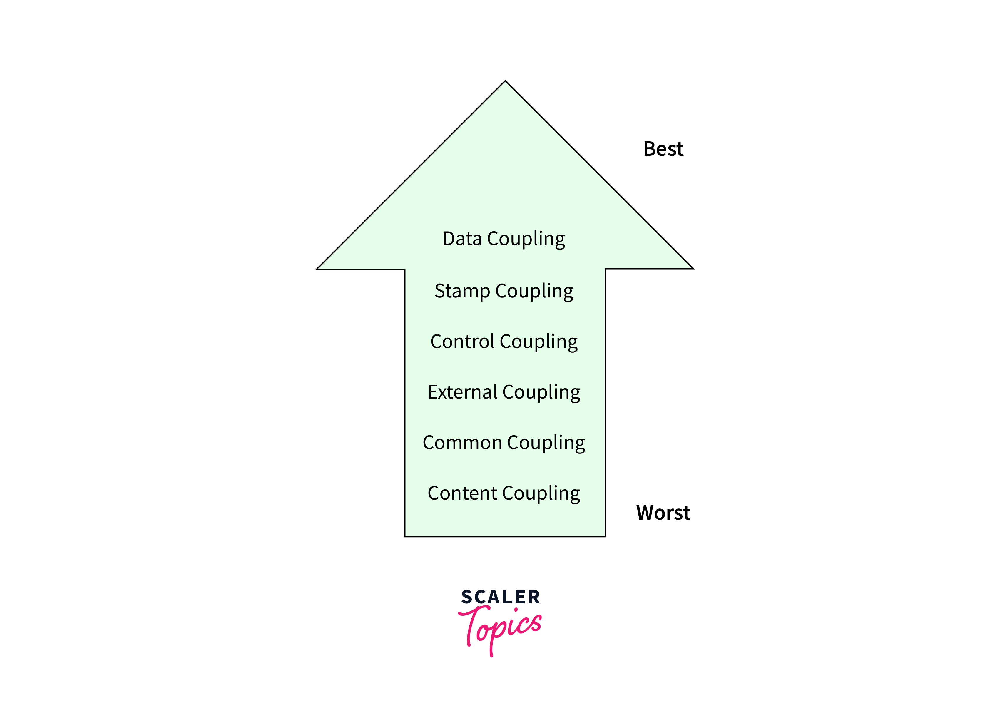
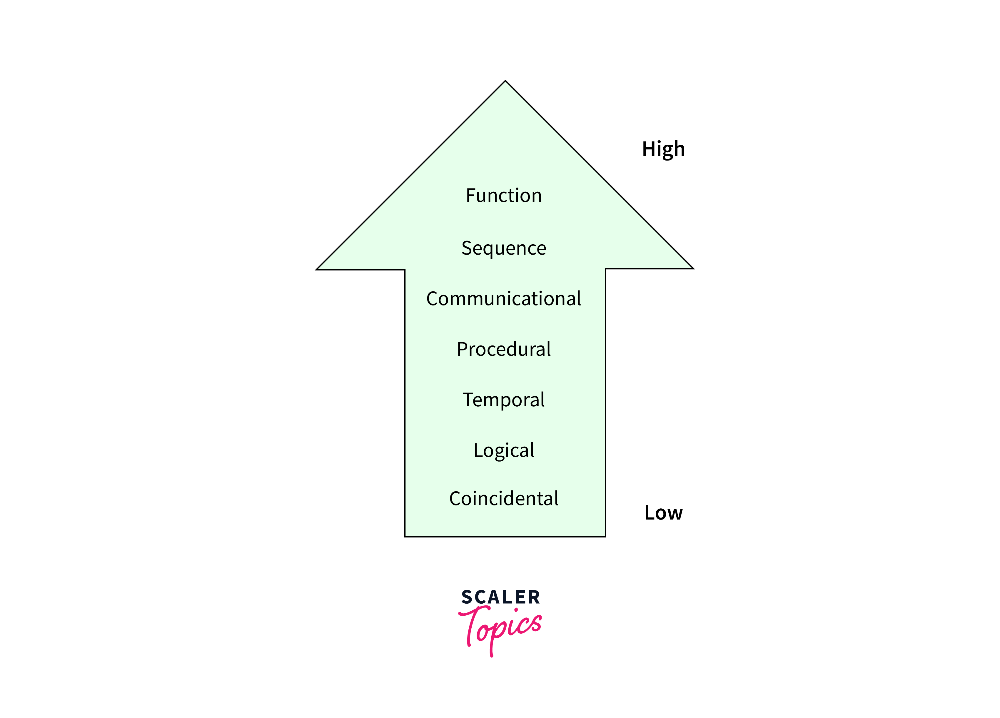

## ## Unit 3: Software Requirement Analysis and Specifications, Design & Software Reliability
### 🔍 Problem Analysis
Understanding the root causes of a problem.

Identifying system goals and constraints.

Involves feasibility study and cost-benefit analysis.

### 📊 Data Flow Diagrams (DFD)
- Graphical representation of data movement in a system.

- Levels: 
1. Context-level (Level 0), 
2. Level 1, 
3. and Level 2 DFDs.

- Elements: 
1. Processes, 
2. Data stores, 
3. External entities, 
4. and Data flows. 

## 🧩 Use Case Diagrams
UML diagrams that show system functionalities from a user’s perspective.

Actors and use cases define interaction.

🧪 Software Prototyping
Building a working model of the system early in the development process.

Types: Throwaway, Evolutionary, Incremental, and Extreme prototyping.

Benefits: Early feedback, better requirement analysis.

##  ⚖️ Cohesion and Coupling
- Coupling refers to the degree of interdependence between software modules. 
- High coupling means that modules are closely connected and changes in one module may affect other modules. Low coupling means that modules are independent, and changes in one module have little impact on other modules.
- Cohesion refers to the degree to which elements within a module work together to fulfill a single, well-
defined purpose. 
High cohesion means that elements are closely related and focused on a single purpose, while low cohesion means that elements are loosely related and serve multiple purposes.

High cohesion = better maintainability.
Low coupling = better modularity.

### 📦 Classification of Cohesiveness & Coupling
- Coupling Types: Data, Stamp, Control, External, Common, Content.

1. Content Coupling:
Modules share data directly through global variables or parameters. This is the strongest coupling method and is not recommended because it tightly couples the modules and makes them highly dependent on each other.

2. General Coupling:
Modules share global data or resources that are frequently used and modified by different modules. Although not as direct as pooling content, it still represents tight pooling through shared resources.

3. External Coupling:
Modules communicate by exchanging data through external interfaces such as function parameters or method calls. Although external binding is more flexible than content and general binding, it can still cause dependencies.

4. Control Coupling:
One module affects the behaviour of another by passing control information, often through parameters. This type of connection may be less direct than a content connection but still requires close communication.

5. Stamp Coupling:
Modules share a composite data structure such as a record or object without sharing. Changes to the structure can affect several modules, but the connection is weaker than in the content connection.

6. Data Coupling:
Modules share data through parameters, but there is no direct relationship between functions. Compared to the previous types, it is a relatively loose form of connection.

### Cohesion Types: Functional, Sequential, Communicational, Procedural, Temporal, Logical, Coincidental.

Functional Cohesion:
Elements within a module are grouped based on a single, specific functionality or task. This is the strongest form of cohesion, where all elements contribute to the same goal.
Sequential Cohesion:
Elements are organized in a linear sequence, where the output of one element becomes the input of the next. This type of cohesion is often seen in processes with step-by-step execution.
Communicational Cohesion:
Elements within a module work together to manipulate a shared data structure. They might not perform the same function, but their actions are closely related to a common piece of data.
Procedural Cohesion:
Elements are grouped based on their involvement in a specific sequence of actions or steps. They might share some data, but their primary focus is on the sequence of operations.
Temporal Cohesion:
Elements are grouped because they need to be executed at the same time or during the same phase. They might not share functional or data-related aspects.
Coincidental Cohesion:
Elements are grouped arbitrarily without a clear, meaningful relationship. This type of cohesion is typically indicative of poor module design.

## 🎯 Function Oriented Design:

Focus on functional decomposition.

Uses DFDs to structure the system.

## 🧱 Object Oriented Design
Uses concepts like classes, objects, inheritance, polymorphism.

More reusable and modular design.

🖥️ User Interface Design
Principles: Consistency, Feedback, Recovery, Efficiency.

Techniques: Storyboarding, Wireframing, Usability testing.

🔐 Software Reliability: Failure and Faults
Failure: Deviation from expected behavior.

Fault: Defect in the code or design.

Techniques: Fault avoidance, fault detection, fault tolerance.

🌐 Quality Standards
ISO 9001: International standard for quality management systems.

SEI-CMM: Capability Maturity Model for software processes. Levels: Initial → Repeatable → Defined → Managed → Optimizing.

### ✅ ISO 9001 vs SEI-CMM

| **Feature**           | **ISO 9001**                                                                 | **SEI-CMM**                                                                 |
|------------------------|------------------------------------------------------------------------------|------------------------------------------------------------------------------|
| **Full Name**         | ISO 9001 – International Organization for Standardization                    | SEI-CMM – Software Engineering Institute’s Capability Maturity Model         |
| **Scope**             | Generic quality management standard for all industries                       | Specific to software development process improvement                         |
| **Focus**             | Customer satisfaction, documentation, and process consistency                | Software process maturity and continuous improvement                         |
| **Structure**         | One-level standard compliance                                                | Five maturity levels (1 to 5)                                                |
| **Applicability**     | All kinds of organizations (manufacturing, services, etc.)                   | Software-focused organizations                                               |
| **Certification Type**| Organization gets ISO 9001 certification                                     | Organization is rated at a maturity level (1 to 5)                           |
| **Control**           | Focuses on what should be done                                               | Focuses on how processes should evolve and improve                           |
| **Flexibility**       | More rigid and documentation-heavy                                           | More process improvement–oriented                                            |

---