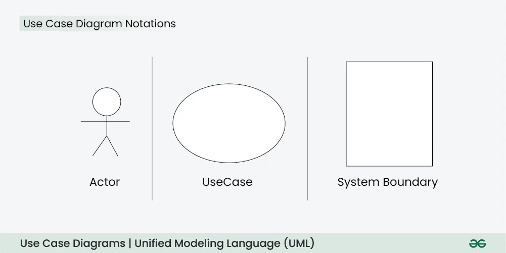
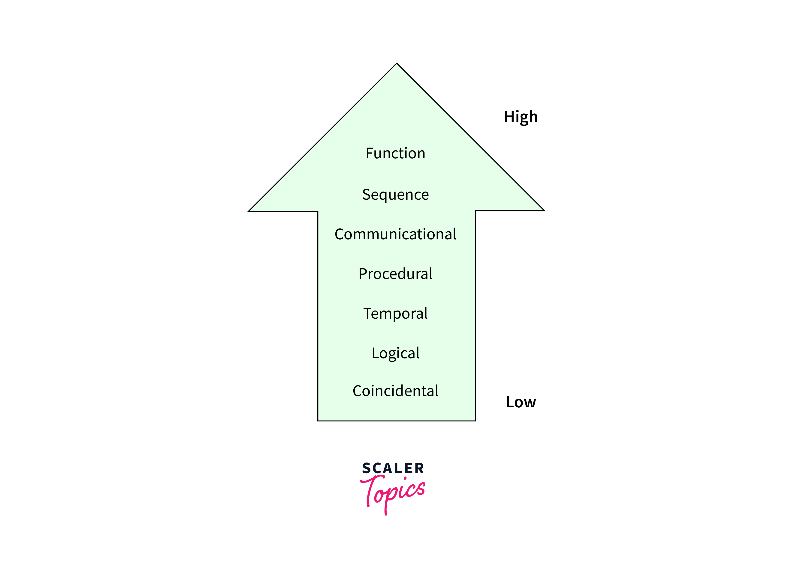

## Unit 3: Software Requirement Analysis and Specifications, Design & Software Reliability

### 🔍 Problem Analysis

Understanding the root causes of a problem.
Identifying system goals and constraints.
Involves feasibility study and cost-benefit analysis.

### 📊 Data Flow Diagrams (DFD)
- Graphical representation of data movement in a system.
- Levels: 

1. Context-level (Level 0), 
2. Level 1, 
3. and Level 2 DFDs.

- Elements: 

1. Processes, 
2. Data stores, 
3. External entities, 
4. and Data flows. 

## 🧩 Use Case Diagram - Unified Modeling Language (UML)
- A Use Case Diagram in Unified Modeling Language (UML) is a visual representation that illustrates the interactions between users (actors) and a system. 
- It captures the functional requirements of a system, showing how different users engage with various use cases, or specific functionalities, within the system. Use case diagrams provide a high-level overview of a system’s behavior, making them useful for stakeholders, developers, and analysts to understand how a system is intended to operate from the user’s perspective, and how different processes relate to one another. They are crucial for defining system scope and requirements

### How to draw a Use Case diagram in UML?
Below are the main steps to draw use case diagram in UML:
• Step 1: Identify Actors: Determine who or what interacts with the system. These
are your actors. They can be users, other systems, or external entities.
• Step 2: Identify Use Cases: Identify the main functionalities or actions the
system must perform. These are your use cases. Each use case should represent a
specific piece of functionality.
• Step 3: Connect Actors and Use Cases: Draw lines (associations) between
actors and the use cases they are involved in. This represents the interactions
between actors and the system.
• Step 4: Add System Boundary: Draw a box around the actors and use cases to
represent the system boundary. This defines the scope of your system.
• Step 5: Define Relationships: If certain use cases are related or if one use case is
an extension of another, you can indicate these relationships with appropriate
notations.
• Step 6: Review and Refine: Step back and review your diagram. Ensure that it
accurately represents the interactions and relationships in your system. Refine as
needed.
• Step 7: Validate: Share your use case diagram with stakeholders and gather
feedback. Ensure that it aligns with their understanding of the system's
functionality.
UML diagrams that show system functionalities from a user’s perspective.

#### examples :
1. Below is the use case diagram of an Online Shopping System:

##  ⚖️ Cohesion and Coupling

- Coupling refers to the degree of interdependence between software modules. 
- High coupling means that modules are closely connected and changes in one module may affect other modules. Low coupling means that modules are independent, and changes in one module have little impact on other modules.

- Cohesion refers to the degree to which elements within a module work together to fulfill a single, well- defined purpose.  High cohesion means that elements are closely related and focused on a single purpose, while low cohesion means that elements are loosely related and serve multiple purposes.

High cohesion = better maintainability.
Low coupling = better modularity.

### 📦 Classification of Cohesiveness & Coupling

- Coupling Types: Data, Stamp, Control, External, Common, Content.

1. Content Coupling:
Modules share data directly through `global variables` or parameters. This is the `strongest` coupling method and is not recommended because it tightly couples the modules and makes them highly dependent on each other.

- hIGHEST cOUPLING.

2. Common Coupling:
Modules share global data or resources that are `frequently used` and modified by different modules. Although not as direct as pooling content, it still represents tight pooling through shared resources.

3. External Coupling:
Modules communicate by exchanging data through `external interfaces` such as function parameters or method calls. Although external binding is more flexible than content and general binding, it can still cause dependencies.
-  The modules depend on other modules, external to the software being developed or to a particular type of hardware. Ex- protocol, external file, device format, etc.

4. Control Coupling:
One module affects the behaviour of another by passing control information, often through parameters. This type of connection may be less direct than a content connection but still requires close communication.

5. Stamp Coupling:
Modules share a `composite data structure ` such as a record or object without sharing. Changes to the structure can affect several modules, but the connection is weaker than in the content connection.
- It involves tramp data. It may be necessary due to efficiency factors- this choice was
made by the insightful designer, not a lazy programmer.

6. Data Coupling:
Modules share data through parameters, but there is no direct relationship between functions. Compared to the previous types, it is a relatively loose form of connection.

### Cohesion Types: Functional, Sequential, Communicational, Procedural, Temporal, Logical, Coincidental.

1. Functional Cohesion:
Elements within a module are grouped based on a single, specific functionality or task. This is the strongest form of cohesion, where all elements contribute to the same goal.

2. Sequential Cohesion:
Elements are organized in a linear sequence, where the output of one element becomes the input of the next. This type of cohesion is often seen in processes with step-by-step execution.
- It occurs naturally in functional programming languages.

3. Communicational Cohesion:
Elements within a module work together to manipulate a shared data structure. They might not perform the same function, but their actions are closely related to a common piece of data.
-  update record in the database and send it to the printer.

4. Procedural Cohesion:
Elements are grouped based on their involvement in a specific sequence of actions or steps. They might share some data, but their primary focus is on the sequence of operations.
- Ex- calculate student GPA, print student record, calculate cumulative GPA, print cumulative GPA.

5. Temporal Cohesion:
Elements are grouped because they need to be executed at the same time or during the same phase. They might not share functional or data-related aspects.

6. Coincidental Cohesion:
Elements are grouped arbitrarily without a clear, meaningful relationship. This type of cohesion is typically indicative of poor module design.
- The elements are not related(unrelated). The elements have no conceptual relationship other than location in source code. It is accidental and the worst form of cohesion. Ex- print next line and reverse the characters of a string in a single component.

## 🎯 Function Oriented Design:

- Focus on functional decomposition.

- Uses DFDs (data flow diagrams) to structure the system.

- In function-oriented design, the system is comprised of many smaller sub-systems known as functions. These functions are capable of performing significant task in the system. The system is considered as top view of all functions.
- Function oriented design inherits some properties of structured design where divide and conquer methodology is used.
- Code reusability is limited.
- Less modular, maintenance can be harder.

eg : In a banking system, separate functions like deposit(), withdraw(), and transfer() operate on data.

## 🧱 Object Oriented Design

Uses concepts like classes, objects, inheritance, polymorphism.
- 
• Objects - All entities involved in the solution design are known as objects. For example, person, banks,
company and customers are treated as objects. Every entity has some attributes associated to it and has
some methods to perform on the attributes.
• Classes - A class is a generalized description of an object. An object is an instance of a class. Class defines all
the attributes, which an object can have and methods, which defines the functionality of the object.
More reusable and modular design.

## 🖥️ User Interface Design

Principles: Consistency, Feedback, Recovery, Efficiency.
Techniques: Storyboarding, Wireframing, Usability testing.

## 🔐 Software Reliability: Failure and Faults
- Software reliability refers to the probability of a software system operating without failures for a specified time and within a defined environment. 
It's a crucial aspect of software engineering, ensuring that software performs its intended functions reliably and consistently. Software reliability is often measured using metrics like Mean Time Between Failures (MTBF) and Mean Time To Repair (MTTR).
- Software Reliability starts with many faults in the system when first created. 
- After testing and debugging enter a useful life cycle. 
- Useful life includes upgrades made to the system which bring about new faults. 
- The system needs to then be tested to reduce faults.  
- Software reliability cannot be predicted from any physical basis, since it depends completely on the human factors in design. 

### Hardware Reliability
Hardware reliability is the probability that the ability of the hardware to perform its function for some period of time. It may change during certain periods such as initial burn-in or the end of useful life.
- It is expressed as Mean Time Between Failures (MBTF).
- Hardware faults are mostly physical faults.
- Thorough testing of all components cuts down on the number of faults. 
- Hardware failures are mostly due to wear and tear.
- It follows the Bathtub curve principle for testing failure.

### Terminology :
1. What is a Bug?
A bug refers to defects which means that the software product or the application is not working as per the adhered requirements set.

2. What is a Defect?
A defect refers to a situation when the application is not working as per the requirement and the actual and expected result of the application or software are not in sync with each other.

3. What is an Error?
Error is a situation that happens when the Development team or the developer fails to understand a requirement definition and hence that misunderstanding gets translated into buggy code. This situation is referred to as an Error and is mainly a term coined by the developers.

4. What is a Fault?
Sometimes due to certain factors such as Lack of resources or not following proper steps Fault occurs in software which means that the logic was not incorporated to handle the errors in the application. This is an undesirable situation, but it mainly happens due to invalid documented steps or a lack of data definitions.

5. What is a Failure?
Failure is the accumulation of several defects that ultimately lead to Software failure and results in the loss of information in critical modules thereby making the system unresponsive. Generally, such situations happen very rarely because before releasing a product all possible scenarios and test cases for the code are simulated. Failure is detected by end-users once they face a particular issue in the software.

- Failure: Deviation from expected behavior.
- Fault: Defect in the code or design.
- Techniques: Fault avoidance, fault detection, fault tolerance.

## 🌐 Quality Standards

ISO 9001: International standard for quality management systems.
SEI-CMM: Capability Maturity Model for software processes. 
- Levels: Initial → Repeatable → Defined → Managed → Optimizing.
> IRDMO

### ✅ ISO 9001 vs SEI-CMM

| **Feature**            | **ISO 9001**                                                  | **SEI-CMM**                                                          |
| ---------------------- | ------------------------------------------------------------- | -------------------------------------------------------------------- |
| **Full Name**          | ISO 9001 – International Organization for Standardization     | SEI-CMM – Software Engineering Institute’s Capability Maturity Model |
| **Scope**              | Generic quality management standard for all industries        | Specific to software development process improvement                 |
| **Focus**              | Customer satisfaction, documentation, and process consistency | Software process maturity and continuous improvement                 |
| **Structure**          | One-level standard compliance                                 | Five maturity levels (1 to 5)                                        |
| **Applicability**      | All kinds of organizations (manufacturing, services, etc.)    | Software-focused organizations                                       |
| **Certification Type** | Organization gets ISO 9001 certification                      | Organization is rated at a maturity level (1 to 5)                   |
| **Control**            | Focuses on what should be done                                | Focuses on how processes should evolve and improve                   |
| **Flexibility**        | More rigid and documentation-heavy                            | More process improvement–oriented                                    |

---

