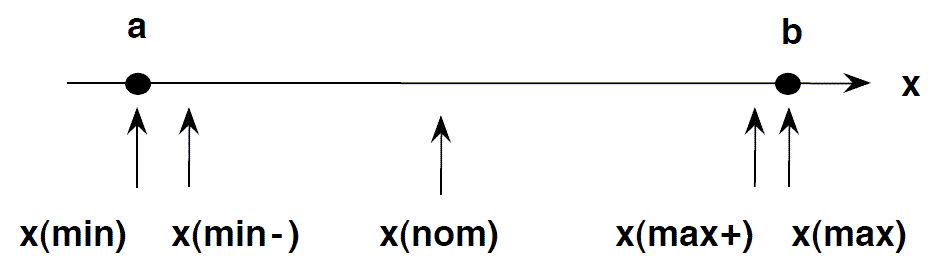
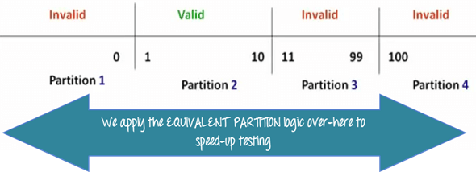

## Write a program or design test cases for the determination of the next date in a calendar. Input: day, month, year where:

1 ≤ MONTH ≤ 12

1 ≤ DAY ≤ 31

1900 ≤ YEAR ≤ 2025

Also: Design boundary value, robust, and worst test cases.

✅ Answer:
The objective is to validate and generate the next date or throw an invalid date error.

- Boundary Value Test Cases:

Test Case	Day	Month	Year	Expected Output
TC1	1	1	1900	02-01-1900
TC2	31	12	2025	Invalid (Year out of range if next date is 01-01-2026)
TC3	31	4	2024	Invalid (April has only 30 days)
Robust Test Cases (invalid values included):

- Test Case	Day	Month	Year	Expected Output

TC4	0	10	2024	Invalid
TC5	15	13	2023	Invalid
TC6	29	2	2024	01-03-2024 (Leap year)

- Worst-case Test Cases (combinations of min/max for all variables):

Test Case	Day	Month	Year	Expected Output
TC7	1	1	1900	02-01-1900
TC8	31	12	2025	Invalid

## Equivalence and Boundary Value

## Decision table

## Why is exhaustive testing not possible?

✅ Answer: Exhaustive testing is not possible because:

The number of possible input combinations is infinite or extremely large.

It is time and cost prohibitive.

Redundant tests do not add value. Hence, practical testing focuses on equivalence partitioning, boundary value, and risk-based approaches.

## 
BVA Test Cases:
Boundary values for:

a: 20 (min), 21 (min+1), 29 (max−1), 30 (max)

b, c, d: 40, 41, 59, 60

Robust Test Cases (including invalid values):
Robust = min-1, min, min+1, max−1, max, max+1

For a: 19, 20, 21, 29, 30, 31 → 6 values

For each of b, c, d: 39, 40, 41, 59, 60, 61 → 6 values each

Total Robust Test Cases = 6⁴ = 1296

Worst Case BVA (4 variables × 6 values):
= 6 × 4 = 24 test cases

## Let us consider arn example of grading the students in an academic institusion. The grading is done according to the following rules: Marks obtained

- ✅ Valid Equivalence Classes (Marks: 0–100):

| Range  | Description | Grade           |
| ------ | ----------- | --------------- |
| 80–100 | Valid       | Distinction     |
| 60–79  | Valid       | First Division  |
| 50–59  | Valid       | Second Division |
| 40–49  | Valid       | Third Division  |
| 0–39   | Valid       | Fail            |

- ❌ Invalid Equivalence Classes:
| Range | Description             |
| ----- | ----------------------- |
| < 0   | Invalid (e.g. -1, -10)  |
| > 100 | Invalid (e.g. 101, 120) |

- ✅ Representative Test Cases from Each Class:
| Test Case No. | Input (Marks) | Expected Output     | Equivalence Class      |
| ------------- | ------------- | ------------------- | ---------------------- |
| TC1           | 85            | Distinction         | Valid: 80–100          |
| TC2           | 75            | First Division      | Valid: 60–79           |
| TC3           | 52            | Second Division     | Valid: 50–59           |
| TC4           | 45            | Third Division      | Valid: 40–49           |
| TC5           | 30            | Fail                | Valid: 0–39            |
| TC6           | -5            | Invalid Input/Error | Invalid: less than 0   |
| TC7           | 105           | Invalid Input/Error | Invalid: more than 100 |

## Code Inspection and Code Walkthrough:

1. ✅ Code Inspection:
    1. A formal review technique used to detect bugs and issues in code.
    1. Conducted by peers or experts without executing the code.
    1. Follows a structured process with roles like moderator, reader, and recorder.
    1. Focus is on programming standards, logic errors, and inconsistencies.
    1. Example: Identifying a missing condition or variable naming error.

2. ✅ Code Walkthrough:
    2. A less formal process than inspection.
    2. The author of the code guides peers through the logic and design.
    2. Participants ask questions, raise doubts, and suggest improvements.
    2. Helps in knowledge sharing and early detection of defects.
    2. Often used in early stages of development.

## Two commonly used tools for functional testing are:

Selenium - A popular tool for automating web browsers, which helps test the functionality of web applications by simulating user interactions.

JUnit - A widely used testing framework for Java applications that is useful for writing and running functional tests, particularly in the context of unit testing.

postman 

## 100% testing is not possible through either White Box or Black Box techniques due to several practical and theoretical limitations. Here's a clear explanation:

1. White Box Testing Limitations (Code-based testing)
White Box testing checks internal logic, paths, conditions, loops, etc.

➤ Why 100% is impossible:
1. Infinite Paths in Loops: If a loop can run any number of times, testing all iterations is impossible.
e.g., while(x > 0) → infinite possibilities for x

2. Combinatorial Explosion: Many paths may exist in nested conditions.
e.g., 10 conditions → 2¹⁰ = 1024 paths

3. Unreachable Code: Some code may never execute (dead code), but it's still part of the program.

4. Time Constraints: Testing every possible condition takes too much time and resources.

2. Black Box Testing Limitations (Input/output-based testing)
Black Box testing tests the functional behavior without knowing internal code.

➤ Why 100% is impossible:
1. Infinite Input Combinations: Real-world programs accept a vast or infinite range of inputs.
e.g., testing all possible strings a user can enter is impractical

2. Hidden Logic: You can’t test internal paths or error-handling logic if it doesn’t visibly affect output.

3. Dependency on External Systems: Things like network, database, or file systems can't be fully controlled or tested.

4. State-based Systems: Systems that change behavior based on previous actions (states) need huge test coverage to simulate all possible states.

✅ Conclusion:
Exhaustive testing is theoretically impossible because:
Time, effort, and resource constraints
Infinite combinations of paths and inputs
Hidden/complex logic and external dependencies

## 
| Aspect             | **Re-engineering**                                        | **Reverse Engineering**                                               |
| ------------------ | --------------------------------------------------------- | --------------------------------------------------------------------- |
| **Definition**     | Modifying and improving existing systems or code          | Analyzing a system to understand its design or functionality          |
| **Purpose**        | To enhance performance, maintainability, or functionality | To understand how something works, often without access to the source |
| **Starting Point** | Known source code or documentation is available           | Often works with compiled binaries or undocumented systems            |
| **Output**         | Improved or modernized system/code                        | Documentation, design diagrams, or recovered source code              |
| **Tools Used**     | Refactoring tools, IDEs, code analyzers                   | Disassemblers, decompilers, debuggers (e.g., Ghidra, IDA Pro)         |
| **Use Cases**      | Migrating legacy systems, code modernization              | Malware analysis, software cracking, competitor analysis              |
| **Legality**       | Usually legal and part of software maintenance            | Legal only in specific contexts (e.g., research, interoperability)    |

## 
🔁 Regression Testing
Definition:
Testing done after code changes (like bug fixes or new features) to ensure that the existing functionality still works correctly.

🛠️ Development Testing
Definition:
Testing done during development, often by the developer, to ensure that new code is working as intended.