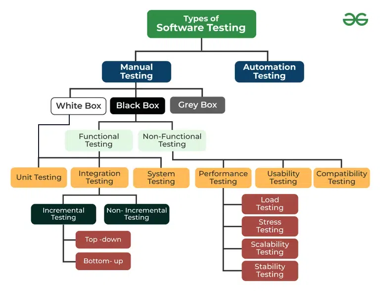
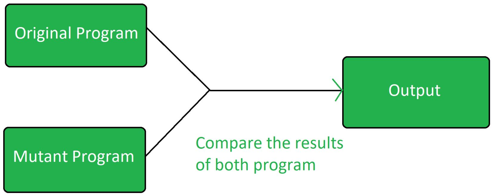

## ✅ Unit 4: Software Testing
🔹 Software Testing Terminology Bug, Error, Defect, Failure, etc.

### PRINCIPLES OF SOFTWARE TESTING :
1. Testing shows the Presence of Defects
2. Exhaustive Testing is not Possible
3. Early Testing
To find the defect in the software, early test activity shall be started. The defect detected in the early
phases of SDLC will be very less expensive. For better performance of software, software testing will
start at the initial phase i.e. testing will perform at the requirement analysis phase.
4. Defect Clustering
In a project, a small number of modules can contain most of the defects. 
- The Pareto Principle for software testing states that 80% of software defects come from 20% of modules.
5. Pesticide Paradox
Repeating the same test cases, again and again, will not find new bugs. So it is necessary to review the
test cases and add or update test cases to find new bugs.
6. Testing is Context-Dependent
The testing approach depends on the context of the software developed. Different types of software
need to perform different types of testing. For example, The testing of the e-commerce site is different
from the testing of the Android application.
7. Absence of Errors Fallacy
If a built software is 99% bug-free but does not follow the user requirement then it is unusable. It is not
only necessary that software is 99% bug-free but it is also mandatory to fulfill all the customer
requirements.

### Testing types: Static vs. Dynamic, Black-box vs. White-box

🔹 Functional Testing Techniques
Boundary Value Analysis (BVA): Tests at the edges of input ranges.
Equivalence Class Testing: Groups inputs into valid and invalid partitions.

🔹 Cause-Effect Graphing
Converts input conditions and output actions into a graphical representation for designing test cases.

🔹 Structural Testing
Also called White-box Testing.

Includes:
Path Testing: Checks all possible execution paths.
Data Flow Testing: Focuses on variables’ lifecycle (definition, usage, deletion).
Mutation Testing: Checks code robustness by introducing small faults.

## 🔹 Types of Testing

2. **Automation Testing**
Automated Testing is a technique where the Tester writes scripts independently and uses suitable Software or Automation Tools to test the software. It is an Automation Process of a Manual Process. It allows for executing repetitive tasks without the use of a Manual Tester.

- Advantages of Automation Testing:
1. Simplifies Test Case Execution: Automation testing can be left virtually unattended and thus it allows monitoring of the results at the end of the process. Thus, simplifying the overall test execution and increasing the efficiency of the application.
2. Improves Reliability of Tests: Automation testing ensures that there is equal focus on all the areas of the testing, thus ensuring the best quality end product.
3. Increases amount of test coverage: Using automation testing, more test cases can be created and executed for the application under test. Thus, resulting in higher test coverage and the detection of more bugs. This allows for the testing of more complex applications and more features can be tested.
4. Minimizing Human Interaction: In automation testing, everything is automated from test case creation to execution thus there are no changes for human error due to neglect. This reduces the necessity for fixing glitches in the post-release phase.

1. **Manual Testing**
Manual testing is a technique to test the software that is carried out using the functions and features of an application. Which means manual testing will be check the defect manually with trying one by one function is working as expected.

- Advantages of Manual Testing:
1. Fast and accurate visual feedback: It detects almost every bug in the software application and is used to test the dynamically changing GUI designs like layout, text, etc.
2. Less expensive: It is less expensive as it does not require any high-level skill or a specific type of tool.
3. No coding is required: No programming knowledge is required while using the black box testing method. It is easy to learn for the new testers.
4. Efficient for unplanned changes: Manual testing is suitable in case of unplanned changes to the application, as it can be adopted easily.

#### Types of Manual Testing
1. White Box Testing
2. Black Box Testing
3. Gray Box Testing

1. White Box Testing -> SUI
White box testing techniques analyze the internal structures the used data structures, internal design, code structure, and the working of the software rather than just the functionality as in black box testing. It is also called glass box testing clear box testing or structural testing. White Box Testing is also known as transparent testing or open box testing.
White box testing is a software testing technique that involves testing the` internal structure` and workings of a software application. The tester has access to the source code and uses this knowledge to design test cases that can verify the correctness of the software at the code level.
- Advantages of White box Testing:
• Thorough Testing: White box testing is thorough as the entire code and structures are tested.
• Code Optimization: It results in the optimization of code removing errors and helps in removing extra lines of code.
• Early Detection of Defects: It can start at an earlier stage as it doesn’t require any interface as in the case of black box testing.
• Integration with SDLC: White box testing can be easily started in the Software Development Life Cycle.
• Detection of Complex Defects: Testers can identify defects that cannot be detected through other testing techniques.

2. Black Box Testing -> F , NF
Black-box testing is a type of software testing in which the tester is not concerned with the internal knowledge or implementation details of the software but rather focuses on validating the functionality based on the provided specifications or requirements.
Advantages of Black Box Testing:
• The tester does not need to have more functional knowledge or programming skills to implement the Black Box Testing.
• It is efficient for implementing the tests in the larger system.
• Tests are executed from the user’s or client’s point of view.
• Test cases are easily reproducible.
• It is used to find the ambiguity and contradictions in the functional specifications.

3. Gray Box Testing
Gray Box Testing is a software testing technique that is a combination of the Black Box Testing technique and the White Box Testing technique.
1. In the Black Box Testing technique, the tester is unaware of the internal structure of the item being  tested and in White Box Testing the internal structure is known to the tester.
2. The internal structure is partially known in Gray Box Testing.
3. This includes access to internal data structures and algorithms to design the test cases.
Advantages of Gray Box Testing:
   1. Clarity of goals: Users and developers have clear goals while doing testing.
     2. Done from a user perspective: Gray box testing is mostly done from the user perspective.
     3. High programming skills not required: Testers are not required to have high programming skills for this testing.
     4. Non-intrusive: Gray box testing is non-intrusive.
     5. Improved product quality: Overall quality of the product is improved.

#### Types of Black Box Testing
1. Functional Testing : SUI
Functional Testing is a type of Software Testing in which the system is tested against the functional requirements and specifications. Functional testing ensures that the requirements or specifications are properly satisfied by the application. This type of testing is particularly concerned with the result of processing.
It focuses on the simulation of actual system usage but does not develop any system structure assumptions.
- Benefits of Functional Testing
• Bug-free product: Functional testing ensures the delivery of a bug-free and high-quality product.
• Customer satisfaction: It ensures that all requirements are met and ensures that the customer is satisfied.
• Testing focused on specifications: Functional testing is focused on specifications as per customer usage.
• Proper working of application: This ensures that the application works as expected and ensures proper working of all the functionality of the application.
• Improves quality of the product: Functional testing ensures the security and safety of the product and improves the quality of the product.

2. Non-Functional Testing : PUC
Non-functional Testing is a type of Software Testing that is performed to verify the non-functional requirements of the application. It verifies whether the behavior of the system is as per the requirement or not. It tests all the aspects that are not tested in functional testing. Non-functional testing is a software testing technique that checks the non-functional attributes of the system. Non-functional testing is defined as a type of software testing to check non-functional aspects of a software application. It is designed to test the readiness of a system as per nonfunctional parameters which are never addressed by functional testing. Non-functional testing is as important as functional testing.
Benefits of Non-functional Testing:
• Improved performance: Non-functional testing checks the performance of the system and determines the performance bottlenecks that can affect the performance.
• Less time-consuming: Non-functional testing is overall less time-consuming than the other testing process.
• Improves user experience: Non-functional testing like Usability testing checks how easily usable and user-friendly the software is for the users. Thus, focus on improving the overall user experience for the application.
• More secure product: As non-functional testing specifically includes security testing that checks the security bottlenecks of the application and how secure is the application against attacks from internal and external sources.

##### Types of Functional Testing
1. Unit Testing
2. Integration Testing
3. System Testing
4. End-to-end Testing
5. Acceptance testing

1. Unit Testing:
Unit testing is a method of testing individual units or components of a software application. It is typically done by developers and is used to ensure that the individual units of the software are working as intended. Unit tests are usually automated and are designed to test specific parts of the code, such as a particular function or method. Unit testing is done at the lowest level of the software development process , where individual units of code are tested in isolation 
> Note: Unit Testing basically Included in both White Box Testing and Black Box Testing.
Advantages of Unit Testing:
Some of the advantages of Unit Testing are listed below.
• It helps to identify bugs early in the development process before they become more difficult and expensive to fix.
• It helps to ensure that changes to the code do not introduce new bugs.
• It makes the code more modular and easier to understand and maintain.
• It helps to improve the overall quality and reliability of the software.
Note: Some popular frameworks and tools that are used for unit testing include JUnit , NUnit, and xUnit.
• It’s important to keep in mind that Unit Testing is only one aspect of software testing and it should be used in combination with other types of testing such as integration testing, functional testing, and acceptance testing to ensure that the software meets the needs of its users.
• It focuses on the smallest unit of software design. In this, we test an individual unit or group of interrelated units. It is often done by the programmer by using sample input and observing its corresponding outputs.
Example:
1. In a program we are checking if the loop, method, or function is working fine.
2. Misunderstood or incorrect, arithmetic precedence.
3. Incorrect initialization.

2. Integration Testing
Integration testing is a method of testing how different units or components of a software application interact with each other. It is used to identify and resolve any issues that may arise when different units of the software are combined. Integration testing is typically done after unit testing and before functional testing and is used to verify that the different units of the software work together as intended.

- Different Ways of Performing Integration Testing:
• Top-down integration testing: It starts with the highest-level modules and differentiates them from lower-level modules.
• Bottom-up integration testing: It starts with the lowest-level modules and integrates them with higher-level modules.
• Big-Bang integration testing: It combines all the modules and integrates them all at once.
• Incremental integration testing: It integrates the modules in small groups, testing each group as it is added.
Advantages of Integrating Testing
• It helps to identify and resolve issues that may arise when different units of the software are combined.
• It helps to ensure that the different units of the software work together as intended.
• It helps to improve the overall reliability and stability of the software.
• It’s important to keep in mind that Integration testing is essential for complex systems where different components are integrated.
• As with unit testing, integration testing is only one aspect of software testing and it should be used in combination with other types of testing such as unit testing, functional testing, and acceptance testing to ensure that the software meets the needs of its users.
> The objective is to take unit-tested components and build a program structure that has been dictated by design.
Integration testing is testing in which a group of components is combined to produce output.
Integration testing is of four types: (i) Top-down (ii) Bottom-up (iii) Sandwich (iv) Big-Bang
   
##### Types of Integration Testing
 1. Incremental Testing
    Like development, testing is also a phase of SDLC (Software Development Life Cycle). Different tests are
    performed at different stages of the development cycle. Incremental testing is one of the testing approaches
    that is commonly used in the software field during the testing phase of integration testing which is performed
    after unit testing. Several stubs and drivers are used to test the modules one after one which helps in
    discovering errors and defects in the specific modules.
    Advantages of Incremental Testing
    • Each module has its specific significance. Each one gets a role to play during the testing as they are
    incremented individually.
    • Defects are detected in smaller modules rather than denoting errors and then editing and re-
    correcting large files.
    • It’s more flexible and cost-efficient as per requirements and scopes.
    • The customer gets the chance to respond to each building.

##### There are 2 Types of Incremental Testing
   1. Top-down Integration Testing
        Top-down testing is a type of incremental integration testing approach in which testing is done by integrating
        or joining two or more modules by moving down from top to bottom through the control flow of the
        architecture structure. In these, high-level modules are tested first, and then low-level modules are tested.
        Then, finally, integration is done to ensure that the system is working properly. Stubs and drivers are used to
        carry out this project. This technique is used to increase or stimulate the behavior of Modules that are not
        integrated into a lower level.
        Advantages Top Down Integration Testing
        1. There is no need to write drivers.
        2. 3. Interface errors are identified at an early stage and fault localization is also easier.
        Low-level utilities that are not important are not tested well and high-level testers are tested well in
        an appropriate manner.
        4. Representation of test cases is easier and simpler once Input-Output functions are added.
   2. Bottom-up Integration Testing
        Bottom-up Testing is a type of incremental integration testing approach in which testing is done by
        integrating or joining two or more modules by moving upward from bottom to top through the control flow of
        the architecture structure. In these, low-level modules are tested first, and then high-level modules are tested.
        This type of testing or approach is also known as inductive reasoning and is used as a synthesis synonym in
        many cases. Bottom-up testing is user-friendly testing and results in an increase in overall software
        development. This testing results in high success rates with long-lasting results.
        Advantages of Bottom-up Integration Testing
        • It is easy and simple to create and develop test conditions.
        • It is also easy to observe test results.
        • It is not necessary to know about the details of the structural design.
        • Low-level utilities are also tested well and are also compatible with the object-oriented structure.

3. System Testing :
System testing is a type of software testing that evaluates the overall functionality and performance of a
complete and fully integrated software solution. It tests if the system meets the specified requirements and if it
is suitable for delivery to the end-users. This type of testing is performed after the integration testing and
before the acceptance testing.
System Testing is a type of software testing that is performed on a completely integrated system to evaluate the
compliance of the system with the corresponding requirements. In system testing, integration testing passed
components are taken as input. The goal of integration testing is to detect any irregularity between the units that are integrated.
Advantages of System Testing:
• The testers do not require more knowledge of programming to carry out this testing.
• It will test the entire product or software so that we will easily detect the errors or defects that
cannot be identified during the unit testing and integration testing.
• The testing environment is similar to that of the real-time production or business environment.
• It checks the entire functionality of the system with different test scripts and also it covers the
technical and business requirements of clients.
• After this testing, the product will almost cover all the possible bugs or errors and hence the
development team will confidently go ahead with acceptance testing.

4. End-to-end Testing
End-to-end testing is the type of software testing used to test entire software from starting to the end along
with its integration with external interfaces. The main purpose of end-to-end testing is to identify system
dependencies and to make sure that the data integrity and communication with other systems, interfaces and
databases to exercise complete production.

5. Acceptance Testing
It is formal testing according to user needs, requirements, and business processes conducted to determine
whether a system satisfies the acceptance criteria or not and to enable the users, customers, or other
authorized entities to determine whether to accept the system or not.
Advantages of Acceptance Testing
• This testing helps the project team to know the further requirements from the users directly as it
involves the users for testing.
• Automated test execution.
• It brings confidence and satisfaction to the clients as they are directly involved in the testing
process.
• It is easier for the user to describe their requirement.
• It covers only the Black-Box testing process and hence the entire functionality of the product will be
tested.

Types of Non-functional Testing
1. Performance Testing : SSSL 
2. Usability Testing
3. Compatibility Testing

## Boundary Value Analysis
Boundary Value Analysis is based on testing the boundary values of valid and invalid partitions. The behavior at
the edge of the equivalence partition is more likely to be incorrect than the behavior within the partition, so
boundaries are an area where testing is likely to yield defects.
It checks for the input values near the boundary that have a higher chance of error. Every partition has its
maximum and minimum values and these maximum and minimum values are the boundary values of a
partition.
In simple terms boundary value Analysis is like testing the edge cases of our software where most of the time it
will get broke so it is important to do BVA before deploying the code. There are many other test that are done if
you wish to learn them all then you can join our complete software testing course
Note:
• A boundary value for a valid partition is a valid boundary value.
• A boundary value for an invalid partition is an invalid boundary value.
• For each variable we check-
     o Minimum value.
     o Just above the minimum.
     o Nominal Value.
     o Just below Max value.
     o Max value.
Example: Consider a system that accepts ages from 18 to 56.
Boundary Value Analysis(Age accepts 18 to 56)
> Invalid (min-1)             Valid (min, min + 1, nominal, max – 1, max)            Invalid (max + 1)
          17                            18, 19, 37, 55, 56 ,                            57

- Single Fault Assumption: When more than one variable for the same application is checked then one can use a
single fault assumption. Holding all but one variable to the extreme value and allowing the remaining variable
to take the extreme value. For n variable to be checked:
Maximum of 4n+1 test cases
eg Taking the year as a Single Fault Assumption i.e. year will be having values varying from 1900 to
2000 and others will have nominal values and so on ....

## Equivalence Partitioning
It is a type of black-box testing that can be applied to all levels of software testing . In this technique, input data are divided into the equivalent partitions that can be used to derive test cases-
• In this input data are divided into different equivalence data classes.
• It is applied when there is a range of input values.

- Equivalence class testing is a black-box software testing technique where input data is categorized into groups called equivalence classes, and then representative values are selected from each class for testing.

- Consider a field that accepts a minimum of 6 characters and a maximum of 10 characters. Then the partition of
the test cases ranges 0 – 5, 6 – 10, 11 – 14.
Test Scenario                  Test Description                                     Expected Outcome
1                              Enter value 0 to 5 character                         Not accepted
2                              Enter 6 to 10 character                              Accepted
3                              Enter 11 to 14 character                             Not Accepted

### Mutation Testing 
is a type of Software Testing that is performed to design new software tests and also
evaluate the quality of already existing software tests. Mutation testing is related to modification a program in small ways. It focuses to help the tester develop effective tests or locate weaknesses in the test data used for the program.

## Software reliability

<!-- 
1. Unit Testing: Test individual modules/functions.

2. Integration Testing: Test combined modules for interface issues.

3. System Testing: Tests the entire system as a whole.

4. Validation Testing: Ensures product meets the user’s needs.

🔹 Debugging Techniques
Locating and fixing bugs using methods like backtracking, cause elimination, and brute force.

🔹 Testing Tools
Examples: JUnit, Selenium, Postman, LoadRunner, etc. -->
